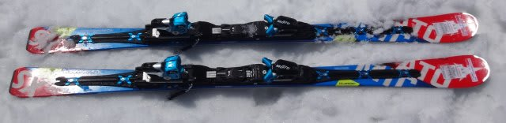
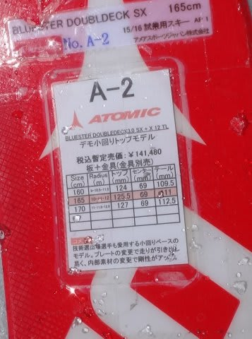
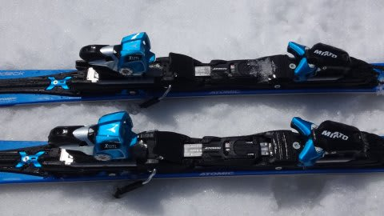
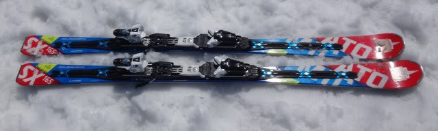
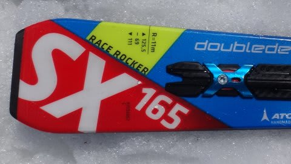
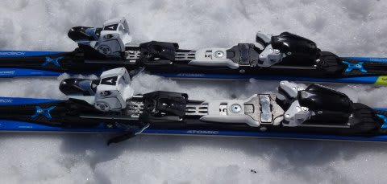

# これがラスト！ 2016シーズンモデル，スキー試乗レポート第23回…ATOMIC編その3

📅 投稿日時: 2015-06-18 00:38:53

🏷️ カテゴリ: [スキー板試乗](c0bd8048615710cee890e403a36cc9a2b.md)

ということで．

長らく続いた，2016シーズンモデルのスキー板試乗インプレッション．

これが，最終回になります…

今回は，またまたアトミック編．

それも，Bluester SXの同じ長さ，ビンディング違いの2種類を

乗り比べというマニアックな内容です．

[前回](ea31a3c0d32a3d5f221a255438204af24.md)は，標準のTLビンディング付きを履きましたが．

今回は，前回同様TLビンディングの板と，ちょいと強めのVARビンディングの板の

2種類を乗り比べてみました…

ビンディングの違いだけで，かなり乗り味が違うのにびっくりです．

では，どうぞ～！

○ATOMIC BLUESTER Doubledeck3.0 SX X12TL 165cm

基礎小回り用．

こちらは，弱めのTLビンディング付きの板です…

履いてみた感じ．

前回の試乗とほぼ同じ印象．

やっぱり，'14モデルのSXと比べると，板の捉え，

返りが優しくなっている印象です．

ガッツリとらえてビン！と返ってくる板ではなく，

比較的谷回りで動かしやすく，山回りでもテールの張りや

グリップをそれほど強烈に感じることなく，コントロール性が

高い感じ．

ある程度板なりに動いて行ってくれるけど，板の行きたい方向に

行かされるのではなく，どの局面からも板が動かせる感じ．

トップスピードでの強烈な捉え・走りというより，

どんな斜面でも，リスクなくしっかり弧を描いていくことを

重視してるのかな～，という板です．

'14モデルで言えば，むしろSCに近い感じがあるかも．

とりあえず，いい板なんですが．

私がATOMIC板に求める'14 SX後継機としては，

ちょいと刺激が足りない感じ…

○ATOMIC BLUESTER Doubledeck3.0 SX X12VAR 165cm

基礎小回り．

さっきのTL付きの板と，板自体は全く同じです．

ビンディングが，VARビンディングに変わっただけです…

…履いてみたところ．

…こ，これだよ．

私がATOMICのSXに求めているのは，これだ！

TLビンディング付きに比べると，板の返りが結構速く，強めに感じます．

あと，グリップの強さ，テールのフレックスの強さ，粘り感も，

TLビンディング付きと比べると一段上がる感じがあります．

トップのグリップ感…というか，ステア感はSL PROより弱い感じで，

やっぱりロッカーっぽく，トップが浮き上がるように回っていきますが，

スピード耐性は十分．

結構攻撃的な小回りができます．

ただ，VARビンディングだと板のグリップが強くなる分，

動かしやすさという点ではTLビンディング付きが上回りますが…．

とりあえず，このVARビンディング付きモデル．

かなり'14 SXのグリップ力，返りの早さ，テールの張りに

近いです．

かなりしっかりグリップし，テールの張りが強いので，

ターン後半にテールをしっかり抑えてターンを仕上げて行けます．

テールを抑えて仕上げていくと，板のテールの張りの強さで，

切換え時にターンの荷重がテールにすっと抜けて，

次のターンが自動的に始まっていく感じ．

スピード耐性も，TL付きより上がります．

…これが，どうやら'14 SXの正統派後継モデルのようです．

ATOMICの人曰く．

「今シーズンは，TLよりVARビンディングの方が評判いいんですよね…」

と言ってましたが．

納得．

…でも．

VARビンディング，TLより1万円以上高いのか…（泣）．

## 💬 コメント一覧

### 💬 コメント by (いか)
**タイトル**: Unknown
**投稿日**: 2015-06-18 08:13:56

14SX乗りがみんな同じ感想ですね…笑

私もVARがいいと思います。

ビンディングは、13SXないしは14SXから移植すると板だけの購入になって安く済むのでは、と思います。私の知り合いはXビンディングをなんども使いまわしているようです(´ー｀)

### 💬 コメント by (Skier_S)
**タイトル**: いかさま
**投稿日**: 2015-06-19 00:00:54

ああ．

やっぱりみんな，同じ感想なんですね…

あと，確かにビンディングは'13SXから

使いまわせますね～

…かなりボロボロのビンディングですが…

そうなると安く上がっていいですね！

### 💬 コメント by (Unknown)
**タイトル**: Unknown
**投稿日**: 2015-09-16 22:28:30

わかりやすいインプレッションありがとうございます。

言葉のフィーリングで伝わりました（私にとっては）。

いつ見ても参考になります。

### 💬 コメント by (Skier_S)
**タイトル**: Unknownさま
**投稿日**: 2015-09-17 00:52:45

コメントありがとうございます…

こんなインプレッションでわかるのでしょうか（汗）．

素人の試乗レポートですが，やくだったなら

何よりです…

