# 2022シーズンREXXAMブーツの情報！基本的に来シーズンも継続．R-EVOシリーズは新色追加！

📅 投稿日時: 2021-02-27 00:47:46

えー．

レインボーさんが病気欠場で．

某おこみんオーナーも志賀から

旅立っている本日．

もしかしたら，

志賀高原に特派員が誰もいないのでは？？

…と，心配しましたが．

すばらしいことに，今日も日替わりで，

特派員の方が志賀入りしていたようです…！

…ただ，志賀へは午後入りだったようなので．

午後の写真しかありませんが…

まぁ，今日の午前中の志賀高原はこんな感じで．

気温はそこそこ冷えているものの，かなり

ガス気味の，視界が悪い天気だったよう

なので．

あまり滑っても楽しい天気じゃなかったのかも．

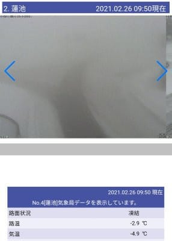

([北信建設事務所道路状況カメラ](http://hokushin.pref-nagano-roadcamera.jp/)より）

でも．

昼からはガスも上がり．

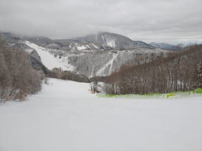

午後1時ごろには，曇り空ながらも

視界は良くなって来たようです…！

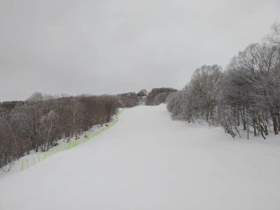

…そして．

いつも通りがらがらで…

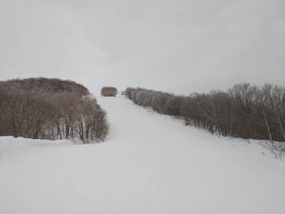

西舘フーディーリフトも飛び乗り

だったみたいですね！

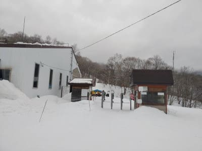

西舘は，下の方に結構殺人コロコロが

出てくる難しいバーンで…

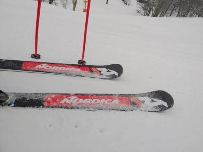

西舘の一番下は氷っぽいのが

出てきているところもあったようですが．

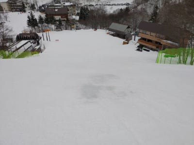

意外とジャイアントが良かったみたいで…

気温はそれほど冷え冷えではなかったものの．

プラス気温に上がることもなかったので．

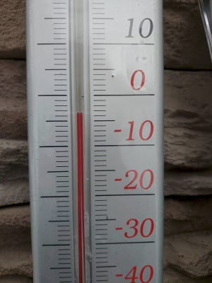

一の瀬，焼額方面の雪質は，かなり

良かったという情報も入ってます…！

ってなことで．

夕方になると空が結構明るくなってきて

いたようなので．

明日はいい天気になりそうな感じ

ですね…

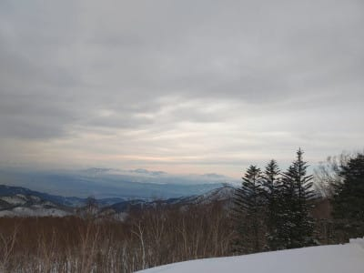

という感じの本日だったわけですが．

今日のレポートを送ってくれた特派員の方，

ありがとうございました～！

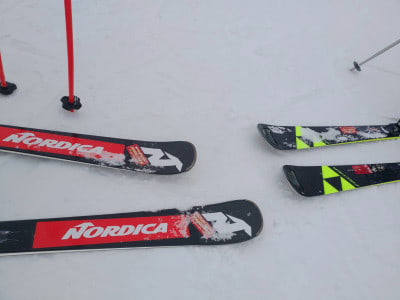

とりあえず．

この週末の予想は，昨日から大きくは変わらず．

27日（土）：朝はマイナス10℃以下！

　朝のうち曇が多そうだけど午後は晴れて．

　この日も一日冷え冷えで

　いいスキー日和！

　あさイチはかなり締まったいいシマシマ．

　午後も雪は締まり気味で，締まっている分

　雪は荒れずに，晴天でいいコンディションで

　滑れそう！

28日（日）：朝は-3℃ほど，

　朝の雪は硬めのシマシマ！

　昼間は0℃を上回りそうだけど．

　終日晴れのいいスキー日和！

　日差しが良いところはちょっと

　雪が緩むけど，ちょっと緩む程度

　で済みそうだし．一の瀬や奥志賀は

　そこまで緩まないかな…

という感じです！

…ただ．そのあと．

3月1日はすごい気温が上がって…

3月2日は液体が空から落ちてくるかも…

昨日，1か月予想で「この3月はダメっぽい」って

書きましたが．

3月，いきなりスタートからダメっぽいですね(涙)

…というところで，本題へ．

えー．

今シーズンからREXXAMユーザーとなった

私ですが．

エキップさんから早くも来シーズンモデルの

情報をいただきました…

まず．

R-EVOシリーズは，今シーズンはちょっと

マイナーチェンジしたんですが，

来シーズンは今シーズンモデルから

変更なしの継続となるようです…

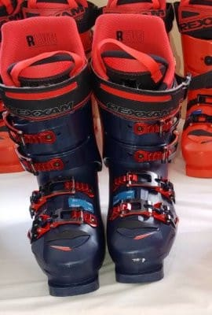

うむ．

この写真を見るだけでは，今シーズン

モデルからの違いが全く分かりませんね…

ただ，R-EVO S，Mともに

130,120,110のフレックスのモデルに

赤色が限定モデルとして追加され．

従来の紺色と赤色の2種類が

選べるようになるようです！

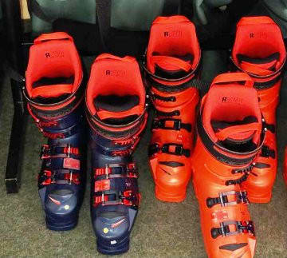

うーん．

赤いブーツってREXXAMっぽく

ないなぁ…

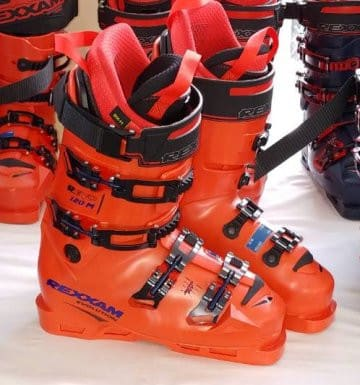

でも，この色，

ちょっといいかも？

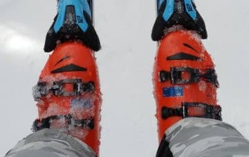

まぁ，私は紺色も気に入ってます

けどね(笑)．

で．

モーグルモデルのXXも継続モデルっぽいですが，

こちらは微妙にREXXAMのロゴの色が変わりました．

XXが赤なのは今年と同じですが，

REとAMのロゴが，黒から白になりましたね…

日本国旗のイメージの色だとか．

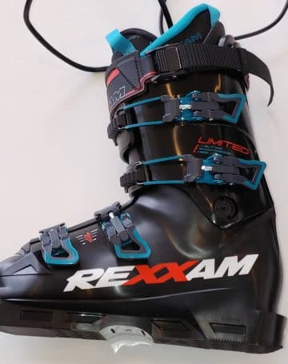

ってなことで．

来期も継続となったらしい

R-EVOですが．

うーん．

二郎君買うなら，赤色かなぁ…←もう二郎君買う気でいるのか？？

## 💬 コメント一覧

### 💬 コメント by (レインボー73)
**タイトル**: Unknown
**投稿日**: 2021-02-27 08:49:52

今日で休場４日目です。私の呪いが足りなかったのか、槍やミサイルは振らなかったようですね。おまけに今日は湯田中でパウダーとは、悲しすぎる。（なんという自我）

腰痛は長引くらしいのですが、連日の、アルコール摂取による全身の麻痺作用の甲斐あってか、週明けには定位置に復帰できそうです。皆様、またお会いできますことを楽しみにしております。でも、明日、我慢できるかなあ！

### 💬 コメント by (アリス)
**タイトル**: 志賀高原楽しみました
**投稿日**: 2021-02-27 17:52:32

Skier_S様

お世話になっております。

S様が自粛している間申し訳ありません。

25日、26日と会社ズル休みして志賀高原を楽しんでしまいました。

『雪が良くて帰れない』の気持ち初めて理解出来ました。

また、来週ズル休みしてまた行こうかなって計画しています。

レグザムって名前からすると海外の製品かと思いきや国内産で大阪で生産しているんですね。

ブーツ履いて、骨に当たりが当たり前、痛いのは普通、爪剥がしは毎度で、そういう事がなくなるとスキー人生が180℃変わりますよね♪♪

私自身も今シーズン足にフィットするブーツに出会えて同じ思いです。

次郎君、三郎君賛成です。

### 💬 コメント by (Skier_S)
**タイトル**: もう2月も終わるとは，信じられない
**投稿日**: 2021-02-28 00:31:20

＞レインボー73さま

私の呪いもむなしく，やりもミサイルも降ってないようです(笑)

腰痛，お大事にしてお過ごしください…

来週からの特派員復帰，お待ちしています！

＞アリスさま

25，26日，コンディション良かったんですね…

「雪が良すぎて帰れない」

…危ない発言です(笑)．

REXXAMは香川の会社とおもっていましたが…本拠地は大阪なんですね．

何にしろ，足にフィットするブーツは大切です…

足形が変な私は痛感しています．

### 💬 コメント by (ikkun)
**タイトル**: Unknown
**投稿日**: 2021-02-28 23:23:30

お疲れ様です  こちらも今日は青空が今シーズン一番でしたし 昨日午後に

続きステキな雪質でしたよ❤️富士山も見えてましたseasonも１ヶ月を切りましたが？お客様の入りが心配のラストとなります  あフォルクルSLデモ19半額にと行きつけの店で？しかし(笑)

### 💬 コメント by (Skier_S)
**タイトル**: ＞ikkunさま
**投稿日**: 2021-03-01 01:20:23

いい天気でスキーを出来たようですね…

で，確かにシーズンも残り少なくなってきました．

トップシーズンをコロナに奪われたこの悲しさと言ったら…

### 💬 コメント by (ikkun)
**タイトル**: Unknown
**投稿日**: 2021-03-15 01:55:29

赤いレグザム 買った店にて見ました❗…ですね赤はatomicのイメージ(先輩指導員様使用)な私し( *´艸｀)あやつのせいで技術を沢山投入出来ない？かもと さて新しいatomicスキーとオガサカスキーも見てきたのでした❗

