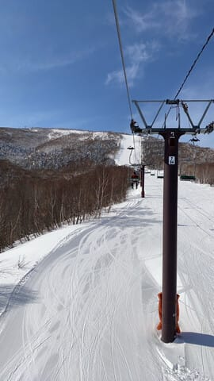
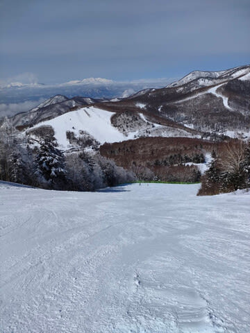
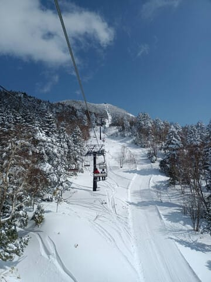
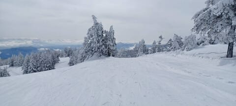
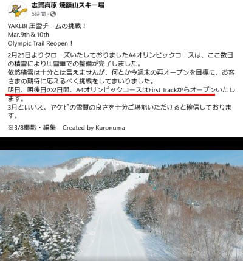

# 3月8日の志賀高原スキー場は，晴れのち雪，昼間はちょっと暖かめ．そして土曜は予想通り雪降り，日曜の朝までそこそこ降りそう．

📅 投稿日時: 2024-03-09 00:10:17

えー．

本日の志賀高原ですが．

一日雪降りかと予想したところ…

意外なことに，朝から昼過ぎまで

いい天気だったようです…！！

気温も朝のうちは冷えて，

かなりいい雪質で滑れたようですが．

気温はプラスに上がらなかったものの，

0℃近くまで上がったので…

焼額の唐松コースとか，日の当たる

南斜面はちょっと雪がしっとり

しちゃったようです．

でも，横手山は終日いい雪だった

みたいですね～！

完全に真冬の景色ですね．

そして，午後3時ごろから曇り始め，

夕方4時ごろに10cmほど

雪が積もったようで…

今晩も深夜0時現在，雪が降り始めて

いるようです…！！

ここしばらくの積雪のおかげで，

なんと．

明日，明後日の今週土日，

オリンピックコースが再オープン

です！！！

素晴らしい…！！

（[焼額山スキー場Facebook](https://www.facebook.com/yakebitaiyama/videos/1848556425589651)より）

いやー．

今年は，2月より3月のほうが雪が

いい気がする…

このままいけば，4月にかけて，さらに

冷え込んでいくんじゃないかな？？←んなわきゃない

で．

これからの土日ですが．

土曜9日：朝までの積雪が10cm，

　運が良ければ積雪20cm．

　あさイチはトップシーズン柔らか

　圧雪にうっすら冷えた新雪．

　終日雪が降り続け，－10℃近い

　気温が一日続く寒い一日．

　昼間だけで10cmくらい積もるかも．

　終日雪質はいいけど，午後になると

　バーンは凸凹になっていきそう．

日曜10日：朝までに運が良ければ20cm，

　運が悪ければ10cm．

　すごい運が良ければ，20cm以上積もる

　可能性も…！

　（風がどのくらい北に回るかによる）

　あさイチは柔らか圧雪の上に新雪が

　数㎝乗ったトップシーズンバーン．

　コースわきはブーツ～脛パフ．

　朝のうちは雪が降り続け…

　北風なら，そのまま午後まで雪が

　降り続ける．

　西風なら，昼前に雪がやみ

　午後は晴れていく．

　風向きがどうなるか，すごい微妙．

　でも，この日も終日冷え冷えで一日

　いい雪質をキープ！

という感じでしょうか．

晴天ピカピカとはいかないけど．

おそらく今シーズン残り少ない…

ヘタすればラストの冷え冷え雪の

週末．

私も2週間ぶりの志賀高原復活です～！！

…そしてまた，あと4時間後に出発（泣）

今日も睡眠時間3時間半です…
