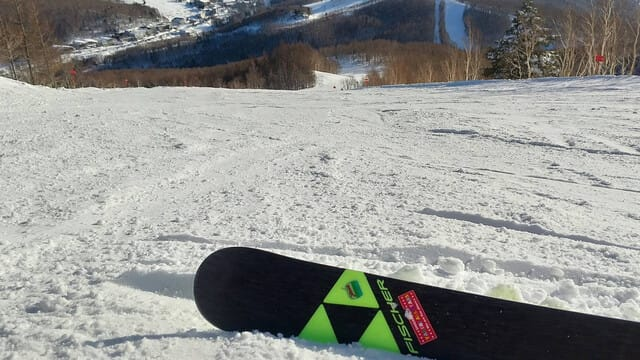

# 1月30日の志賀高原スキー場，特派員情報！…そして今週末までの天気は，ほぼ積雪無し．気温高めだけど液体が降る危険性は無し

📅 投稿日時: 2024-01-31 03:12:56

えー．

本日，いつも通り志賀高原特派員から

写真が送られてきたのですが．

その写真を見て悶絶しましたね．

ええ．

職場にいるのがばからしくなる写真でしたね．

速攻で焼額に飛んでいきたい気分でしたね…

だって．

まずは-10℃以下の冷え冷えあさイチの

シマシマから始まり…

そして，見事な快晴の空の下の

誰もいないシマシマバーン！

なんだこれは～っ！！！

滑りたいぞ～っ！！！

さすが平日だけあって，コースも

ガラガラですが…

これだけ晴天でも，気温が低かったのも

あり．

終日晴天だったのに，雪質は冷え冷えの

締まった圧雪バーンで．

そして夕方まで，全く荒れる気配が

なかったという…

先週末の日曜日が今シーズン最高だと

思ったら．

それより冷え冷えで終日晴天，

そしてガラガラ平日ということで．

毎日来ている常連さん曰く，

この日がシーズン最高！！

ということだったようです…

うがーーー！

私もこんなバーンで滑りたい…っ！！

奥志賀のエキスパートコースも

最高だったみたいですね…

そして，営業終了時間が迫っても，

雪は全く荒れず，人が少なかったので

全然コースはフラットのまま．

これがとても営業終了直前，

4時ごろの写真とは思えない…

ということで．

私の勤労意欲を失わせるに十分な

破壊力を持った特派員の写真だったわけ

ですが．

今週末までこのいいコンディションが続きますように

と，私が強く願ったおかげで．

今週は，いいコンディションが続いて

くれそうです…！

31日(水)：終日晴れ．あさイチ最高．

　ただ，昼間気温が上がって日差しも

　あるので，標高が低いところや南斜面は

　雪が緩む．

1日(木)：終日曇り，ときどき雪もぱらつく．

　あさイチは結構しまったバーン．

　朝は気温が高めだけど，だんだん冷える．

　朝は気温が高めといっても，雨になるほど

　じゃないので，雪は悪くならない．

2日(金)：夜のうちに数㎝うっすら積雪？

　この日は朝からそこそこ冷える．

　基本的に曇りそうだけど，

　時折晴れたり一瞬雪が舞ったりする．

3日(土)：曇り～雪．午後は晴れるか？

　あさイチは締まったシマシマ．

　そこそこ冷える．

　

4日(日)：晴れそう．雪もかなり締まり気味

　だけどいいかも．

…という感じで．

先週段階の予想天気図では，今週は

かなり気温が高そうな予想だったけど…

私の願いのおかげで，

最新の天気図では，今週はそこまで

気温が上がらず，積雪はないけど．

雨が降ったり雪が強烈に融ける高温には

ならなさそうです！！

今週末も，いいコンディションで滑れそう…！！

また明日，週末の詳細天気予想やります～！

## 💬 コメント一覧

### 💬 コメント by (レインボー76)
**タイトル**: Unknown
**投稿日**: 2024-01-31 16:00:20

水曜日の志賀高原情報

明日は雪が降るので、志賀高原の桃源郷も今日までの６日間でおしまい。

ダイヤからイースト(ヤケビ第三)、白樺、オリンピック、GSを経て奥志賀へ。どこもやや硬でよく滑る最高の雪。

やっぱり今日もエキスパがベスト。ダウンヒルを降りて10時31分のバスでダイヤへ。こうすれば、「漕ぐ」という難業を回避できます。年配のかたのご参考になればと思います。

ダイヤから寺子屋をぐるぐるしてファミリー経由でダイヤ終了。11時45分。

わたしの評価は①エキスパ②寺子屋③ファミリーでした。

明日は視界が悪そう(トーンダウン)。

### 💬 コメント by (Skier_S)
**タイトル**: ＞レインボー76さま
**投稿日**: 2024-02-01 02:00:14

今日液体が降らなかったので，これからもしばらくはいい雪が続きそうです！！

ただ，天気がいいのはありがたいけど，そろそろもう少し雪が積もってほしいところですよね…

どうせ降るなら中途半端に降らずドサドサ降ってほしいところ．

