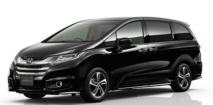

# RCオデッセイに乗ってみた…試乗レポート

📅 投稿日時: 2014-07-12 00:27:48

えー．

ここしばらくですね．

ダイビング日記が続いていたので．

…たまにはちょっと，違うネタを行ってみましょうか…

ということで．

新しいオデッセイに試乗したので，そのレポートをば．

（ホンダHPより）

…RBオデッセイに乗っていた自分としては，

先代までの背の低いスタイルから，一気に背が高くなり，

スライドドアになったオデッセイ．

その乗り心地や，いかに？

と，たいへん気になっていたので．

今回，オデッセイに試乗してきたわけなんですが．

まず，

室内は．

背が高くなったので，十分広くなりましたね～．

少なくとも，エスティマに引け目は感じない

広さになりました．

7人乗りだと，後ろ座席も十分広いし．

3列目はエスティマ同様，たたんだ際に

床下収納できるので，3列目をたためば，

荷物がいっぱい積めるのは嬉しいところ．

フロントシートの着座位置も，思い切って

高くなりましたね～．

…で，走りですが．

…この背の高さのミニバンとしては，かなり

まともな車です．

しっかり作りこんであって，足回りに金をかけてある

ことがよくわかる車ですな～．

エンジンパワーは必要十分レベル．

でも．この車重だと，もう少しトルクがほしいかな…

踏み込むと，CVTが効いて，エンジン回転数が

ぐぐぐっと上がって，それから加速…

というシーケンスになるので．

「もうちょっと頑張れ！」

感がありますが．

一旦スピードが乗ってしまえば，

あとはすごい静かに滑らかに車を

引っ張っていくので．

クルージングにはいい感じのエンジンですね．

スポーツグレード(？)のアブソルートと，

通常グレードのGと，両方乗ってみましたが，

直噴エンジンのアブソルートと

ポート噴射のGのエンジンのパワー差は，

それほど感じませんでしたね～．

アブソルートの方が40kgほど重いので，

わずかなトルク差は帳消しになっちゃったのかな？

ECONモードを切れば，もう少し回転数を

高めに引っ張るので．

きびきび感は増します．

…デフォルトは，ECONモードを切って

走りたいところ．

その場合は，燃費がちょっと悪くなるんでしょうね～．

で．

電動パワステは結構よくできてて，

「これは，油圧か？」

と思わせるでき．

あと．

足回り．

アブソルートの足ですが，

しっかりダイレクトに，路面の凸凹に

ボディがついてきます．

それも，足回りがばたばたせず，突き上げなんかを

一発で抑え込む，しっかりしたダンピング．

しっかり微小ストロークでも，ダンパーが

効いている感じ．

いやー．

やっぱり，ホンダ車．

足はいいなぁ…！

アブソルートの足，硬すぎるっていう人が

いますが．

スプリングレートが高いんじゃなく，ダンパーが

しっかり効いていて．サスが余計なストロークを

せず，突き上げや段差の乗り越えなどで，

余計な揺り戻しやボディの揺らぎがなく，

一発で抑え込んでくれるので．

私はこのくらいの足が好きです．

この足，気に入りました．

ただ．やはり．

車重が重く，車高が高いからか．

ロールスピードは遅いんだけど．

ステアリングを切り込んでいくと

外のタイヤの接地感に，余裕が

なくなっていく感じがします…

RBオデッセイでも思ったけど，もう少し

バンプ側キャンバーを付けた方が

良いんじゃないかしらん？

でも．

ミニバンと考えると，おそらく十分で，

セレナとかステップワゴンに比べると

別次元でよくできた足ですが．

…この車高のミニバンに，このような

足を求める人がどれだけいるのかは，

ちょいと疑問かも…

ちなみに，Gの方の足は．

アブソルートに比べると，ダンピングを

抑えてきた感じで．

いわゆるミニバンっぽい，柔らかい乗り心地に

なってます．

…おそらく，普通の人は，こっちが

「乗り心地がいい」

と表現するんだろうなぁ…

私はアブソルートのしっかりした足は十分

アクセプタブル．

＃運転手以外の同乗者には不満かも

ただ…

この内装は好き嫌いが分かれそう．

あと，操作系周りも，タコメータが

バーグラフ式でみにくいし．

エアコンとかのタッチパネルも

「しっかり見ないと操作できない」という

欠陥があったのが，ちと惜しいところ．

あとは，4WDにすると7人乗りが選べないとか，

燃料タンクが2WDでも少な目の55Lだったのが，

4WDだと50Lとさらに少なくなり，航続距離が

かなり短くなっちゃうってところも，

長距離走行メインの私にはつらいところ．

…それ以前に，ハンドルを握ってワクワクさせる

感じも弱く，ガンガン走って，山道を攻めよう

とかは思わない車だし．←当たり前だ

ちょっと残念ながら，私の購入候補には

のぼらないかな～．

いい車ではあるんですけどね～．

…しかし．

以前はオデッセイに乗っていた身というのに．

レガシィに乗ってからというもの．

もうミニバンには戻れない体になって

しまったかも…

と思った，Skier_Sなのだった．

＃というか，スバル車以外に乗れない体になったか？？
