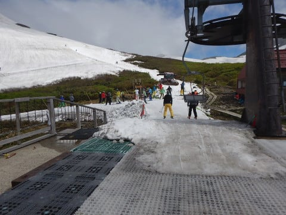

# ご無体！K奈川県から日帰りで月山へ行ってきた…2019/6/9(日)の月山スキー場，速報モード

📅 投稿日時: 2019-06-10 01:59:50

🏷️ カテゴリ: [2019スキー滑走日記](c3e4496fc0fb7f9c17ff21214a35b1ace.md)

というわけで．

行ってきましたよ．

片道500km．

ご無体日帰り月山へ…

深夜1時に出発して，朝7時半に月山到着．

そして，午後1時に滑り終えたものの．

その後いろいろ巡って，帰りの高速に乗ったのは

午後5時過ぎ（涙）

ついさっき帰ってきました…

家を出てから帰宅まで，23時間以上．

活動時間，25時間．

とりあえず，言っておきます．

普通の人は，K奈川県から日帰りで

月山で滑ってこようと思わない方が

いいです←いや，頼まれても日帰りで行く人なんていないから

とりあえず．

本日の月山がどんな感じだったかというと…

とりあえず．

天気は終日曇り～うっすらガス（涙）

時折，日が射しこむこともあったけど．

基本的には曇りの一日でした．

んで．

まだ，リフト乗り場には滑って行けます．

まだしばらくはリフト乗り場まで滑って

行けそうなくらい雪はありましたね…

そして，板を履いてリフトに乗れます！

リフト降り場からゲレンデも，

まだ雪が着いてます！

…が．

明後日，11日火曜からリフトを夏山の

低い位置にかけ替えるようなので．

次の週末は，板は脱いで乗り降りに

なるでしょう…

で，天気が悪かったこの週末．

リフト待ちは最大でこのくらい．

5分待たないくらい．

11時を過ぎると，ほぼ待ちなし！

思ったより空いてました…

沢コースもまだ雪がたっぷりあるし．

トラバースルートもまだ藪が出てきてないし．

大斜面も，まだ結構幅が広く，

コブラインが何本もあります！

いや．

今年のGWごろは，月山は平年並みくらいかな…

と言われていたけど．

現時点では，平年より雪が多い気がします…

ってな感じで．

もう，起きてから25時間以上活動してます(涙）

そろそろ寝ないと，健康に悪いので←そもそも日帰りで1時出発で月山に行って

深夜に帰ってくる時点で身体にいいわけが無い

もう寝ます…

明日詳細レポートやります～！

## 💬 コメント一覧

### 💬 コメント by (Hide)
**タイトル**: なんと・・・
**投稿日**: 2019-06-10 07:41:41

S 様

やはり行かれたのですね。

日帰りとは恐れ入りました。さすがです。

同じK奈川県民ですが、私の思考回路に日帰りというキーワードは持ち合わせておりません（汗）

くれぐれも運転にはお気をつけ下さい。

寝てても走っちゃう車ですから。

### 💬 コメント by (カンタロス)
**タイトル**: Unknown
**投稿日**: 2019-06-10 19:07:58

月山日帰り後にコメント返信して頂けるとは…

気力、体力ともに人間離れしてますね。(笑)

月山には行ってみたいと思いますが東京多摩地区在住の身では、そこまでして滑らなくてもいいか。と思ってしまいます。スキーに、対する情熱の、差ですね。(^_^;)

### 💬 コメント by (Goku)
**タイトル**: Unknown
**投稿日**: 2019-06-10 23:06:36

相変わらずの超人ぶりに脱帽です。

### 💬 コメント by (NorthFox)
**タイトル**: お疲れ様です
**投稿日**: 2019-06-10 23:39:24

往復1000kmのドライブでも十分に過酷なのに加えてスキーとは．．．

まずは無事帰宅されて何よりです。

兎に角、凄い！凄すぎます！このエネルギーの源泉は何のでしょうか。

真似しようとは思えませんがその超人ぶりは羨ましく思います。

### 💬 コメント by (Skier_S)
**タイトル**: シーズン2回，月山日帰りしたことがあったなぁ…
**投稿日**: 2019-06-11 02:54:40

＞Hideさま

行ってきましたよ～！

最近，大体シーズンに1回は日帰り月山に行ってる気がします…

今回は3人で乗りあって，運転も2時間ほど代わってもらえたので

助かりました…

＞カンタロスさま

帰ってきたあと，やはりBlogをちゃんと更新しないと

いけないので(笑)．

死にそうでしたが…

一度月山は行っておいて損はありませんよ．

この時期なら，サクランボ狩りもできますし．

さくらんぼ狩り，結構楽しいですよ！

＞Gokuさま

滑らないと死んじゃうので…

日帰り月山も死にますが，

同じ死ぬならスキーに行って死んだ方がまだ救いがあります(なんのこっちゃ）

＞Northfoxさま

そうですよね…

普通1000km運転だけで一日終わっちゃいますよね．

でも．

滑らないと死んじゃうので…

それがエネルギーの源泉でしょうか．

しかし，今日の仕事はつらかったです…（涙）

