# 2010年7月，2歳の子連れで座間味でダイビング！その8…2日目の夜は，サバニレース前夜祭！

📅 投稿日時: 2021-10-03 00:04:42

🏷️ カテゴリ: [ダイビング日記](ce3a7a8d424d112fce83ee85c81a0e344.md)

ってなことで．

やっぱり，カメラは今日も残念な結果に

終わった二日目のダイビングも終わり．

宿に戻ると…

ペンション高月さんはダイブショップも

兼ねているので，宿のテーブルで

ログづけタイムです．

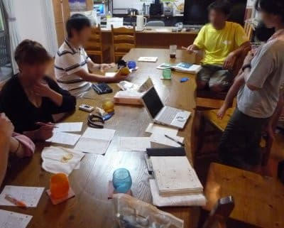

娘も母親に抱っこされて，ログづけに

参加してますが…

今から考えると，この時から英才教育

だったのかも？

で．シャワーを浴びると，夕食タイム！

今日も結構盛りだくさんのご飯です．

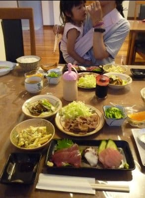

そして．

夕食を食べ終わったあと．

宿の主人から

「今晩，港でサバニレースの前夜祭をやるよ」

ということを聞いたので，娘を連れて

港へ出かけてみました．

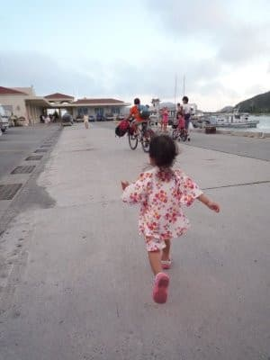

サバニとは…

鯖を煮たやつじゃなくて．

沖縄の伝統的漁船で，帆をつけて

風と櫂の両方で進めるように

なった小舟．

有名な沖縄ハーリーは手漕ぎ

オンリーの舟ですが，

このサバニは帆も使うところが違います．

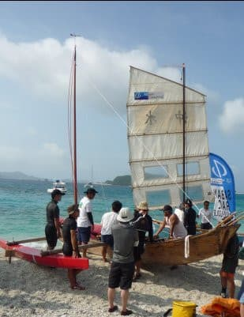

（サバニってこんな舟）

で，数人程度が乗る小さな船で，座間味から

那覇までの時間を競うというヘビーな

レースが明日開催されるようで…

実は，このときが一番座間味の観光客が

多い時期みたいです．

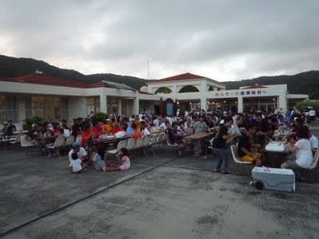

前夜祭の会場の港に行くと，レースの

参加者や，座間味のかなりの人が

集まっているみたいで，

かなりにぎやかに盛り上がってます…！

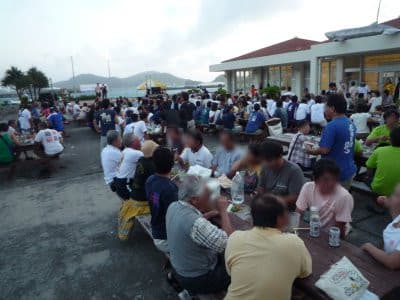

特設ステージがあり

歌やら沖縄民謡やらが演奏されてましたが．

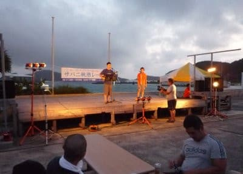

夜が更けてくると，ステージの周りに

人が集まり，参加者やサポーターが

盛り上がってきて，大勢踊ってました…

さすがノリがいい…！

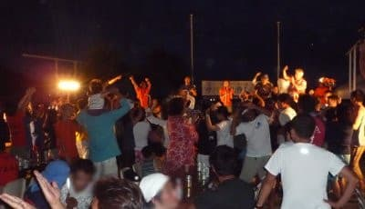

この賑やかな踊りの中…

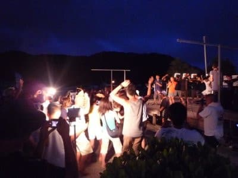

その群れのはずれで踊っていたわが娘．

地元のTVの取材やら何やら，大量の人が

ウチの娘を撮影していました（笑）

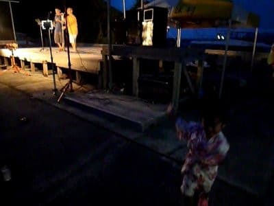

娘，親が教えたわけではないのに，

本能的に踊っているけど…

やはり，踊りってのは人間の本能

なんだろうか？ 

ってな感じで．

夜遅くまで続きそうな前夜祭でしたが．

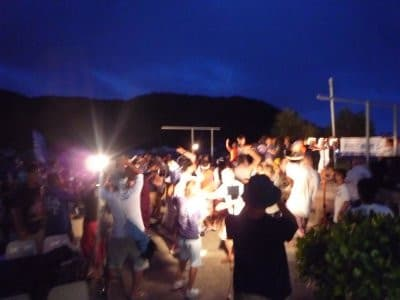

夜9時近くになると，娘もさすがに

眠そうだったので，

お祭り会場を抜け出して．

宿に戻って，ぐっすり眠ったのでした．
