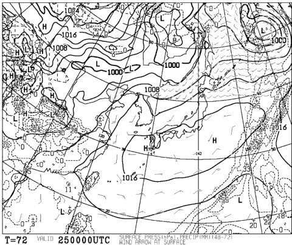
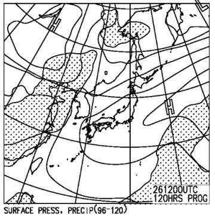
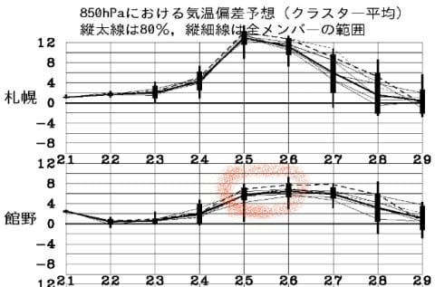
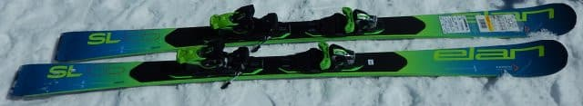
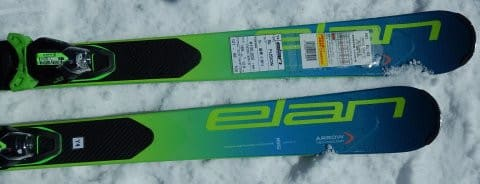
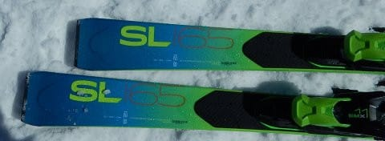
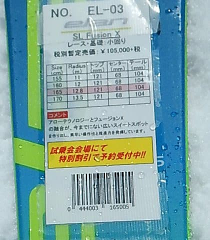

# 今週末のかぐらも土日とも晴れそう！すごい気温が上がるけど（涙）…そして2020シーズンモデルのスキー板，試乗レポート…ELAN編その1

📅 投稿日時: 2019-05-23 01:03:13

🏷️ カテゴリ: [スキー板試乗](c0bd8048615710cee890e403a36cc9a2b.md)

ってなことで．

まだまだスキーシーズンが続いてるわけですが．

…ええ．

続いてます．

続いてますよ．

まだ終わってませんよ～！！（強調）

…だもんで．

スキーシーズン水曜深夜定番の，

スキー場天気予想をやるわけですが．

…この時期，いつも気になるのが．

今週末のスキー場の天気を気にする人が，日本に

何人いるんだろう…

とりあえず．

25日，土曜日の地上天気図を見ると．

見事に高気圧に覆われているので．

土曜は終日晴れますね…

見事に晴れます．

26日，日曜の地上天気図も，

しっかり高気圧に覆われていて．

網掛けの降水域は，まったく日本に

かかっていないので，日曜も

すっきり晴れになりそうです！

で．

この時期のスキー場の予想は．

雨が降らないと分かれば，大体の

目的は果たしているわけですけど．

…まぁ，追加情報として，気温がどうなるかを

見ておくと…

…

…うげげげげっ！！！

25，26日．

なんだか，めちゃくちゃ気温が上がり

そうなんですけど！？？

赤く印した25，26日のところ．

平年比+6℃くらいの予想なんですが…っ！！

これは．

かぐらでも，最高気温は20度近くまで

上がりそうな予感…

もう，夏スキーかと思うほど暑く

なりそうで．

気温が上がるので，この土日で一気に

雪が解けちゃいそうですね…

土曜の方が，日曜より雪のコンディションは

いいでしょうねぇ…

…ってことで．

ここで終わってもいいんですが．

天気予想だけじゃちょっと寂しいので．

本日はおまけにスキー試乗レポートも

載せます！

なんてゼイタクな2本立て！！

今回は，エラン編．

…なんですが．

この板．どうも正しい性能を見切れない

コンディションだったという，ちょっと残念な

感じだったので．

天気予想とくっつけて，2本立てにしてしまいました…

では，どうぞ～！

○ELAN SL FUXION X 165cm

基礎小回り

説明書きには，レース・基礎小回りって

なってるけど…

この板，レースに使うレベルではない気がする…

ガチのレーシング板のSLX Worldcup，

その次にレーシングセカンドモデルを兼ねる

基礎小回りのSLXフュージョンがあって．

さらにその下のモデルとなるこの板．

張りがそれほど強くなく，

板自体もかなり軽く，

履いた感じの足元の軽さもあるので．

クルクル回せる感じがします．

というか，どっしりした安定感というより，

ちょっと板がキョロキョロする感じの

頼りなさを感じます…

まぁ，これまで試乗してきた小回り板が，

過激なグリップ力をもったものばかり

だったので，ちょっとそれらと

比較するのは間違ってますが（笑）．

とりあえず，安定感のあるガッツリグリップ

というより，動かしやすさ，優しさをもった

ライトな感じの板です．

ただ…

どうもこの板，エッジのチューンがおかしかったのか．

板の張りが弱めなのに，硬い雪では妙に

エッジだけがカツンと引っ掛かり，

動かしたい方向に動いてくれず，

雪面にどうしようもなく引っかかる感じがします…

柔らかい雪面では，板の軽さと

柔らかさゆえに，簡単にずらせて

…というか，ずれてクルクル回りすぎるほど

回るのに．

斜面が硬いところに来ると，カツンと

引っかかって回らなくなるので．

ちょっと怖くて滑れない感じ…

うーむ．

おそらく，エッジチューンがちょっと良くない

状況だったんだと思います．

エッジが立ちすぎた上に，多少ビベルも足りなかったのか…

もう少しエッジのコンディションがまともな状態で

試乗しないと正しく評価できそうにないですが．

とりあえず，グリップは優しくて，簡単にクルクル

回る板っぽいことだけは感じました…

うーむ．

試乗板にこんなエッジ仕上げの板が混ざっていると，

ちょっと惜しい感じ…
