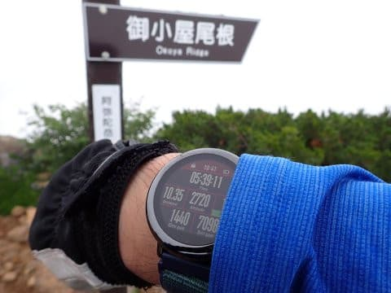

# 八ヶ岳の阿弥陀岳・赤岳ピストン登山！その8…2度目の阿弥陀岳へ！

📅 投稿日時: 2022-10-09 23:06:28

🏷️ カテゴリ: [登山・旅行](c1d637a11a25b457ac978d197adbdafc5.md)

えー．

10月7日なので，一昨日になりますが．

焼額スキー場のホームページで，公式に

焼額限定シーズン券情報が出ました！

（[焼額山スキー場ホームページ](https://www.princehotels.co.jp/ski/shiga/informations/seasonpass202223/)より）

ふむ．

大人通常価格55,000円，

10月31日までの購入で早割の46,000円

ですか…

うーん．

焼額＆奥志賀のヤケオク券が，早割で

60,000円と考えると…

なかなか微妙な値付けですが．

焼額限定券なら，

ナイターも早朝も滑りたい放題（ファーストトラックはダメだけど）

と考えると．

意外と焼額限定券，お得かも…？？

…私は2月以降利用可能なセカンドシーズン券が

今シーズンも出るようなら，昨シーズン同様，

早朝＆ナイターだけのために買っちゃうかも…

ってなことで，本題へ．

今日は，しばらく中断していた阿弥陀・赤岳

登山レポートです！！

ーーーー

とりあえず．

中岳を下りて，阿弥陀岳へ登り返す

中岳のコルまで下りてきたものの…

目の前まで迫ったのに，阿弥陀岳が

ガスで見えない…

でも．

視界はそれほどひどくなく．

登山道はしっかり見えるので安心．

…阿弥陀岳に登る激烈急斜面，

見えなかったら怖いから…

ってなことで．

ここからが今回のルートで一番体力的に

厳しい，阿弥陀岳への登り返し．

スタートです…！

最初は鎖をサポートに，必死に急斜面に

貼りつきながら登っていきます…

そして，途中からは手足を使って

よじ登っていくような斜面だとか…

岩場ならまだ手がかり足がかりがあるけど，

足元が土で，滑り落ちそうなところを

這いつくばりながら登ったり…

途中で緩くなって気が抜ける斜面無しに，

こんな斜度をひたすら上り続けること

20分．

最後はこういうところをよじ登ると…

今日2度目の阿弥陀岳山頂へ到着です！！

いや…

しんどかった．

目的地に着いた後の帰り道で，

この急登は精神的にも肉体的にも効く…

阿弥陀岳に2回登るルートは，

計画を間違えた

としか言いようがないですね（涙）

とりあえず，阿弥陀岳山頂の

到着時間は10:32．

中岳山頂から30分，

赤岳山頂からはコースタイム1時間40分

のところ，1時間ちょうどで

阿弥陀岳に登り返しましたが…

阿弥陀⇒赤岳に登って体力を使った後の

赤岳⇒阿弥陀の登り返しで，かなり体力を

消耗したので．

まだ山頂で休憩してから1時間しか

経ってないけど，ここで10分間ほど休憩…

休憩後，10:41に，御小屋尾根に向かって

下山スタートです！

