# 2012年　子連れモルジブ　ダイビング旅行記　その2

📅 投稿日時: 2012-10-10 00:06:53

🏷️ カテゴリ: [ダイビング日記](ce3a7a8d424d112fce83ee85c81a0e344.md)

モルジブ・マーレ国際空港には着きましたが．

移動はまーだまだ続くのだ．

今度は，水上飛行機に乗って．

マーレ環礁からバアァ環礁まで，約1時間の移動です．

空港内の水上飛行機のチェックインカウンターで搭乗手続き．

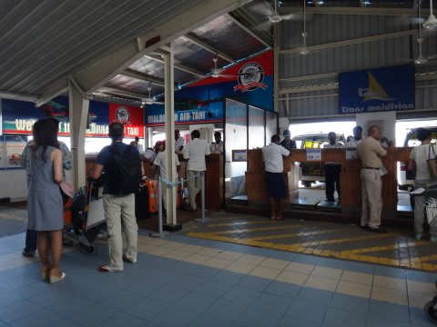

…この水上飛行機．

バックパックなんかも，よっぽど小さくないと機内に持ち込めません．

んで，荷物が一人20kg超えると，しっかりエクセスチャージ取られますんで，

ご注意をば…

我が家は．子供を含めて3人．60kgまでOKだったのでセーフでしたが．

他のダイバーは，ほとんどがエクセス取られてましたね～．

で．チェックインが終わったら，今度はバスで水上飛行機乗り場へ移動．

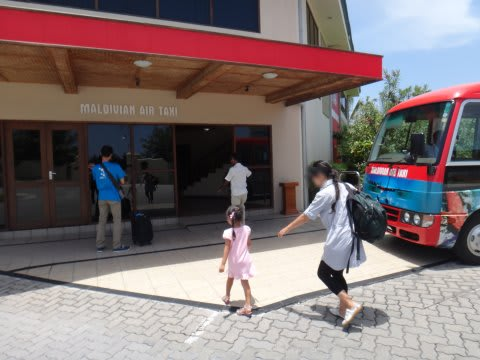

…昔は，空港ターミナルビルから，空港の反対側にある水上飛行機乗り場まで．

バスで滑走路を横切っていく(!)という．

世界で類を見ないエキサイティングな移動をしましたが．

今はさすがにそれはなくなったのか．

滑走路を大きく迂回しての移動で．

うーん．ちょっと残念…．

水上飛行機乗り場では，

ロイヤルアイランド専用のラグジュアリーな待合室で，飲み物サービスを受けて…

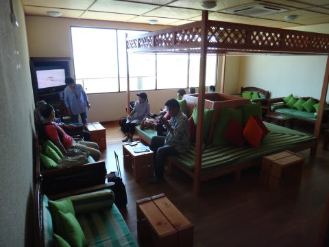

飛行機へ向かいます．

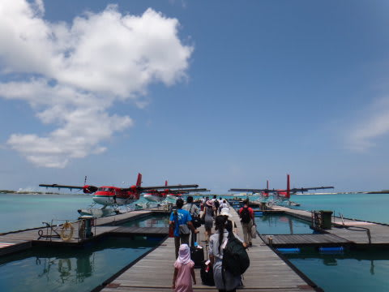

もう，海と飛行機という，娘の好きなものが揃っているので．

娘は超大はしゃぎ．超ハイテンション！

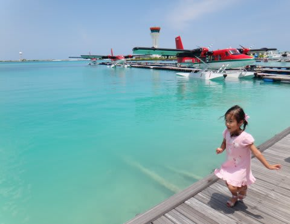

娘　「防水飛行機，ボースイ飛行機乗ろうよ～！」

私　「…娘．それは，『水上』飛行機だよ」

なぜか．

水上飛行機を，防水飛行機だと覚えてしまっている娘…．

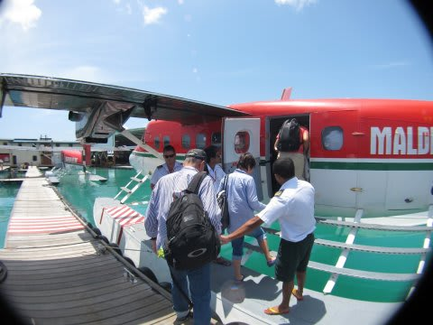

飛行機は，かの名機．DHC-6ツインオッター18人乗り．

陸上版は，かつて沖縄離島便で飛んでたなぁ…波照間とか，大東島とか…

どーでもいいけど．

この飛行機のパイロット，裸足で操縦しているんですけど…

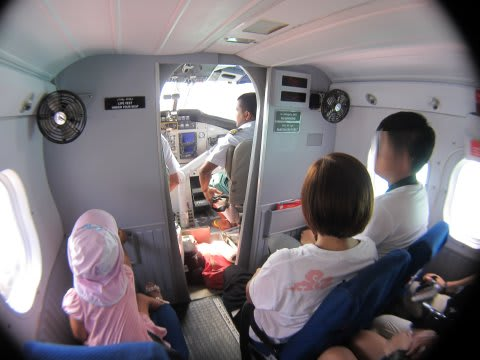

ということで．

桟橋を離れて水上を滑走し…

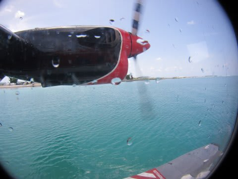

離陸！

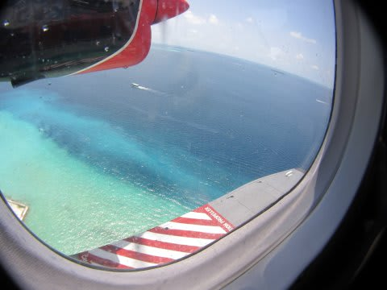

いやー．

景色がきれいだわー

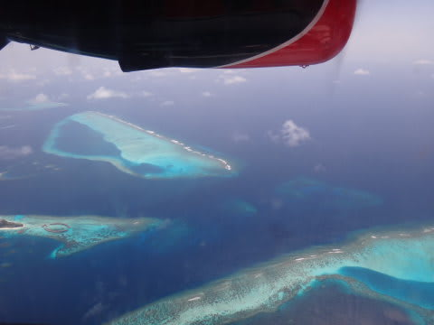

モルジブのマーレ環礁だと，空港に到着したら船でリゾートまで移動だけど．

この飛行機に乗るだけのために，バアァ環礁に行ってもいいくらい．

＃この飛行機に乗っただけで帰るのはいやだけど

とりあえず．

飛行機好きの娘は，かぶりつくように景色を見てます．

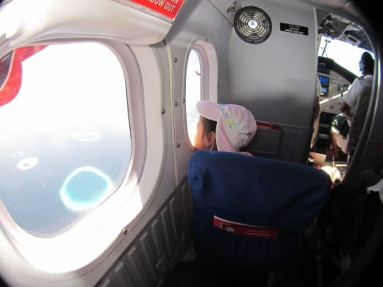

前回モルジブに来たときは，まだアナログだったコックピット．ハンディGPSをナビの補助に使ってたけど…

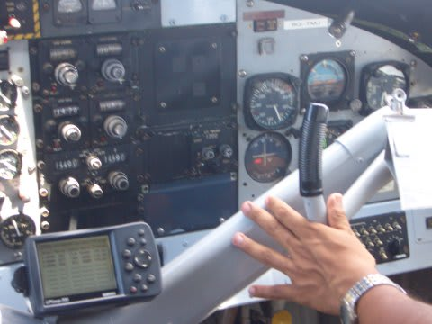

(6年前の写真)

今回はカラー画面のGPSがちゃんと航法計器として組みこまれて，

ADIとHSIがデジタル化されているのに驚き！

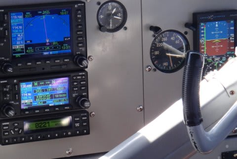

＃IAS125kt，4400ft, MLEのラジアル337°アウトバウンド，HDG343°

で．30分ちょっと飛んだら，もうバアァ環礁が見えてきて，

高度を下げ始めました…

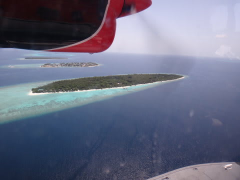

そして，着水！

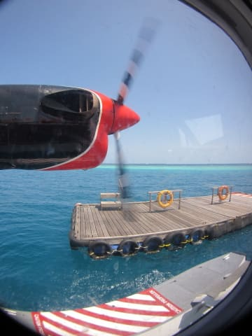

飛行機は，小さな浮き桟橋へ接岸します．
