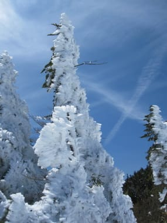

# 5月12，13日の志賀高原の熊の湯は…真冬か？

📅 投稿日時: 2012-05-15 02:37:01

って感じで．

この週末も志賀高原に行ってきたわけですが．

一言で言うと

超Goodでした

…寒かったんですよ．

かなり．

なぜ，この時期の昼間に氷点下？？

って感じで．

さらに雪が積もって，コンディションは最高だったという…

まず．土曜の朝．

熊の湯ホテルからゲレンデに向かう道にすでに積雪が…

昨日からこのくらい積もってるってことですね．

で．リフトに乗ってみたんですが．

…

…なんだか．

リフトも木々も凍り付いてるんですけど…

…えーっと．

今，何月でしたっけ？

気温は昼間も0度を上回らなかったんじゃないでしょうか．

昼間は雪が降り続け…

時折かなりの勢いで降ります

えーっと．

確か，今は5月中旬だったと思ったんですが…

かなりの冷え込みのため，ゲレンデ上部，馬の背付近は

キンキンに冷え込んだアイスバーン．

そして，中間点から下の緩斜面部分は…

なんか，いい雪質の雪なんですけど．

結構粉雪なんですけど．

えーっと．

今，5月中旬ですよね？？

おかげでゲレンデは一面真っ白となり…

とても5月と思えない上々のコンディション．

えーっと．

ゲレンデ状態は，3月よりいいんですけど．

今，3月でしたっけ？

ゲレンデはオガサカキャンプの参加者が多かったですが…

コース幅も十分広かったので，それほど気にならず．

リフト待ちも，キャンプ参加者が集中する一瞬を除いて，

ほとんどなし．

午後からはうっすら日がさすこともあり…

しかし気温はしっかり一日氷点下キープで，

この日は朝から夕方まで丸一日．

とても5月中旬とは思えない，最高のバーン状況で

楽しめたのでした．

で．

あけて日曜日．

この日は朝から晴天！快晴！

なのに，早朝は気温マイナス5度…

リフトも凍りついたまんまです．

えーっと．

今日，5月中旬だったよなぁ？？

昨日の夜も雪が降り続いて，新雪が積もってます．

そのため，冷え込んでも裸のアイスバーンではなく，

新雪が圧雪されたシマシマバーンっ！！！

…えーっと．

今，5月中旬ですよねっ？？（しつこい）

でも．

でも．

最高！

GWを過ぎて，誰がこんなきれいで雪質がよい，

氷点下の新雪圧雪斜面を滑れると思ったか！

生きててよかった…（感涙)

北アルプスもきれいにみわたせるこんないい天気の中…

こんないい雪質で滑れるなんて．

シ・ア・ワ・セ（はあと）

シアワセの早朝スキーを終え，通常営業時間に入っても，

しばらくは雪が緩まず．

午前10時ごろまでは，結構いい雪質をキープ．

ただし，10時を過ぎるとちょっと雪がやわらかくなってきたかな…

ゲレンデ外の部分は雪が解けて土が顔を出してきました

残念ながら，昼前には板に張り付く，普通の春の

雪に戻ってしまいました…

しかし．

5月中旬にはありえない，晴天＆冷え込み＆新雪圧雪という

奇跡のコンディションだった午前中が滑れただけで満足…

…しつこいようだけど，5月中旬の写真と思えない…

とりあえず，超スーパーウルトラエクストリームGoodな

この週末でした．

また来週，こんな感じだとうれしいなぁ…

＃絶対ありえないですから

PS.

木曜から凍結で通行止めになった志賀草津道，日曜午前中に

オープンしたようですが…

一部こんな感じでした．

えーっと．5月中旬ですよね？？？（だから，しつこいってば）
