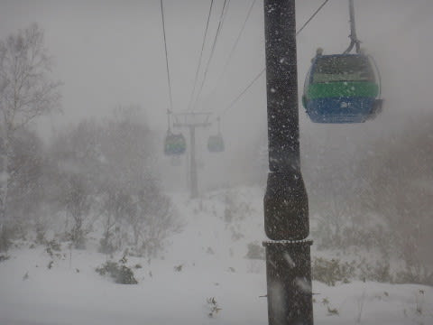
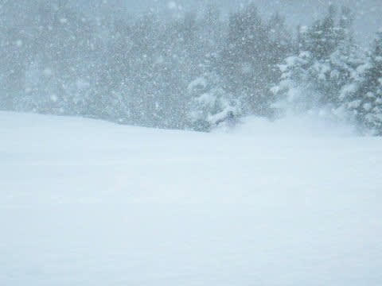
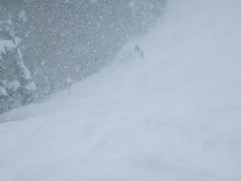
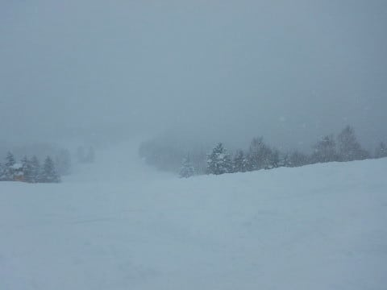
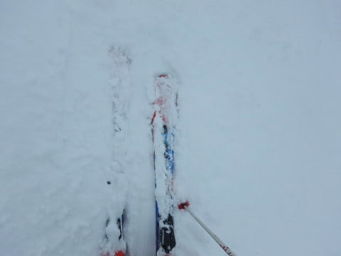
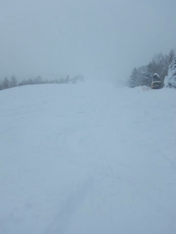
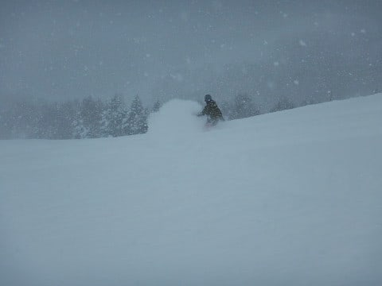
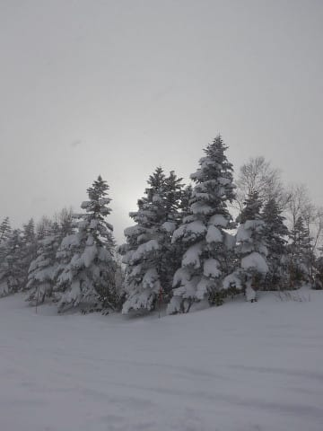

# 12月17日（日）の志賀高原速報モード…朝は積雪30～40cm，終日激寒で雪降りの一日

📅 投稿日時: 2017-12-18 00:11:52

というわけで．

本日もいつも通り，焼額でリフトストップまで

滑ってきたわけですが．

帰宅はいつも通り夜遅いので（涙）

日曜定番の，速報モードにて…

えー．

まず．

朝．

積もってます．

　昨晩からの積雪は10～20cm．

と予想した通り，新雪が20cmほど積もってます！

予想の多いほうが当たった感じで．

これは，ゲレンデはパフパフが期待できるか？？？

と．

激しく雪が降り続ける中．

オリンピックコースに出てみると…

ををを！

ひざパフ！

積雪40cmほどあるかも？？

結構軽いパフパフだぁ！！

…

と．

一見すごいいい新雪っぽく見えるのですが．

大変残念なことに．

この新雪の下地は，カリカリに固まった凸凹

バーン（涙）．

新雪の下に隠れた見えない硬い突き上げを食らって，

ちょっと難し目のバーンでした…（残念）．

でも．

終日雪降りだったこの日．

…というより．奥志賀は風のため全面運休

になるほどだったんですが．

北風だと風下になってそれほど荒れない

焼額は，運休どころか，ゴンドラが減速することもなく．

そんな状況の中，雪がドサドサ降り続けるので．

終日エンドレスパウダー提供状態で．

午後になっても，圧雪バーンで

新雪パフパフ状態！

そして…

午後はゴーストタウン状態となり．

滑る人が少ないので，

オリンピックコースは，午後になっても

パフパフ！

…下地が硬くて難しかったので，誰も

滑らなかったという説もありますが…

でも．

雪不足の2シーズン前では，シーズン最後まで

これより雪が少なかったくらいなので．

12月でこれは，恵まれすぎでしょう！

とりあえず．

午後には雲が薄くなるタイミングもあったものの…

午後まで雪が降り続け．

おかげで，午後のGSコースなんかは結構荒れた

感じになったりもしたけど…

昼間も-10℃程度だった，激寒の一日で．

終日軽めのパフパフが楽しめ．

超ガラガラで．

いやーーー．

今日もまた，楽しかったな～！！←だから，あなたはどんなコンディションでも

楽しいんだから，普通の人の参考にならない気が…

とりあえず，明日，また詳細レポート

します～！←いや，これで十分詳細だから…

## 💬 コメント一覧

### 💬 コメント by (olaf2125)
**タイトル**: Unknown
**投稿日**: 2017-12-18 08:01:35

土曜と打って変わってかなり厳しいコンディションだったようですね。

土曜はあの後、赤い軍団を避けて徘徊してたら結局お会い出来ずになってしまい失礼しました。

また年末おじゃまします。よろしくお願します。(^O^)

### 💬 コメント by (れお)
**タイトル**: 昨日もありがとうございました!!
**投稿日**: 2017-12-18 12:13:43

昨日はよく降りましたね～

来週は志賀行けずですが、もしコンディション良かったら私の日頃の行いかも…。

次は、年末に志賀予定です～。

またよろしくお願い致します～

### 💬 コメント by (seeker_NT)
**タイトル**: とても楽しかったです
**投稿日**: 2017-12-18 18:00:51

半日以上ご一緒させて頂きありがとうございました。

あのモオモコの中を滑りぬけるのは結構スペクタクルで楽しいと思ってました。そんな中、ずっとSさんについて行こうと懸命に滑ったおかげで、随分と切れが戻りました。

　ちなみにSXだらけだとゴンドラでスキー間違えちゃいますね。(間違える迂闊な奴は私だけか・・・)

### 💬 コメント by (Skier_S)
**タイトル**: 今日もご無体時間…
**投稿日**: 2017-12-19 06:29:04

＞olaf2125さま

私はあの日はオリンピックコースを

攻め続けてました…

ぱふぱふ楽しかったですよ！

次は年末ですか．

また焼額でお会いしましょう！

＞れおさま

いやーー．

12月と思えないパフパフでしたね～！！

この週末はいらっしゃらないのですね．

だとすると，この週末が晴天ピカピカ

間違いなしかも（笑）

また年末お会いしましょう～！！

＞seeker_NTさま

こちらこそ，ありがとうございました！

楽しかったです…

しかし．

私の方がseeker_NTさんについて行くのに

必死だったんですが…（笑）．

いや，すごい速いし，さすが本格トレーニングを

した方は，スキーの安定感半端ないと思いながら，

置いてかれまいと必死について行ってました…

でも，楽しかったですね，あのオリンピックコース！

またご一緒させてください~！

