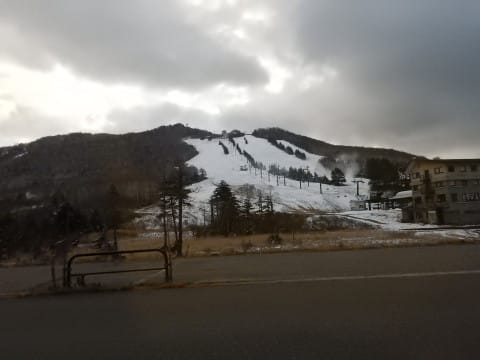
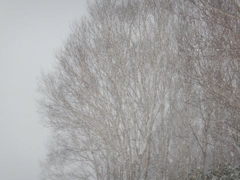

# 2018/12/1(土)の焼額スキー場は…曇り時々雪．雪は微妙な感じだったけど，そんなに混まなかったよ

📅 投稿日時: 2018-12-02 00:11:22

🏷️ カテゴリ: [2019スキー滑走日記](c3e4496fc0fb7f9c17ff21214a35b1ace.md)

ということで．

今シーズンも，ついにわがホームゲレンデ，

志賀高原の焼額山がオープンしました～！

…ってことで．

今シーズン初のホームゲレンデを滑ったわけですが．

普通なら，ホームゲレンデを滑ると

「あぁ，本格シーズンが始まったなぁ…」

と，しみじみと思うものですが．

…今日は全くそんなことはありませんでした(涙）

コース幅が狭めだし，

ペアリフト1本しか動いてないし…

なんだか，まだ全然焼額を滑っている感が湧きません(泣）

…とりあえず．

本日がどんな感じだったか，レポートしますと…

まず．

サンバレーまでの道路は全く積雪もなく．

そして…

サンバレーの積雪，先週より減ってないですか？（涙）

蓮池を超えてから，路面にところどころ

積雪が出てきましたが…

…本日オープンの高天ヶ原は．

積雪が…

積雪が足りない感じですね（ちょっと涙）

で，一の瀬ファミリーはこんな感じだったので．

…これは，事前の通知通り，オープンするのは

無理な積雪だわ…

と思っていたら．

なんと今朝突如，

一の瀬ファミリーペアA線の営業が決まったそうで．

本日，一の瀬のペアリフト，動いていたようです…

「営業しない」というアナウンスがされていたため，

ガラガラだったようですが…

そして．

一の瀬ダイヤモンドはまだ禿山だし．

焼額の唐松コースも…

全然ダメだ（涙）

第2高速が営業できるのは，いつだろう…(泣）

ってな感じで．

焼額に着くまでに，かなりガックリさせられる

景色を見せられての到着だったわけですが．

焼額の積雪，公式発表は30cmですか…

でも，リフト乗り場の周り．

全然雪がないね（泣）

リフトに乗って，コースを見てみたたところ…

乗り場付近は，ちょっとコース幅が狭いものの…

とりあえず，上部の方のコースは，

ちゃんと雪がついているようで，一安心…

山頂付近は，まぁまぁの幅かな．

山頂付近，一見コース幅いっぱいに雪がついているように

見えますが．

コースの端の方は，人工雪が薄く，

ちょっとブッシュが出ています…

とはいうものの．

朝イチは，ちゃんとシマシマバーンが

お出迎え！

…でも．

完全人工雪なので．

ちょいと硬めです(涙）

滑ってると，氷のコロコロもお出ましになり．

ちょいとかっ飛ばすには厳しなのが，

残念…

リフト待ちは，朝イチはこのていどで．

もっと混むのを覚悟していたところ，

ちょっと拍子抜けする程度のすき具合．

待ち時間ピークだと，こんな感じで

数分待ちになり．

ゲレンデの人口密度も高めだったけど…

スキー場開き祭がホテル内で始まると．

そのイベントを見に行く人が多かったのか，

ちょっとずつ人が減り始め…

（ホテルのスキー場開き祭会場からゲレンデを覗くおこみん）

そして．

スキー場開き祭のフラッグ滑走やら，

大蛇のデモンストレーション滑走などが

ありましたが．

午前11時に抽選会が始まってからは，

かなりの人がそちらに行ったらしく，

リフトががら空きになり．

このまま，午後までずっとほとんど

待ちなしでリフトに乗れた感じでした！

うむ．

雪はちょっと残念だけど．

リフトがガラガラなのはうれしいので，許す←だから，なんでいつもそんな上から目線？？

そして．

昼頃になると．

なぜかゲレンデを時折ガスが覆うようになり…

さらになんと．

雪が降り始めて来ました！

小雪が舞うかも？？？

と予想してましたが．

それよりは強い降りですね…

ゲレンデには，うっすら雪も積もり始め．

「ぱらつく程度で積もらない予想だったけど…

　…これは，予想外したか？？」

と，ちょっとドキドキしたけど．

…残念ながら，やはり予想通り，

1～2cm程度しか積もりませんでした（涙）

…こういう予想は外れてくれた方がうれしいのに…(残念）

で．

本格積雪があるほどではなかったので．

午後2時ごろになると．

大勢が滑って，雪が削れて荒れてきた，

落ち込みの急斜面部分．

雪が薄くなって，ブッシュが出てきた

ところや…

雪が剥げて，下の氷が出てきたところなんかが

あり．

コースも全体に荒れ気味で，

ちょっと滑りにくくなってきました…（涙）

とはいうものの．

日が陰りだす，午後3時を過ぎてくると．

ゲレンデの人は一気にいなくなり．

好き放題のラインで飛ばせる，ガラガラ

ゲレンデになりました～！

うむ．

Yetiのナイター一番飛び込み以来の，

ガラガラゲレンデを満喫できましたよ～！！

（ゲレンデは荒れてたけど（ちょい涙））

ということで．

ゲレンデはちょい硬めで，昼頃には結構荒れてくる

バーンコンディションでしたが．

一日気温は氷点下の冷え冷えで，雪が緩むこともなく．

なんにしろ，リフトが混んでないのが良かったかな…．

…でも．

明日は気温がぐんぐん上がりそうだから．

昼頃には，かなり荒れ荒れバーン状況になりそうだなぁ…

とりあえず，明日も焼額滑ってます～！

## 💬 コメント一覧

### 💬 コメント by (はっち)
**タイトル**: Unknown
**投稿日**: 2018-12-02 07:30:10

お疲れ様でした。

気持ちよく滑れたのは朝の2〜3本まででしたね。妻は昼過ぎにはヘロヘロになっていました。

「いよいよシーズンイン！」と大きなな声で言えないのが残念ですね。

### 💬 コメント by (michi)
**タイトル**: 昨日はありがとうございました(^^)
**投稿日**: 2018-12-02 09:37:30

昨日はご一緒させていただきありがとうございました。息子も楽しかったようです。最後までお付き合いできず娘さんには悪いことをしましたね。次回はもっとたくさん滑りましょう。

また宜しくお願いします！

### 💬 コメント by (Skier_S)
**タイトル**: 今日も深夜帰宅
**投稿日**: 2018-12-03 02:33:47

＞はっちさま

この週末はお世話になりました！

今日はあさイチはかなり気持ちよかったですね～．

来週は，金曜日の雪でゲレンデが良くなっていることを期待…

しかし，あのベストを着てらっしゃらないはっちさんは，

すぐに認識できないことに気づきました(笑)．

＞michiさま

土曜はお世話になりました！

娘も喜んでいました．ありがとうございます．

今日は，もりやさん一家とリフトストップまで子供3人爆走状態でした…

12月15日の週末は，ぜひ娘と一緒にリフトストップまで…(笑)

