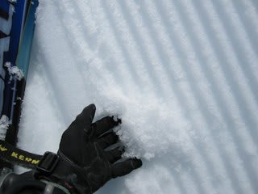
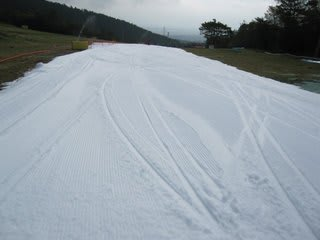
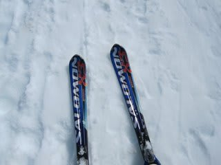
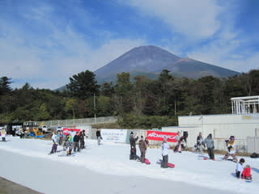
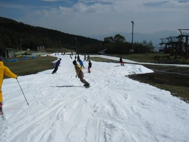
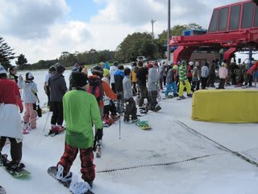
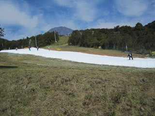
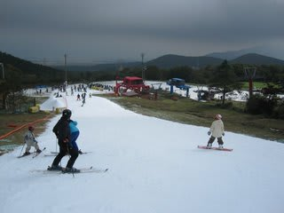

# 10月16，17日　Yeti

📅 投稿日時: 2010-10-18 00:48:11

気温：10度～15度

天気：晴れ！！！

雪質：アイスクラッシュなので…

積雪：コース内は十分

リフト：最大7分

路面：ドライ

この土日．

シーズンインしてきました．

そうです．初すべりです．

今回行ったのは日本一早くオープンするスキー場，

静岡県の富士山麓に位置する，Yetiです．

雪は，当然自然雪なわけが無く，アイスクラッシュシステムの雪．

つまり，巨大冷凍庫で作った雪をばら撒いたもの．

でも．

この時期．

まだ10月中旬，昼間は半そででも過ごせる時期に．

屋外で．

約1kmの長さがあるリフトを使って．

冷たい雪の上で滑れるのは．

感動を通り越してます．

感激です．

実に．

実に，6月末の月山以来，3ヶ月と25日ぶりのスキーです．

帰ってきたよ～

ゲレンデに．

短いようで長いシーズンオフだった…

物心がつく前から，30年以上スキーをやってきた私ですが．

シーズンオフが4ヶ月を切ったのは初めての経験．

例年なら，シーズン前1ヶ月くらいから，

スキーに行きたくて仕方なくなり，スキー板の手入れやら，

スキーのビデオを見たイメージトレーニングなどをやって

シーズンに向けての気持ちが高まって行くところですが．

今シーズンはそんな気持ちが高まる前に，

シーズンに突入してしまいました．

日本一早くオープンするYetiですが，

首都圏からも近く，それだけ混むだろうし，

斜面が緩いとか，

ボーダーがほとんどでスキーヤーは絶滅危惧種とか，

いろいろうわさがあったので，これまで行かずに

いたのですが．

今年はなんかリミッターが外れて，ついに禁断の

Yetiに行ってしまいました．

ああ．

ついに行ってしまったか…

＃人間としてすでに終わっているお前が

＃いまさらYetiに行ったところで…という

＃意見に対して私も反論できませんが

しかし．

意外にもいいスキー場でした．Yeti．

富士山も見えるし．

緩いって言われるけど，シーズンインの基本練習には

ちょうどいい斜度だと思う．

ボーダーが9割でスキーヤーが1割．

スキーヤーは滑りにくい，って言われるけど．

ボーダーは基本的に滑走スピードがゆっくりなので，

レーサースキーヤーが多いスキー場より

人間の回避は楽だし．

リフト待ちも，滑れるコースは1本だけど，

リフト待ちが5分を越えたあたりでクワッドと

平行にかかっているペアリフトを運転してくれたので，

それ以降は最大3分待ち（ペアリフトは待ち時間常に0)

という状況だったので，丸沼や軽井沢に比べれば

ずーーーーっとまし．

それどころか，1本のコースが長いので，20分まって

1分かからず滑ってしまう軽井沢よりいいぞ．

コース幅は狭いけど，11月中旬まで，どこに行っても

こんなもんでしょう．

フォト

さらに．

この時期にナイターをやっており．

一日件でナイターまで滑れてしまう．

すばらしい…

なんにしろ，10月中旬に滑れるんですよ．

もう，それだけで許す．

何もかも許す．

混んでても許す．

コース幅狭くても許す．

滑れるだけで幸せ．

スキーって，こんなに楽しかったんだ～！！！！！

って，幸せに浸れます．

大変満足．

今シーズン，シーズンオフが短かったからか．

例年のシーズンインで感じる違和感がほとんど無く．

いつもなら感じる，

「スキーって，こんなに曲がらないものだったっけ？」

「あれっ！？板ってこんな動きするんだったっけ？」

という感じが無く．

いきなり昨シーズンの感覚そのままで滑れたのが

感動．

1本目から，まるで先週までスキーで滑ってたかのように．

思い通りに谷側に体を落としこんで谷回りを作っていけたという．

人生初めての体験…

今シーズン，調子良さそうです．

というわけで．

今シーズンもついにスタートです．
