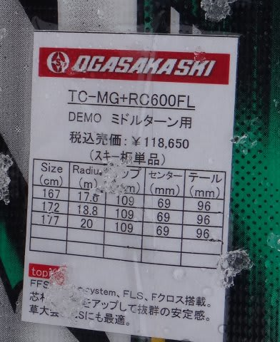

# 2014シーズンモデルのスキー試乗レポートその10…OGASAKA編つづき

📅 投稿日時: 2013-04-17 00:47:32

🏷️ カテゴリ: [スキー板試乗](c0bd8048615710cee890e403a36cc9a2b.md)

えー．

またまた，試乗レポートの続きです．

今日もオガサカ編．

今回は，技術選向けモデルの，TCシリーズです～

-----

OGASAKA

TC-MG + RC600FL 172cm

昨年のTC-MVは，割としなやかなフレックスが作り出すたわみに乗って，

中回りができる板だったけど…

今年のMGは，去年よりかなりフレックスが強くなった感じ．

踏んでいった時の踏み応えがしっかりして，かなり強い板に感じます．

フレックスが結構強いので，板なりに滑っていくとあまりたわまず，

大回りになります．

まぁ，R=18.8と結構大きめなのもありますが，172cmという長さよりもっと長い板に感じます．

普通のゲレンデ履きだと，これは中回り板ではなく，大回り板ですね…

ただ．

さすがOGASAKA.

ずらしの操作性が抜群です．

エッジをはずして簡単にずらしに行けます．

迎え角を作っての操作で，自由な旋回半径を作れます．

この板の真価は，ずらし操作のような気が…

とりあえず，板の強さは去年より出てきたけど，

オートマチックさは去年よりちょっと弱まった気が．

結構マニュアルな板，という印象を受けました…．

TC-SG + RC600FL 165cm

これは…

基本的に去年のSVと近いですが．

MGと同じく，昨年のSVより張りが強くなった気がします．

この板は，サイドカーブに乗って曲がる板ではありません．

自分で動かして，迎え角を作っていって曲がる板です．

迎え角を作ったとき，トップの抵抗とテールの抵抗差で旋回力がしっかり出て，

板が回されていきます．

OGASAKAの人いわく

「自分で操作して曲がる板ですから」

ってことでしたが…確かにそんな感じ．

オートマチックな，楽な板ではないです…

とりあえず．

TCシリーズは，MG，SG共に，技術選向けのシビアな板になった感じ．

ゲレンデで楽しく履くなら，Keo'sシリーズですね！
