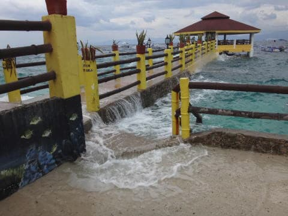

# 2016年8月　子連れで再訪！モアルボアル旅行記その20…全ダイビングが終わった後の夕方

📅 投稿日時: 2017-10-02 03:39:53

えー．

Yetiオープンが来週に迫ってきた今日この頃．

スキーを心から愛してやまない皆様におかれましては，

必死にシーズンインの準備を進めていらっしゃることと

存じます←いや，まだほとんどの人はシーズンインしないから

しかし．

このBlogはまだ夏モード．

車の試乗レポートが時折間に挟まってますが．

残り少ない夏モード期間で，

急ぎモアルボアル旅行記を仕上げてしまわなくては

ならないため．

本日もモアルボアル旅行記です．

では，どうぞ～！

----

という感じで．

大変残念なことに，モアルボアルでのラストダイブも

終わってしまいました…

ラストダイブ終了後，ショップへ戻りますが．

普通なら，ラストダイブ終了後．

ダイビング器材を洗わなくてはならないところですが…

殿様ダイブのフィリピンですから．

ダイビング終了後，器材はショップの

スタッフが洗ってくれます．

うーむ．

なんとお気楽なことよ…

ってことで．

ウェットスーツだけ洗って干して，

また夕方にログづけに戻ってくる約束をして．

ホテルへ戻ります．

ホテルへ戻ると．

うはーー！

なんだか，結構海が荒れ始めてきたみたいで…

うおー！

海が，すごいことになってる！

…明日の帰りの飛行機の時間から．

今日の午後はダイビングできなかったけど．

午後に潜らなくて，良かったのかも…

で．

ホテルでシャワーを浴びて．

お昼ご飯を食べに行こうかな…

私「娘～．お昼何食べたい？」

娘「いつものお昼！ピザ！パスタ！終わったらすぐプールで泳ぐ！」

…ってことは．

私「それって…昨日までと同じで，

　ホテルでお昼ご飯食べたいってこと？」

娘「うん！そしたらすぐプールで遊べるから！！」

…そうですか．

やっぱり，そうですか．

ってことで．

いつものテラス席ではないけど…

ホテルのレストランで，いつものピザと

麺類でお昼ご飯．

…それを，すぐに泳げる水着で．

水泳用ゴーグルをしたまま食べる娘…

おまえ，どんだけ泳ぎたいんじゃ．

で．

食べ終わったら．

さっそくプールで泳ぐ娘．

ただ．

この日は天気もあまり良くなく．

気温もちょっと低かったので．

珍しいことに，2時間ほど泳いだら．

娘「ちょっと寒い…もう休む」

と言って，自らプールから出てきました…

め，珍しい…

って感じで．

娘がプールから出てきたら，ちょうど夕方のログづけタイムだったので．

いつもの道をショップに向かい．

そして，ショップでのログづけタイムです．

今日撮った写真をPCで確認しながら，

魚の名前の確認などして．

楽しかったダイビングなどを振り返りますが…

楽しかったダイビング終了後は，

ダイビング代の清算タイム…

今回，一日2本のダイブフィー込みの

ダイビングツアーで申し込んでいたので．

3本目を潜った日だけ，追加ダイブ費用が

必要です…

ダイビング追加費用，1本1750ペソ．

ぺスカドール島遠征費用なども不要で，

日本円にして，4000円くらいの明朗会計．

フィリピン，物価安いなぁ…

ただ．

フィリピンでは，ダイビング1本に着き

入海料が100ペソ取られます．

2人で7本ずつ潜ったので，一人700ペソ．

大体，1500円ちょっと…って感じなので．

まぁ，こちらもお財布に優し目のお値段．

…そして．

ここがすごい．

娘のボート同乗代金，無料！！！

ってことで．

追加のお支払金額は，結構リーズナブル．

うーむ．

やっぱりフィリピン．

沖縄やパラオに行くよりは，

ずっと安く上がりますな…

ちなみに，このショップ．

支払いはペソでもUS$でも，さらには日本円でもOKですが，

カードは使えません…

ってことで．

お支払いを終えたら．

ダイビング器材を回収して．

ホテルへ戻りますが…

ホテルまで，オーナーとスタッフで，

ダイビング器材を運んでくれます…

どこまで殿様ダイブなんだろう…

ありがとうございます…

そして．

あとは，ホテルのベランダで．

器材を干すべし，干すべし，干すべし！

## 💬 コメント一覧

### 💬 コメント by (yama)
**タイトル**: 物欲選手権?
**投稿日**: 2017-10-02 20:02:53

シーズンインの準備ということは早速物欲選手権開催ですか？自宅近くのスポーツデポに行ってきましたが、１１月くらいにならないと品物が入って来ないと言われました。やはり神田まで行かないと駄目なようです。イエティオープンには間に合わないので壊れてるブーツで行くしかないでしょう。

### 💬 コメント by (Skier_S)
**タイトル**: yamaさま
**投稿日**: 2017-10-03 00:15:54

私も日曜に，我が家のそばのスポーツデポに行ってきましたが，

まだスキー用品は全く売ってませんでした…

神田に行けるのはいつの日やら…

