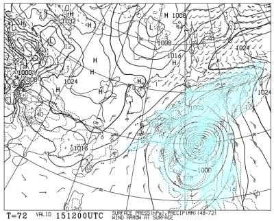

# 2023シーズンモデルのスキー板に試乗してきたよ！どんな板に乗ったのか＆クイックレポートその3

📅 投稿日時: 2022-04-13 01:56:12

まだまだご無体モードが続き．

同時に二つのWeb会議に出ながら

内職するのが最近のデフォルトに

なりつつある，Skier_Sです（涙）

本日も志賀高原から，特派員写真が

送られてきましたが…

今日も朝から，気温は+10℃（涙）

土曜以来ずっと異常に気温が高い日が

続いてます…（泣）

そして朝から晴天だったので．

今日も朝から雪はユルユル（泣）

おこみんちゃんも立ってられず，

倒れちゃうくらいの緩みきった

雪です…

今日も一日晴天で，暑いくらいだった

みたいです…

しかし．

まだ晴れてくれて雨になってないだけ，

気温が高くてもそれほど雪が解けずに済んでますが…

15日の天気図を見ると．

なんだこりゃ！！！

これ，ホントに4月の天気図か？？？

中心気圧970hpaの，かなり発達した

台風が日本に近づいてるんですけど？？

…4月にここまで発達した台風が日本に

近づいたのは見たことない気が…

そして，当然この台風は高温だけじゃなく，

大雨ももたらすので…

14，15日の2日間は雨です．

時折強く降ります．

諦めてください…（涙）

16日は気温がそこそこ冷えそうですが．

雪にはならなさそうですね…

あぁ…雪が解けていく…（泣）

ってなことで本題へ．

3月に，エキップさん主催の2023シーズンモデル

スキー板試乗会に参加してきて，

その試乗板のクイックレポートを[その1](e1faadb497231c5eb892525f0348ecc66.md)，[その2](ebce4e14d34daa93a774dfa2949907ce6.md)と

書いてきましたが．

その後，いろいろ多忙でまともに記事が書けず…

何とか今日，第3回目です！！

…って，もう1か月以上前で，いまさらクイック

レポートもないですが…

今回はセミファット編です！

○FISCHER RANGER 96

その名の通りセンター幅96ｍｍ．

新雪を軽く蹴散らしていける浮力がありながらも，

そこそこ張りがあって，サイドカーブもある

キャンバー板なので，圧雪斜面での

カービングもイケる，結構軽めな板．

ただ，圧雪ではスピードを出すと

ちょっと板が逃げる感じもあるので．

新雪がメイン，時折圧雪も…という感じの板かな．

○FISCHER RANGER 102

センター102mmと，かなり広めの板．

これは…ちょっと幅広すぎて，圧雪バーンを

圧雪バーンでもそこそこのグリップで，

大回りのカービングは行けなくもないし，

ずらしのコントロールも悪くないけど…

そこまでグリップは強くない感じ．

新雪や荒れ雪の走破性は問題なし．

圧雪バーンより，新雪か春の荒れ雪で

履く感じの板．

○HEAD KORE 99

センター幅99mmとちょい広め．

でも，この板．メタルがしっかり入っていて，

張りがかなり強い！

幅の広さがあるけど，圧雪でもスピードを

出してカービングでガッツリ切って行ける！

ゲレンデ大回り板として十分使える

エッジグリップと張りの強さ．

それでいて99mmの浮力を使って，新雪も

問題なし！

○HEAD KORE 93

さっき乗ったKOREシリーズのセンターが

93mmと狭い方．

意外と99と93の履いた感じに違いが感じられず．

どちらもゲレンデでガッツリカービング大回りが

気持ちよくできて．

ゲレンデ大回り板として十分使えるレベル！

93mmでも，荒れたバーンの走破性もいいし．

完全新雪に行かなければ，93mmの方がいいかな？

○VOLKL BLAZE 106

これは…センター幅106mmとかなり太く．

サイドカーブもそれほどないので，圧雪で

板なりに滑るとかなりまっすぐ行っちゃう板．

エッジグリップも弱く，ある程度のスピードで

簡単にエッジがずれて行っちゃいます．

ただ，幅の広さの分圧雪の走破性は高いので．

こいつは新雪スペシャルですね…

ってなことで．

これで，エキップさん試乗会で乗った板の

クイックレポートは終了．

またGWが過ぎたあたりで，それぞれの板の

詳細レポートを書きます～！

あと，4月のアルペンさん試乗会で乗った板も，

同じようにクイックレポート予定！
