# 1月21日（日）の志賀高原，速報モード…朝から晴天！でも固めの雪質（涙）．夕方はいきなり雪

📅 投稿日時: 2018-01-22 02:36:49

えー．

22日朝の予想天気図を見て．

「東京近辺は，雪じゃなく雨では？？」

と思っていたら．

22日夜から23日朝の天気図を見て．

「うむ．確かに22日夜は雪が降るかも…」

と思い始めた，Skier_Sです．

ってことで．

24日朝の500hpa図を見ると．

赤くマークした，雪の目安の-30℃線が関東近辺まで

下がっているどころか…

水色でマークした，大雪の目安の-36℃線が志賀近辺まで

来てますよ！？？

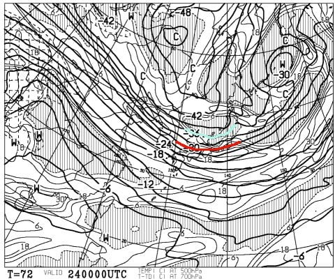

そして，地上天気図を見ると…

これは…降りそう．

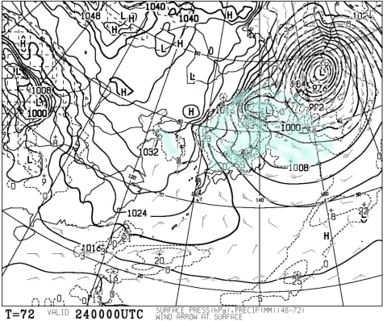

分かりにくいので，拡大すると…

なんだか，55って数字が見えますが．

12時間で予想される降水量55mm．

積雪になおすと，だいたい55cm．

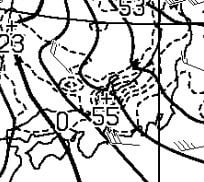

これは…

23日夜から24日にかけて．

ドサドサ降ります…

もう，ドサドサというよりドカドカです．

そして．

この雪は25日いっぱいまでかなりの勢いで

降り続け．

26日くらいまでは雪降りの天気が続きそう…

これは，すごい積もりそうですね…

今週末は，3週間ぶりにアイスバーンじゃない

ゲレンデを滑れそうです…

…ってことで．

本題へ．

今日の志賀高原レポートですが…

はい．帰宅が遅かったので．

日曜定番，速報モードで行きます！

まず．

今日は朝からすっきり晴天っ！！

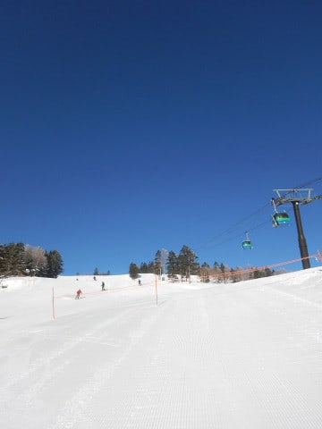

…誰かさんは，「朝は雪がちらつく」と書いてたはずだけど…

また誰かさん，予想外したようですね（涙）

で．

朝イチのシマシマはちょいと固めで，

ゴロゴロした感じだったので…

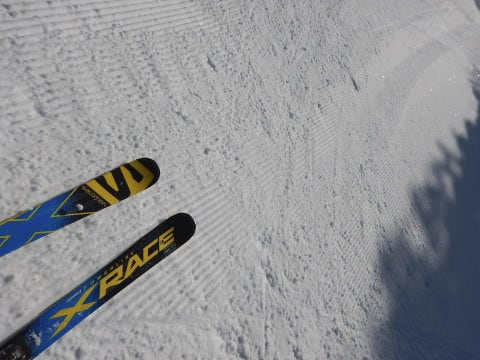

しばらく経つと，GSコースは全面コロコロ化（涙）．

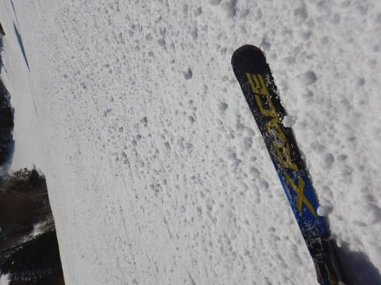

そして，人口密度も上がってきたので…

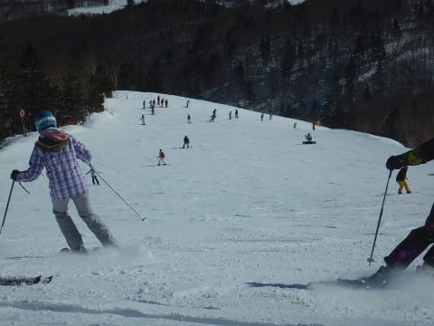

「焼額から脱出できない呪い」が掛けられている

私にしては珍しく，今日は奥志賀へ！

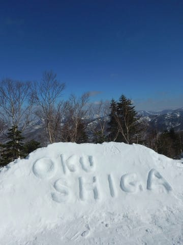

奥志賀のリフト側，エキスパートコースは

ちょいと固めで手ごわい斜面だったけど…

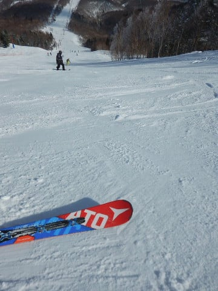

ゴンドラ側のダウンヒルコースは，

ちょいと固いところもあったものの．

コロコロもなく，結構滑りやすいよ！

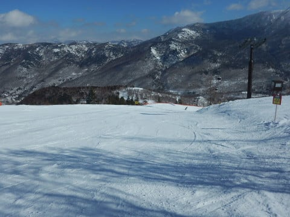

そして，ゴンドラ待ちもほとんど無し！

…ってこてとで．

午後はひたすら奥志賀ゴンドラグルグルという．

私のことを知っている人が見たら，

「なぜここを滑ってる？？」

という状況だったわけですが…

でも．

午後3時過ぎ．

雲が増えてきたなぁ…

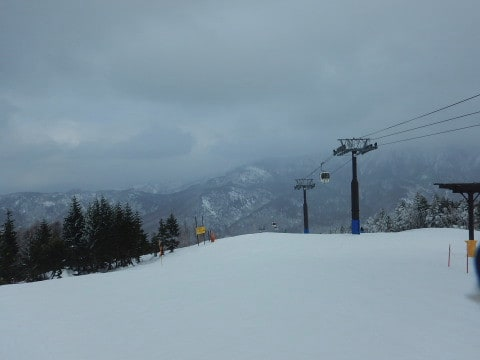

と，思ったら．

3時半ごろ，いきなり視界が悪くなり，

かなりの雪が降ってきました！

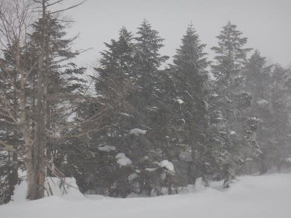

…今日は，リフト営業している間は

降らないと思ったんだけどなぁ…

ここも予想外しちゃったよ…（泣）．

でもまぁ．

営業終了まで1時間切ったタイミングだったし．

良しとしておこう←なんだかうやむやにしようとしている

ということで．

やはりゲレンデ全面固めで，難しい

バーンコンディションの一日でしたが．

奥志賀ダウンヒルが良かったので

楽しめたかな！

また明日，詳細レポートやります～！

今日はもう眠いので，おやすみなさい…

## 💬 コメント一覧

### 💬 コメント by (michi)
**タイトル**: Unknown
**投稿日**: 2018-01-22 07:20:59

昨日はお疲れ様でした。

息子のスキー、ありがとうございました。

昨日は私も早めにヤケビを脱出し、奥志賀、一ノ瀬、寺子屋、高天ヶ原、東館山を回ってました。

夕方、ちょうどお会い出来て良かったです。

### 💬 コメント by (ほっぽ)
**タイトル**: 奥志賀で
**投稿日**: 2018-01-22 10:04:28

Sさん

昨日は一ゴングルグルしててもお会いしないなぁと思っていたら、まさか奥ゴン乗り場で真後ろにいらっしゃったとは。(@_@)

おかげでゴンドラ一本分楽しいお話聞けましたし、滑り出したら、秘技！滑りながら撮影！も拝見出来ました。

あの速業、私にはとてもムリです。

今週末も土曜日日帰りヒトリストでお邪魔する予定です。

お会いできたらよろしくお願いします。

### 💬 コメント by (hiro)
**タイトル**: Unknown
**投稿日**: 2018-01-22 16:18:17

朝一山頂でお声かけさせていただきました。丁寧にお相手をしていただきありがとうございました。奥志賀遠征されていたのですね、またお会いできるのを楽しみにしております！

### 💬 コメント by (おぶせ)
**タイトル**: やっぱり志賀はいいですね。
**投稿日**: 2018-01-22 21:32:51

皆さんの会話を見ていると、すぐにでも行きたくなりますね。

今週２３日からのお天気解説ありがとうございます。只今、東京の大雪混乱ＴＶ見ながら、２３日志賀ＳＫＩ協議中です。小生は寒くてもふわふわを滑りたい、と主張。だったらあたしゃ、ホテルで寝てるわ、と、土俵際寄り切り目前。帰りの小布施栗三昧では大サービスでダメ押しか？。お教えに従い、防寒対策しっかり致します。

２１日は雪質は恵まれなかったご様子ですが、しかし、素晴らしい空の青ですね。小生この青、大好きです。

茶の間でコメント打ち込んでいるうちに、となりで女房が白旗あげました。とりあえず今晩のところは決行で決まりました。（ダイヤモンドのキツネも効いたようです。・・）

### 💬 コメント by (新潟のスキーヤー)
**タイトル**: 奥志賀で…
**投稿日**: 2018-01-22 22:08:02

昨日は突然のお声かけ失礼しました！

まさか、Sさまにお会いし、

一緒に滑る事ができるとは…

とても楽しい時間をありがとございました。

また、お会い出来る日を

楽しみにしております！

### 💬 コメント by (Skier_S)
**タイトル**: 首都圏もつもりましたね…
**投稿日**: 2018-01-23 00:04:19

＞michiさま

日曜はいいタイミングでお会いできましたね．

息子さん，板が気に入ってもらえたようで

良かったです…

うちにあっても使わない板ですので，

存分に活用してください！

＞ほっぽさま

私もちょっと奥志賀見に行くつもりが，

まさか11時から3時まで4時間近く

滞在するとは思いませんでした…

でも，日曜は奥志賀ダウンヒルが

一番良かった気がします．

で．

私は，あの瞬殺ならぬ瞬撮をしたいがために，

スマホと別にデジカメを持っているので…

スマホだと絶対できない技だと思います（笑）

また今週もお会いしましょう！

＞hiroさま

日曜はお声がけありがとうございます！

土日の焼額1ゴンにいつもいますので，

またお気軽にお声がけください…

…って．

日曜は奥志賀行ってましたが（笑）．

では，また焼額でお会いしましょう！

＞おぶせさま

この土日，雪質はちょっと残念な

感じでしたが，晴天で良かったですよ～！

24，25日はその逆で，雪質はいいけど

天気は悪そうです…

朝の営業開始が遅れるくらいの大雪かも？？

でも，新雪はたっぷり滑れますよ～！

ぜひ志賀高原楽しんできてください！

＞新潟のスキーヤーさま

奥志賀ゴンドラではお世話になりました～！

まさか奥志賀で遭遇するとは思ってなかったところでの

突然の出現でびっくりだったでしょうが…

同じSX&X-RACE乗りということで，かなりの

親近感でした（笑）．

土日がお休みでないとなると，なかなか

お会いする機会もないかもしれませんが，

年末年始もGWも志賀にいますので，

またのチャンスに志賀にお越しください～！

