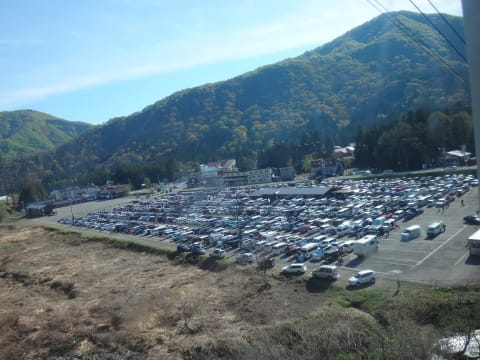
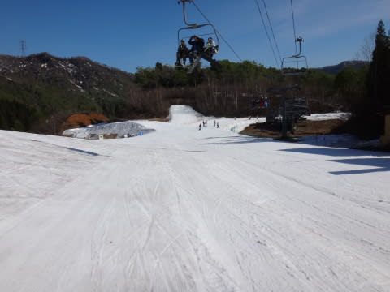
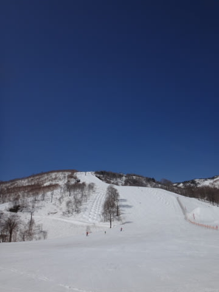
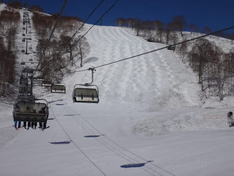
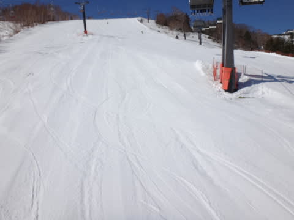
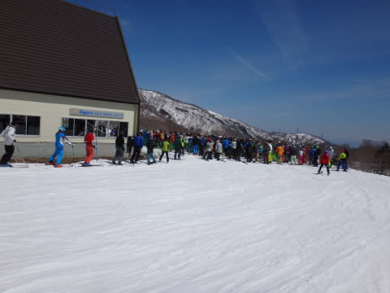
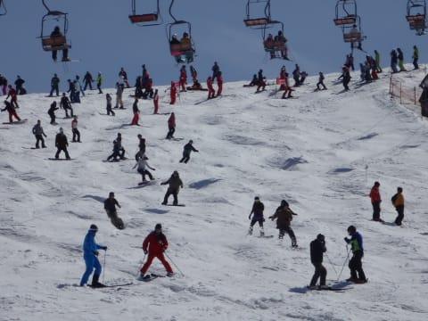
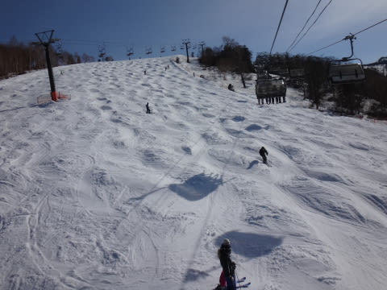
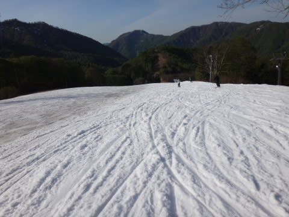

# 5月11日，日曜日のかぐら速報モード…混んでたけど，雪は十分！

📅 投稿日時: 2014-05-12 00:45:26

えー．

今日もリフトストップまで滑り．

夜9時過ぎに帰宅して．

それから，今シーズンもう出番が終了した，

VOLKLとフレックス強化版SXのシーズン終了の

手入れだなんだやっていたら．

こんな時間になってしまったので．

今日も速報モードで…

えー．

朝，7時半からのロープウェイ営業開始に

間に合うようにやってきたのですが…

すでに，駐車場は結構車が多かったですね～．

で．

ゲレンデに出るために，みつまたロープウェーを登る

わけですが．

…ロープウェーを降りたところから，もう雪がいっぱい！

うはー．

今年は雪が多いなぁ…

そして，

ゴンドラに乗って，かぐらエリアまで上がると…

晴天！

雪もたっぷり！

テクニカルバーンも全く土が出てないよ！

さらに．

朝イチのメインバーンは．

大回り板を履いて来れば良かったな～，

と思うほどの幅広フラットバーン！

…だったんだけど．

快適なのは9時まで．

朝10時過ぎには，リフトが最大10分待ちになり…

そして，人が多いということは．

コース全面，コブになるということで．

午後は，荒れ荒れコブコブバーンでしたね～．

＃そのかわり，午後はリフト待ち1～3分と短くなりましたよ．

でも．

午後はコブ掘削作業狙いと考えれば．

かなり本格的なコブをおなか一杯楽しめたし．

みつまたゲレンデも移動用じゃなく，ゲレンデとして

営業するくらい，雪はいっぱいあったし．

楽しめた一日でしたよ～！←雪があれば，どんなとこでも楽しいんでしょ（自己突込み）

詳細レポートは，また明日…

＃これで十分詳細じゃないかい？？
