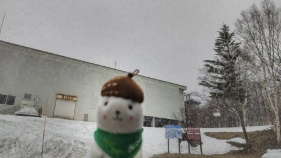
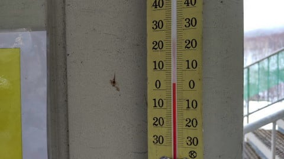
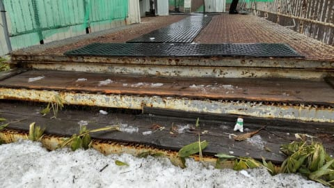
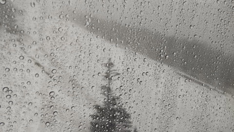
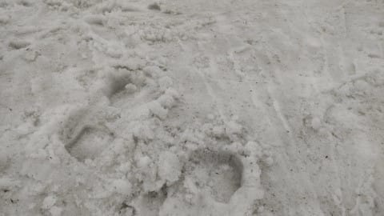
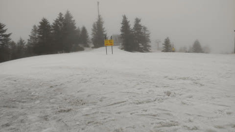
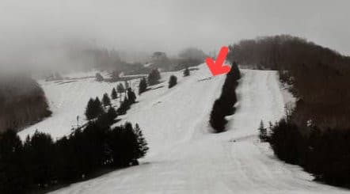
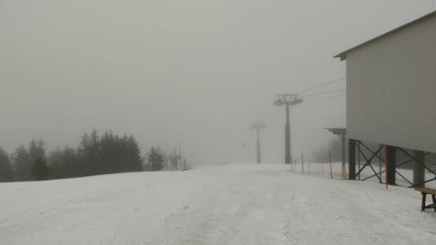

# 4月17，18日の週末の志賀高原スキー場の天気は…土曜は終日雨（泣），日曜はちょっと冷えた曇り空

📅 投稿日時: 2021-04-15 09:05:47

🏷️ カテゴリ: [スキー天気予想](c6554f5c3c106093b511a8daae23757e8.md)

今日も大変バタバタしておりまして．

昨日の夜に更新する時間がとれず…

朝更新！

で，昨日，水曜の志賀高原．

朝までには雨が止んでいるという予想

だったのですが．

…予想を悪い方向に裏切って，

朝になっても雨は止んでなかった

ようです（涙）

いつもの特派員写真を見ると．

車の窓ガラス越しに撮った写真，

窓ガラスの水滴が見えますでしょうか…

そして．

昨晩から気温は高く，朝の気温は

すでに+4℃とかなりの高温（涙）

…だもんで．

昨日からの高温＆雨で，一晩でかなり

雪が解けたらしく．

奥志賀ゴンドラ乗り場の階段1段分，

この一日で解けちゃったようです…（泣）

ゴンドラ営業開始時間になっても，

雨は無情にも降り続け…

ゲレンデは当然，雨をたっぷりと

吸いまくった，しっとり雪．

ゲレンデ自体も，かなり雪が減った

感にあふれていたようで…

かなり雪が薄くなってますね（涙）

高天ヶ原も，メインバーンの矢印部分，

ついに穴が空き始めました（泣）

天気は，午前中霧雨っぽい雨が

降り続けた感じのようで．

残念な一日だったようです…

で．

この週末の天気ですが．

土曜：雨．朝から雨．気温は朝からかなり高く，

　最高気温は+8℃くらいか…

　風も強く，ゴンドラは動かない可能性も．

　雪も解けそうで，かなり残念な感じ．

日曜：朝はおそらく曇り．

　日ごろの行いが悪ければ，朝まで雨が残る．

　午後は曇り．気温は低め．

という感じでしょうか…

やっぱり，

7週間の週末のうち，6回の週末で雨

という，呪われた天気になりそうです（激涙）

ダメだ．

今シーズンは緊急事態宣言があり，

それが終わるとずっと週末雨という，

何かに呪われたシーズンだ…（涙の海に沈みながら）

## 💬 コメント一覧

### 💬 コメント by (Unknown)
**タイトル**: Unknown
**投稿日**: 2021-04-15 09:22:21

毎日お疲れ様です。

更新されるのが楽しみで、

今朝も待ち焦がれていました。

さて、

今、タンネのライブカメラを見ると

リフトが動いてます。

再開したのかな？？

### 💬 コメント by (葛飾のS)
**タイトル**: Unknown
**投稿日**: 2021-04-15 18:09:44

久しぶりに平日スキー行って来ました。

奥志賀の午前中は良いっすネー

ガラガラでした🤤

### 💬 コメント by (通りすがり)
**タイトル**: Unknown
**投稿日**: 2021-04-16 00:59:25

Unknown様

一ノ瀬に学校団体が来ていて、主にファミリー下部で滑ってたようですが、タンネにも集まってましたので

学校団体のためにタンネのリフトを動かしてたのだと思われます。

### 💬 コメント by (Skier_S)
**タイトル**: 土曜はダメっぽい（涙）
**投稿日**: 2021-04-16 01:58:07

＞Unknownさま

コメントありがとうございます～！！！！

タンネの森は，修学旅行生とか団体が来ると臨時営業することがありますよ…

って，通りすがりさんもコメントに回答書いてくださってますね（笑）．

＞葛飾のSさま

平日スキー，うらやましいです…

木曜滑ってらしたんですか？

だとすると，朝はそこそこ冷えてるのに晴れと言う，

いいコンディションの日で良かったですね！！

＞通りすがりさま

このご時世で，修学旅行生が来ているってのが驚きですが…

団体さんが来ている休日は，一の瀬第3クワッドも動かしてほしい…

### 💬 コメント by (うえいと)
**タイトル**: Unknown
**投稿日**: 2021-04-16 10:01:21

金曜

16の焼額山も朝からか廊下が融けて一部穴あき、下の最後の廊下にも穴が見える

土が雨で動いた部とピステで動かした分のところが弱くなりつつありますね。

雪だししてこないと怪しい雰囲気が漂ってます。

でも横手渋では、雪模様。

同じ志賀でも二山超えると〜と思われます。

### 💬 コメント by (Skier_S)
**タイトル**: ＞うえいとさま
**投稿日**: 2021-04-16 23:56:44

焼額，早くも穴が開いてきましたか…(泣)

横手は今日の午後は雪だったんですね！

うーん．

GWまで雪がもってくれるのか心配…

