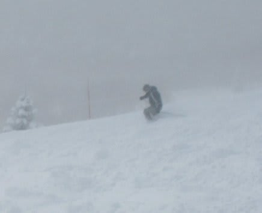

# 日曜の志賀高原は…

📅 投稿日時: 2011-02-14 01:45:32

🏷️ カテゴリ: [2011スキー滑走日記](ca488c98cfb9169941c3e73770dcefb56.md)

今日の…

っていうか．

日付が変わっているので，厳密には昨日になっちゃいますか…

とりあえず．

3連休最終日の志賀高原は．

非圧雪コースは，朝からパウダー！

ひざパフ！

午前中，時々日も射すこともあり，

気温もそこそこ低く．

かなり上々のコンディションの一日でした．

圧雪コースもやわらかい滑りよい雪．

ただ，やわらかかったので昼ごろにはでこぼこに

なってきましたが…．

でも，気温も低く，雪質は良かったです．

あ，一日って書いてますけど，この日は．

リフトストップまで滑らないと気がすまない私にとって

大変珍しいことに，昼に切り上げて帰宅したんですね～．

なんで，昼までしか分からないんです…
