# 2020/1/2(木)の志賀高原，焼額山スキー場は…天気は曇りのち雪，それほど積もらず．そろそろどさっとふて欲しい…

📅 投稿日時: 2020-01-03 06:42:51

🏷️ カテゴリ: [2020スキー滑走日記](c282e9230de179e245c7334eabeb0a3b3.md)

えー．

昨日は夜遅くまで飲んでいて．

そのまま倒れたように寝てしまいました…

なので．

1月2日の志賀高原レポートは，速報モードにて！

…この日の天気は，年末に予想した通りの

朝から雪降り！

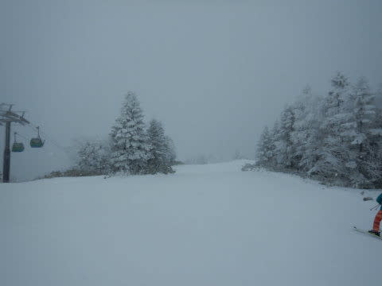

だけど…つもらない雪で，

昨晩からの積雪は，せいぜい2cm（涙）

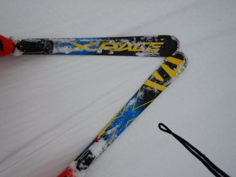

朝の気温は-8℃と，かなり低かったんですがねぇ…

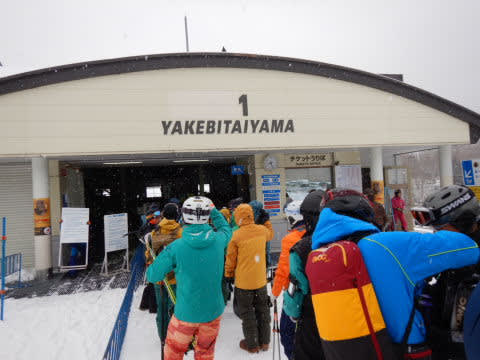

朝イチは，快適シマシマに1cmほど新雪が乗った，

いい感じのバーン！！

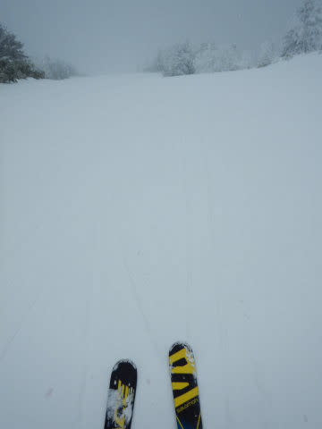

しばらく快感バーンを楽しんでましたが．

でも，ここ数日まともな積雪がなかったので，

白樺コースやGSコースの一部．ちょいと

ブッシュが出始めてきました…（涙）

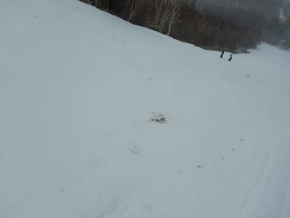

GSコースのブッシュはごく一部だけど．

白樺コースはちょいと浮石が多く，

もう一度滑ろうと思わないレベルで．

そろそろも一降りほしいところ…

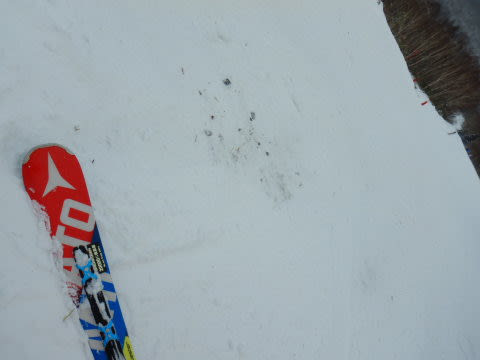

オリンピックコースも見に行ってみましたが．

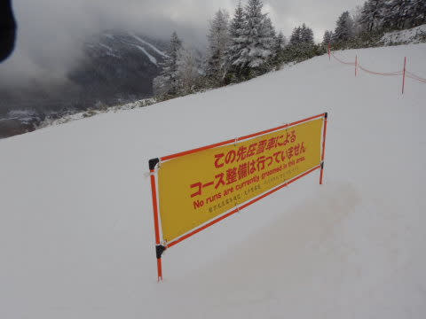

ここは相変わらず非圧雪で，

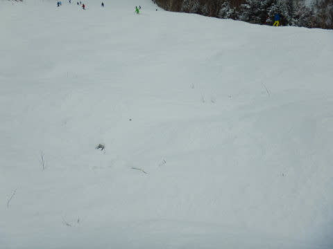

かなりひどいブッシュになってました(涙）

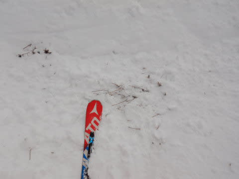

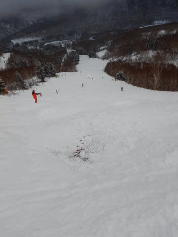

とはいえ．

GSコースやパノラマーサウスは

まだまだ真っ白で，気持ちよく滑れますよ！

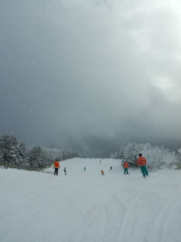

ただ．

やはり正月休み．

朝イチはガラガラだったけど．

ゲレンデは10時を過ぎるとかなりの人口密度（涙）

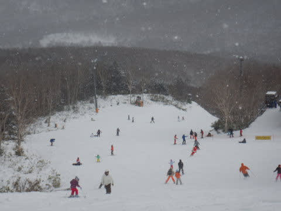

ゴンドラも，午前11時ごろには，

ピークで6～7分待ちになっちゃいました（泣）

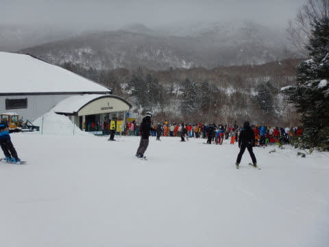

でも，ゴンドラ待ちがあったのは11時半まで．

それ以降は待ってもゲート内の2-3分．

リフトは最大でもこのくらいの待ちで．

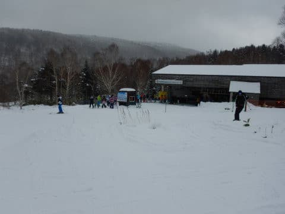

正月休みとしてはそ，れほどひどい

混雑じゃなかったかな…

ってな感じで．

一日中，雪が降ったりやんだりの

天気だったこの日．

人は多かったものの，積雪が少なくて，

ゲレンデの下地がちょい硬めだったのもあり．

午後までそれほど荒れずに割とフラット目な

バーンを滑れたかな～．

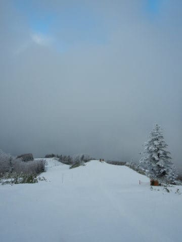

午後3時以降はガラガラになり．

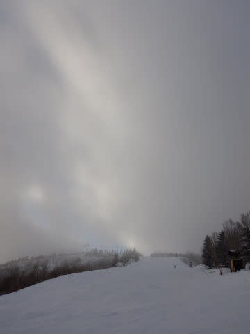

いつも通り，16時のリフト営業終了まで

滑り倒しました…

…でも．

そろそろどっさり積雪が欲しいなぁ…

結局この正月休み，まだ一度もパウダーに

出会ってません．

あぁ…もしかしたら，今シーズン．

太板を履く機会がなく終わってしまうのか！？？

## 💬 コメント一覧

### 💬 コメント by (ももも)
**タイトル**: Unknown
**投稿日**: 2020-01-03 19:07:23

昨日、今日とヤケビでお話をさせて頂いた者です。貴重なお時間をありがとうございましたm(_ _)m

明日ですが、一の瀬に行こうかと思っているのですが石ころが転がっているかもと思い悩んでいます。(ヤケビも増えてきてましたよね…)

一の瀬やタンネなどの状況を教えていただけると助かります。よろしくお願いします

### 💬 コメント by (Skier_S)
**タイトル**: ＞もももさま
**投稿日**: 2020-01-03 23:34:43

昨日，今日とありがとうございました～！

一の瀬ファミリーは，正面バーンは硬いようですが，

まだそれほどブッシュは出てきてないと聞いています…

タンネは緩いので，それほどひどくブッシュは出てないと思います．

…ただ，私は焼額から出ていないので伝聞ですが…

しかし，いろいろ情報を集めると，一番まともに滑れるのは焼額のように感じます…

