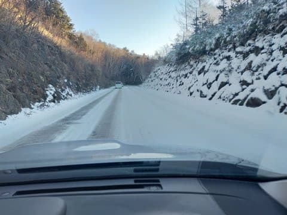

# 2022/12/10(土)の志賀高原焼額山スキー場は…終日晴れ！バーンは硬めだけどそれほど混まず

📅 投稿日時: 2022-12-11 00:12:47

🏷️ カテゴリ: [2023スキー滑走日記](cd943df30cfcc3d0896469e2ff98720cd.md)

ついに．

本日，今シーズン初志賀高原にやってきました～！！

いやーー．

本来先週焼額オープンのはずが雪不足で開かず，

1週間遅れの今日，私の志賀高原今シーズン

デビューとなりました！

まず．

本日，志賀高原へ登ってくる道は．

下の方はドライでしたが，スキー場に近づくと

本格雪道です！

…スタッドレスタイヤを履いてない場合，

自殺願望がある方か，何か物理現象を超えて

自動車を操作できる方のみ，来ることが

できる道路状況ですね．

そして．8:30の営業開始前に焼額に到着すると…

リフト待ちはそれほどひどくはなくて，

今日はそれ程混まなさそう…！！

焼額は昨日からオープンしてますが，今日が

オープニングイベントらしく．

朝イチリフト待ちのお客さんにクラッカーが配られ，

テープカットとクラッカーで8:30ちょうどに

オープン！

リフトから見えるコースは…

意外とコンディションは良さそう！！

天気は雲一つない晴天で…

人工雪100％ですが，意外なことに

コース幅いっぱい滑れますよ！

天然雪がないので，人工雪の廊下かと

思っていたら…

意外にもコース幅いっぱい滑れて，

イエティとは比較にならないコース幅！！

そして．

あさイチは…

ぐはーーーーーー！！！！

最高のヤケビクオリティのシマシマバーン！

これだ．

これですよ．

これがヤケビクオリティ．

この広いコース幅で，ヤケビクオリティのシマシマと

くれば…

この時期としては最高のバーンコンディション！！

いやーーー！！

イエティも，雪がない時期に滑れるだけ

ありがたいと思っていたけど．

これだよ！！！

これがスキーだよ！！！！

バーンは完全人工降雪でちょっと硬めで，

所々硬いところもあったものの…

あさイチはリフト待ちも0だし．

人工降雪なので，バーンが硬めで

朝のうちはちょっとコロコロが出るところも

ありましたが…

でも，ガラガラバーンを気持ちよく

飛ばしたい放題！！！

もう，イエティと全然違う！！

イエティでやっているのとこれが，同じ

スキーとは思えない…！！

ただ，午前10時ごろに研修会の方々が

出てくるとリフト待ちが伸びましたが…

最高の待ち時間はこのくらい．

でも，団体さんがドカッと来た時以外は，

昼間の平均待ち時間はこのくらいで．

動いているリフトが少ないので，

混むのを覚悟してましたが，

それほどひどい待ち時間じゃなかったです．

そして．

コースの人口密度もせいぜいこのくらいで．

イエティの混雑から比べれば，激烈天国

状態！！

いや．

これがスキーだよ！！！

このコース幅を大回りで気持ちよく

滑れるのが，スキーだよ！！！

ただ，やはり人工雪なので，コースの途中，

しっかりエッジを立ててない板だとツルっと

行く感じのツルツルな個所も多かったですが…

でも．

アイスクラッシュの雪とは違う，ホントに

冷え冷えの雪を滑れるシアワセ！！！

午後になっても雪が緩むことはなく．

しっかり締まった，人の少ないバーンを

イエティでは絶対に不可能なスピードで

飛ばすことができて…

ペアリフト1本だけだけど．

それでも，コース幅いっぱい雪が着いていて．

今シーズンはじめて気持ちよく大回りすることが

できて…

今日も営業開始の8:30から，日が暮れるまで．

お昼休みも取るともなく，ひたすらグルグル

滑り続け…

営業終了の16:00まで，イエティでは味わえない

快楽をひたすら味わい続け．

ペアリフト1本でも，圧雪最高，コース幅いっぱい

滑れる焼額は，やっぱり良い…

と感動したSkier_Sでした．

いや．

良かった．

今シーズン初の焼額でしたが．

やっぱり最高でした…

しかし．

睡眠時間1時間半で良く滑りにきたもんだ…

…そして．

夜久しぶりに会った皆さんと飲んで．

日付が変わるまで飲んでしまった

自分がいたのでした…←早く寝ろよ（自己突っ込み）

## 💬 コメント一覧

### 💬 コメント by (アツシ)
**タイトル**: Unknown
**投稿日**: 2022-12-11 01:35:28

ホーム開幕戦、おめでとうございます🎉今季もSさまにとって良いシーズンとなりますように😄

私は仕事が立て込んでおりまして、今季の初滑りはクリスマス頃になりそうです。何とか今月中にご挨拶できればと思っています。それまでにどっと雪が積もればいいなー。また天気予想も楽しみにしてます。

### 💬 コメント by (Skier_S)
**タイトル**: ＞アツシさま
**投稿日**: 2022-12-12 00:43:19

1週間遅れましたが，無事ホームゲレンデデビューできました…

お仕事お疲れ様です．

クリスマスに志賀高原でお会いできることを祈っています…

クリスマスまでにはクリスマス寒波が来て，志賀は全面オープンするはず…！！（願望）

