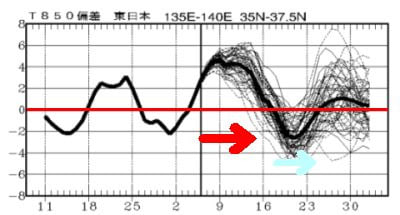
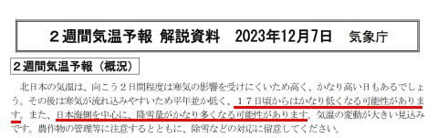
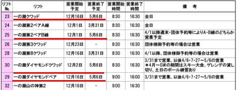
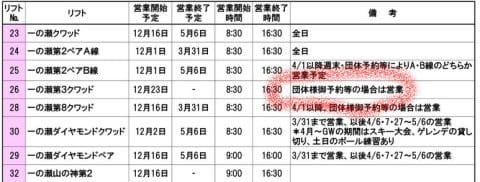
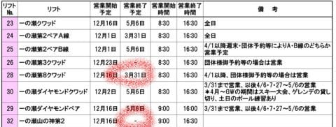
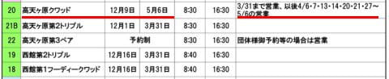
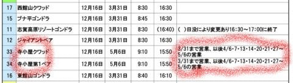
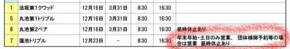
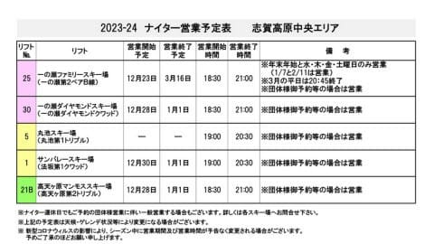
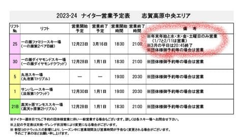

# 志賀高原スキー場，中央エリアのリフト営業予定が出たよ！…おおむね例年通り．一ノ瀬第3クワッドは団体時のみ，山の神の営業終了は未定

📅 投稿日時: 2023-12-08 05:25:40

えー．

相変わらず，謎な時間にBlogを更新してる，

Skier_Sです．

とりあえず，これから来週にかけて

高温が続きそう…

と，[昨日の記事](e6ee566c3a5eefc6dc6d49850d29a6aee.md)に書きましたが．

その後，ちょうど来週末の17日あたりに

かなり冷えそうな予想になってきました！！

これから16日ごろまで，赤矢印の高温

期間が続きそうですが…

その後は24日ごろまで，平年比-2℃ほどの

低温期間がやってきてくれそうです！

…そして，気象庁の[QXVX91](https://www.sunny-spot.net/chart/QXVX91.pdf)にも…

17日ごろから気温かなり低くなり，

日本海側を中心に降雪量がかなり多くなる

という予想が！！

…来週末に間に合わなさそうなのが残念

だけど，とりあえず冷えてくれそうなので

ちょっと期待…

ってなことで，本題へ．

11月末に，志賀高原中央エリアのリフト

営業予定が出ていたので．

いつも通り読み込んでみましょう！

（[志賀高原中央エリアホームページ，リフト営業予定](https://shigakogen.co.jp/news-002/)より．以下同じ）

まずはざっと見ると…

おおむね，

例年GWまで営業するリフトは

5月6日まで運転，

それ以外は3月31日にすべて終了

という，わかりやすい感じで，

特にびっくりするようなニュースは

ない感じ…

一ノ瀬エリアは，一ノ瀬ファミリーの

クワッドとペア，

そしてダイヤモンドがGWまで営業ですね…

…しかし，一ノ瀬クワッド12月16日の

営業開始予定までに動いてくれるかな？

そして．

ちょっと残念なのは…

今年も一ノ瀬ファミリーの第3クワッド，

団体さん予約とかがない限り動かなさそう

という点．

昨シーズンから，一ノ瀬ファミリーが混雑

しても全く動かす気配がなく，

せめて混んでるときは第3クワッド動かして

ほしい…という願いは通じなさそう（涙）

そして…

やはり今シーズンも，タンネの森の

第8クワッドは3月31日に終わっちゃうんですね…

さらに，山の神の営業終了は未定になってます．

…山の神，GWまで動かして一ノ瀬と

焼額・奥志賀の行き来ができるようにして

欲しいけど…

今年も，雪があっても止めちゃうのかなぁ…

せっかく，GWまで広いエリアが滑れる

志賀高原の魅力が半減なんだけど…（泣）

高天ヶ原エリアは…例年通りですね．

高天ヶ原クワッドがGWまで．

ただし，4月に入ると週末と

GW期間のみの運転になります．

それ以外は3月31日で終わりですね．

あとは…

寺子屋もGWまで営業で，

高天ヶ原と同じく，4月以降は週末のみ．

ここも大体例年と同じですが…

ただ，リゾートゴンドラとジャイアント．

4月第1週の週末まで営業することが

ありましたが，今シーズンはあっさりと

3月31日で終わるようです．

で．丸池・蓮池・サンバレーエリアですが．

ここも12月16日営業開始，

3月31日営業終了予定ですが…

蓮池が年末年始と週末のみ，昼の休止あり

という微妙な運転．

…大丈夫か，蓮池・丸池・サンバレーエリア…

ってなところが，昼間の営業予定ですが．

続いてナイター営業予定を見ると…

残念ながら，

ファミリースキー場以外のナイターは

正月休みのみ

となります（泣）

あぁ…サンバレーとかダイヤとかのナイター，

週末に滑りたいんだけどなあ…

もったいない…

そして，ファミリースキー場も，3月16日まで

やってくれるものの…

日・月・火は営業せず，

水・木・金・土と正月，休前日のみ

となります．

あぁ…昔は毎日やってくれて，

それもGWまでダイヤとファミリーの

ナイター滑れたのになぁ…

だんだん縮小されていく…

ということで．

あまり期待していなかったものの．

リフトの営業期間が延びるとか，

一ノ瀬第3クワッドがせめて週末は

動くとか，いいニュースは全くなく．

ちょっと残念な感じ…

まぁ，中央エリアだしな（あきらめの境地）

とりあえず，今シーズンは雪がちゃんと

積もって，この営業予定より遅く始まって

早く終わっちゃうことがないことを祈るほうが

大事かも…

## 💬 コメント一覧

### 💬 コメント by (新米パパ)
**タイトル**: Unknown
**投稿日**: 2023-12-08 12:46:11

今シーズンもよろしくお願いします。

大晦日から2日まで焼額山滞在予定です。

来年、年末年始のヤケビの早朝、ナイターはどんな感じの営業でしようか？

### 💬 コメント by (アリス)
**タイトル**: Unknown
**投稿日**: 2023-12-08 13:52:39

S様

こんにちは☀

昨日からヤケビで滑っています🎿

レインボーさんも一緒です。

プリンス職員からの情報によりますと、明日から二高の営業開始するそうです✨

そうです🎵唐松コースが滑れます。

ヤケビで会いましょう🎵

### 💬 コメント by (Skier_S)
**タイトル**: 今週末も志賀高原！
**投稿日**: 2023-12-08 23:58:54

＞新米パパさま

大みそかから2泊3日ですか！

うちも正月休みはひたすらヤケビはりつき予定です！

ナイターは年末年始は30，31，１，２日の営業です．

早朝は元日のニューイヤーファーストトラックだけだと思います…

＞アリスさま

明日からカラ松滑れるようですね～！

でも，幅15～20mと，ちょっと狭そうですが…

明日ヤケビでお会いしましょう！

### 💬 コメント by (a-island4138)
**タイトル**: Unknown
**投稿日**: 2023-12-09 09:32:38

スキーヤーSさん今シーズンもよろしくお願いします🙇　私は母を連れ1/9に高天ヶ原スキー場へ4日滞在予定です（35年ぶり高校修学旅行以来の）　また情報を楽しみに読ませて戴きますね📖ありがとうございます❄

### 💬 コメント by (Skier_S)
**タイトル**: ＞a-island4138さま
**投稿日**: 2023-12-09 20:41:36

コメントありがとうございます～！

今シーズンもよろしくお願いします！

35年ぶりの志賀高原ですか…あまり変わってないところと大きく変わったところの両方があるので，

もしかするとびっくりするかも．

天気予報，ゲレンデ状況など参考にしてください．

### 💬 コメント by (新米パパ)
**タイトル**: Unknown
**投稿日**: 2023-12-10 13:12:13

情報ありがとうございます。

ナイターも味わってみたいです！

今回、西館泊なんで、移動しなきゃですね。

東館泊まる時に限って、ナイターの営業場所が変わるんですよねー、、、

### 💬 コメント by (Skier_S)
**タイトル**: ＞新米パパさま
**投稿日**: 2023-12-11 02:20:16

西館からなら，プリンスの連絡バスに乗っていくのがいいと思います．

年末年始は，ちゃんと第2高速でナイター営業してくれると思いますよ！

