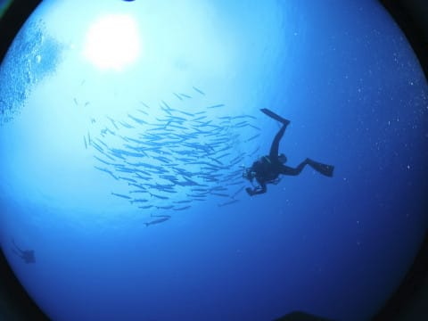
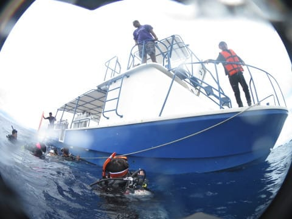

# 2017年8月，小学生の子連れでパラオ再訪！その18…3日連続のブルーコーナー！

📅 投稿日時: 2018-10-09 02:36:18

えー．

昨日，引っ越し日を決めてきたのですが．

なぜか，あと1か月以内に引っ越しが迫っているというのに．

本日．山に登ってきました～！

いや．

ここ1か月，プロジェクトZがらみでいろいろ

忙しかったので．

「うがーー！遊びたい！自然のある所へ行きたい！」

と，ほとんど発作的に行くことを決めて．

日帰りで行ってきたのでした…

が．

せっかく登ったのに…

山頂は，雲で景色が見えず（涙）

残念…

残念だよ（泣）．

でも，紅葉がきれいだったし．

LEVORGで長距離走ってこれたから，良しとしよう！

…しかし．

LEVORG，ホントに長距離が楽な車だなぁ…これ．

という，現実逃避の報告の後は．←ホントに引っ越し日までに準備終わるのか…？

いつものダイビング旅行記です．

では，どうぞ～！

---

ってな感じで．

3日連続のブルーコーナーへエントリーしましたが．

…3日連続で下げ潮のブルーコーナーですね…

透明度はまぁまぁいい感じ！

うーん．

しかし．

今回も流れは弱めで．

なんだか魚がばらけて，魚影が

そんなに濃くない感じ…

とはいえ．

いつものグレイリーフシャークがグルグル

してますし…

ギンガメアジの群れも，近づけないながらも

ドロップオフの先を通り抜けて行ったし…

まぁ，これで不満を言うのはゼイタクというもの！

そして．

あまりカレントが強くなかったので．

根の先端から沖の方へ泳ぎ出していきましたが…

おっと．

バラクーダの群れ，登場！

ちょいと残念ながら，密度が薄めですが…

おっと．

上手く巻いてくれるか…？

グルグル回ってくれるか…？

ちょっと巻き始めた！

巻いた！

巻いたけど…

…うがーーー！

残念っ！！

群れが深く潜っていくので，

逆光ポジションに入れず…っ！！

逆光のバラクーダトルネード写真は撮れないまま，

群れは目の前を通り過ぎて，深く潜って行って

しまいました…

惜しかった！

今回はちょっと残念な感じだったかな…

ってな感じで．

安全停止のあと，Exit！！

船の上では，娘がお出迎えしてくれました…

