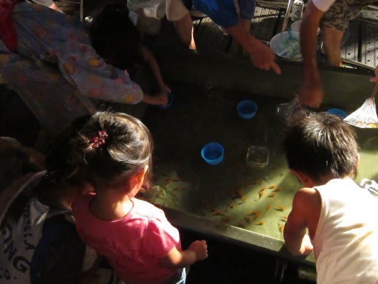
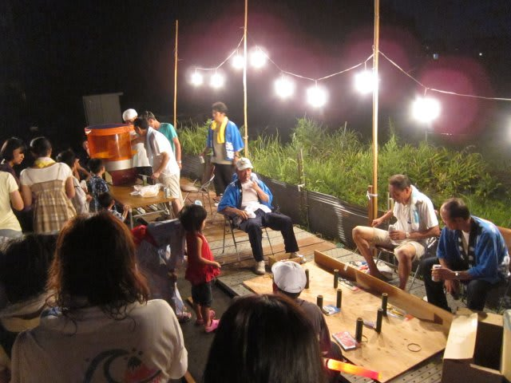
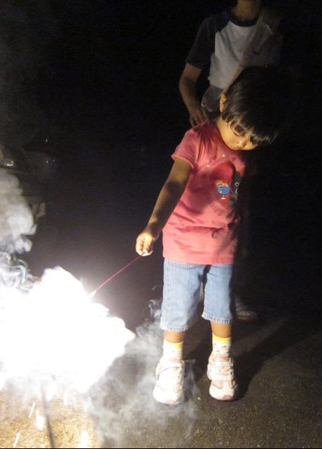

# 露出決定パラメータが３つ？？

📅 投稿日時: 2012-08-18 00:53:59

…今日の文章は長いよ…

＃さらに，面白くないときている

覚悟して読んでください(笑）．

----

えーっと．

デジカメから入った人は当たり前の世界なのかも知れませんが．

これまで，フィルムのカメラのとき．

ISO感度は，フィルムを変えない限り変更不可能なパラメータでした．

デジタルカメラになってからも．

最初のうちは，実用できるISOは100，200，せいぜい400．

エマージェンシーとして800を使えるかどうか．

ISOを切り替えることはほとんど無く，

「暗くなったら400にしとくか」というくらいの

使い方．

しかし．

私が今，水中撮影用のメインとしているCanonのS90では．

引き伸ばししないならISO1600は実用域．

ISO3200も，シャッタースピードが遅くて被写体ぶれする

シチュエーションでは．

「ISO1600でぶれるくらいなら，1段速いシャッタースピードの

　ISO3200の方がいいなぁ」

というレベル．

これらの画像はISO1600～3200で撮影．

＃恐ろしい高感度特性…

さらに，ISOも設定単位は1/3段ステップ．

なので，撮影中は一枚ごとに，ISO80～3200まで，1/3段レベルで

こまめに調整して使えます．

で．

ある日．

暗いところで動き回る娘を撮影しているとき．

暗いので，当然いつもの習慣通り．

可能な限りはやいシャッタースピードで撮影できるよう，

絞り優先AEで開放F2.0固定．

ISOはオート．

これで出たシャッタースピードで撮影．

被写体ぶれや手ブレが出そうなシャッタースピードになったとき．

ISOを高感度側にして早いシャッターにしたいわけなんですが…

でも，S90は，ISOオートにすると…

ISO800までしか使ってくれません．

ISO1600や3200まで高感度を使いたいときは，

ISOをマニュアル設定するしかありません．

ということで，ISOはマニュアル設定したい．

S90はレンズの周りのリングと後ろのダイヤルの

二つの調整ダイヤルをもってるわけですが．

このフロントリングを回したときに何を調整するか，

カスタマイズ出来る機能を持っています．

その機能を使って，フロントリングにISOを設定．

…この場合，絞り優先モードの絞り値がフロントリングで

設定できなくなるので，本来は通常は露出補正が割り当てられている，

リアのダイヤルに絞り値設定が割り当てられます．

こういう設定で．

シャッタースピードが動く子供を追っかけるのに必要な

1/125～1/60より遅くなったらISOを高感度側に振る．

という撮影をしばらく続けて．

…んん？

なんか，変．

あ，そうか．

露出補正をしたいのに，リヤのダイヤルで出来ない．

理想的には，フロントダイヤルでISO，リアダイヤルで

露出補正をしたいんだけどなぁ…

あれ？

じゃぁ，絞り優先AEの絞り値はどうやって設定するの？？？

あれ

ちょっとまて．

ちょっと待て．

自分が求めているのはシャッタースピードであって，

シャッタースピードを決めるために，何で手動で

ISOを決めているんだ？？

で，使っているモードが絞り優先AEモードって，どういうことだ？

シャッタースピード決めたいんだから，シャッタースピード優先モード

で撮るべきなんだよなぁ…

うん．

ちょっとこれで落ち着いた…

あれ？

シャッタースピードをリアダイヤルに，ISOをフロントリングに

割り当てたら，やっぱり露出補正を割り当てるダイヤルが

なくなっちゃう？？？

ダイヤルが3個無いとダメなのか？？

いやいや．そんなことは無い．

絞り開放に決まってんだから，あとはISOが決まればカメラがシャッター

スピードを決めてくれる．

だから，ISOとシャッタースピードの両方がダイヤルで設定できる

必要は無いんだよな．

じゃ，シャッタースピード優先AEでISOはオートに任せて，シャッター

スピードだけダイヤルで決めれば…

おっと．そうか，ISOオートだと，ISO800までしか行かないんだ．

ISO3200まで使いたいんだよな．

…そっか．

基本的に，ISOと露出補正の二つを，それぞれ二つのダイヤルに割り当てたいんだよな…

って…

そんなモード無いぞ？？

あれれれれれ？？？？

あれれれ？？れれ？？？

冷静に考えよう，冷静に…

マニュアルモードで絞り値を開放固定，シャッタースピードを

1/60に固定すればいいのか？

いや．

それだとISOが自動設定になっちゃうので，ISO800までしか行かない

から，だめなんだな…

理想的には，絞り値を固定して，ISOをダイヤルで回せば，

適正露出になるようシャッタースピードが変わるイメージ．

それで，あとはダイヤルでぐりぐりと露出補正をかける，と．

こういう操作をしたいわけだな．

…

ないぞ．そんなモード．

どうしてだっ！？？？？

これまでは露出を決定するために変えられるのは，

絞り値（Av）とシャッタースピード（SS)の2パラメータ．

だから，

Av優先モード：絞り値手入力，シャッタースピード自動

SS優先モード：絞り値自動，シャッタースピード手入力

の2モードで済んだ．

ところが，ここでISOを細かく大きな範囲で変更できるように

なった最新のデジカメでは．

Av優先モード：絞り値手入力，シャッタースピード自動，ISO自動

SS優先モード：絞り値自動，シャッタースピード手入力，ISO自動

…こう考えると．

ISO優先モード：絞り値自動，シャッタースピード自動，ISO手入力

って考えになるはずが．

これは，プログラムAEモードだよなぁ…

自分は，ISOを手入力すれば，シャッタースピードだけ

自動で設定するモードを求めてるんだよな．

プログラムAEみたいに，絞り値もカメラで勝手に変えられると

困るぞ…

あれ？？？？？

えーーっと．

露出を決定するために3パラメータあるんだよな．

3自由度あるということは，本来2パラメータを決定して，

自由度を1パラメータのみに縮退させるという発想が自然なわけだ．

1パラメータ固定，1パラメータ手動，1パラメータ自動，

と考えると，

プログラムAE以外に，絞り優先AEとシャッタースピード優先AEという

2モードじゃなくて…

ISO固定Av優先(手動)SS自動AE：ISOを固定，Avを手動で設定すれば，カメラがSSを決める

以下同様に，

SS固定Av手動ISO自動AE

ISO固定SS手動Av自動AE

Av固定SS手動ISO自動AE

Av固定ISO手動SS自動AE

SS固定ISO手動Av自動AE

って言う感じで，6モードが必要なんだな～．

これなら，Av固定ISO手動AEにすれば，

絞り値を固定して，ISOを手動で変更するに伴い

シャッタースピードが自動で決まる，

あとは露出補正をかければOK,と．

どっちにしろ，絞り，ISO，露出補正とダイヤルが

3個あるのが理想だけど…

少なくとも，露出制御に3パラメータある現在．

モードによって，2個のダイヤルに

絞り，シャッタースピード，ISO

の3個のパラメータのうち2個が割り当てられて，

露出補正ボタンを押すとダイヤルで露出補正が

かけられるようになる，というカメラ操作が

自然なはず．

うーーーん．

ISOが可変パラメータとなるとややこしいなぁ…

しかし，

S90に限らず．

いろいろ一眼レフを触ってみたけど．

シャッタースピードと絞りはダイヤルで変えられるけど，

ISOをボタンを押すことなくダイヤルで変えられる

カメラって無いんだよな～

＃NIKONのD7000とかは，設定すれば可能だけど

…なんだか，従来の一眼に引きずられすぎてしまっている

カメラのSS優先とAv優先モードに，矛盾を感じるのは私だけかなぁ．

あと，ブラケット撮影も，

Avシフトブラケット

シャッタースピードシフトブラケット

のほかに，

ISOブラケット

が必要になりそうなのに．

ISOブラケットがあるカメラって，ペンタックスだったか

しかないんだよな～．

デジイチって，ISOが変えられないフィルム時代の発想を引きずって

いるのかしらん？？？

ISOが6段分，1/3段ステップで設定できる現在．

カメラはいつまでもフィルム時代の

「Av優先AE」「SS優先AE」の2種類だけじゃ

おかしいよ～っ！！！

＃ああ．今回の日記も面白くなかった

あ，どーでもいいけど，私はデジイチは持ってません．

コンパクトカメラしか持ってないです…

## 💬 コメント一覧

### 💬 コメント by (伽羅)
**タイトル**: ISOブラケット
**投稿日**: 2012-08-18 20:33:54

私もダイヤル3つあれば良いのに、と思ったりします。

実は最近、ミラーレスを手に入れまして。。。

それにISOブラケット入ってるようです。

AE, WB, FL, ISO BKT。色んなことできるんですね。

Kiss, 40Dより高性能でびっくりです。

### 💬 コメント by (Skier_S)
**タイトル**: をを！買いましたか！
**投稿日**: 2012-08-21 00:35:39

私のような古い人間にとっては，

ミラーレス機はなんだか私がカメラに求めるものとは違うんですよね…．

ミラーレス機って，3ダイヤルどころか，2ダイヤルも

ない機械が多いじゃないですか．

1ダイヤルしかもっていないで，いろんな操作をしようとしたら

タッチパネルやら階層の深いメニューをいじらないと

いけなかったり…

私のように絞り・シャッタースピード・露出補正が一瞬で調整できて，

AF合焦後のMF調整が可能なら，

あとは何もいらない…

＃むしろ機械は余計なことをしないでほしい

という人間にとっては，あんまり魅力的な

ミラーレス機はないんですよねー．

WB BKTなんかも面白そうですけど，

RAWで撮ってあとで調整すれば良い気が（笑）．

そういう意味で，私はS90はそういう（古くさい)人間の

スイートスポットを突いているいいカメラだと

思ってます…

あー．

でも，デジイチほしい．

ミラーレス機購入，正直羨ましかったりします…(;_;)

