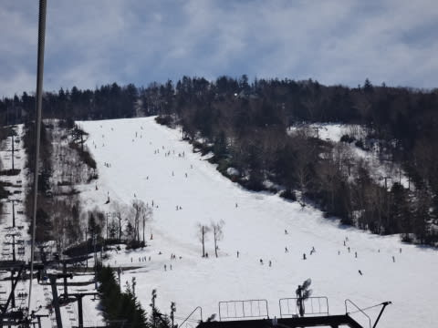
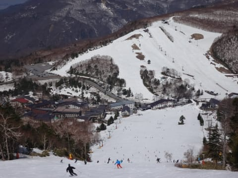

# GW4連休初日，5月3日の志賀高原は…晴天！それほど混まず．でも夕方崩れる…

📅 投稿日時: 2014-05-03 21:24:37

🏷️ カテゴリ: [2014スキー滑走日記](c992167609b6415052179ee69ea1ea7d8.md)

えー．

ゴールデンウィークの後半4連休が始まりましたが．

…まず．

初日の本日は，朝から晴天っ！

さすがに4連休だけあって，

ゲレンデはそこそこの混雑だったものの…

リフト待ちはほとんどなしっ！

焼額もゴンドラ待ちはほとんどなかったようで，

少なくとも本日，心配されていた4連休大混雑は

なかったです…

＃関越・上信越の渋滞で昼過ぎに到着した人が

＃多かったから，という説もあり

早朝滑っていないのであれですが．

通常営業が始まったときはもう雪はやわらかく．

ところどころ下地に硬いのがある感じ．

雪はまだ，ほぼ全面に着いてますよ～

一の瀬の下もダイヤモンドもこんな感じで，

雪の量はまだまだ問題なし！

…でも．

一の瀬パーフェクターコースは．

上部がかなり土が出てきていて…

寺子屋も，一部雪が薄い箇所がありましたが…

まー，雪質はこの時期ですから，

あまり期待しないとして．

でも，ちょっと引っかかるけど，ストップスノーって

ほどではない，割と滑る雪だったな～．

ただ．

本日．

午後2時過ぎまでは，死ぬほど暑く．

ウェアのジャケットなんて着てられるか～っ！

…ってほど天気が良かったけど…

なぜか，3時過ぎににわかに掻き曇り，

ガスで前が見えない～（涙）

と，思ったら．

それだけじゃなく．

4時近くには，雨が…(激涙）

これは．

あれですね．

昨日の予想の，

明日，初日は天気良さそうだけど．

でも，夕方一瞬崩れるかも…

ってのが，当たってしまったようで…←当たって欲しくなかった，

こーゆーのは当たるんだよな～(泣)

とりあえず．

今日も，私以外の日ごろの行いが悪い人がいたということで．←ちがうでしょ

でも，

雨が降ったのはリフト終了直前だし．

降り始めて30分ちょっとで上がったし．

午後３時ごろまでは，Tシャツで滑れるほど

暑かったのに，そこそこ滑れたし．

リフト待ちがあるほど混まなかったので．

…まあ，いい一日だったかな～

＃今日は焼額に行かなかったという，珍しい1日でした
