# 3月9日の志賀高原は…うははっはは！最高！幸せ！超Goodな一日っ！！！！

📅 投稿日時: 2014-03-11 00:43:17

🏷️ カテゴリ: [2014スキー滑走日記](c992167609b6415052179ee69ea1ea7d8.md)

えー．

山頂付近強風＆ふもとはアイスバーン地獄or混みこみゲレンデという，

何かに呪われていた[土曜日の五竜](e9e28dad2253c56f4d2cf0b5668d4750e.md)でしたが．

あー．

なんだか．

土曜の志賀高原は．

[私の天気予想](edf294626f16bb1d050cd1c4ee6b5f4ed.md)がぴったり当たり．

土曜：超冷え冷えの一日！朝は軽いパウダー！昼間も気温は上がらず，

　　曇り時々雪，時折強くなるときもあれば，日が射すタイミングも．

…って天気だったらしく．

[すごく良かった](https://www.facebook.com/photo.php?fbid=573922796036404&set=a.533933973368620.1073741847.116999658395389&type=1&relevant_count=1&ref=nf)みたいですね…（;_;

冷え冷えの軽い新雪が20～30cmくらい積もって．

[オリンピックコースはひざ～太ももパフ](http://blog.princehotels.co.jp/yakebi/2014/03/post_1204.html)で．

さらに，午前中は天気も良く．

一日最高の雪質だったようで…

…

…

五竜もパフパフならまだ救われたのに．

なんで，終日アイスバーン…（涙）．

…なんで，こーゆー日に五竜で試乗会だったのか…（泣泣泣）．

…そうかっ！

志賀高原ラブの私が，志賀高原以外のスキー場に浮気したから．

…きっと．

志賀高原が嫉妬して，

罰が当たったに違いないっ！…←んなわきゃない

…

…とりあえず．

気をとりなおして．

昨日速報した，日曜の志賀高原のレポートをば…

えー．

日曜は．

朝から超冷え冷えの志賀高原．

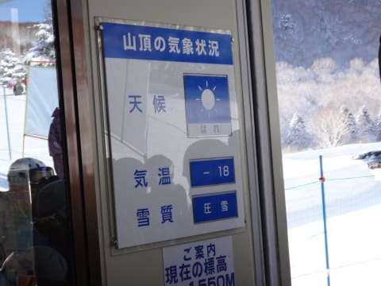

…朝の気温がマイナス18度っ！

3月にしては，ありえない冷え方ですな…

そして．

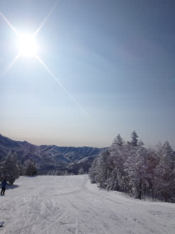

朝からピカピカの晴天っ！

さらに…

なんだ，これはっ！

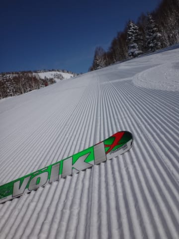

雪質，これ以上何を求めればいいのかってくらい最高なんですがっ！？？

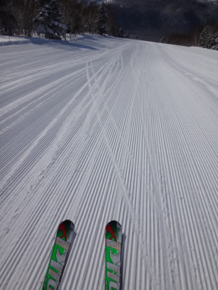

なんだ～，このゲレンデコンディションは～っ！（喜）

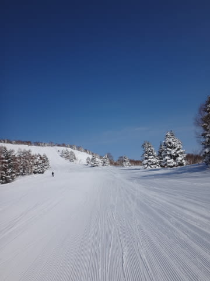

うおおおおおおお～っ！！！

幸せ～っ！！！！！！！

柔らかすぎず，硬すぎず．

最適の圧雪を．

最高の日差しの中．

人がいない貸し切り状態のゲレンデを，

自由落下していく幸せっ！

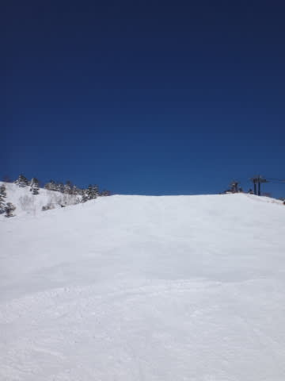

これだよ～っ！

これだ．

この幸せを感じるために，人間は生きているんだよ～（感動の嵐）．

いや，ホントに．

最高の雪質で．

朝イチは人もいなくて．

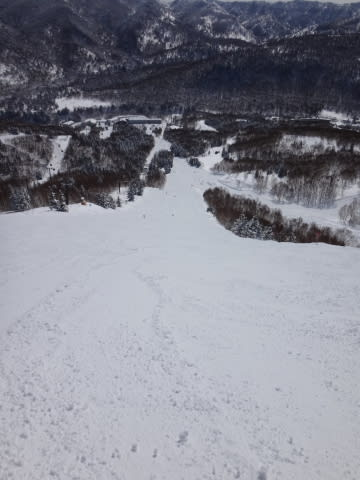

もう，自由落下したい放題．

飛ばしたい放題．

好きなラインでかっとばし放題っ！！

…って，10時ごろまで幸せをかみしめていると．

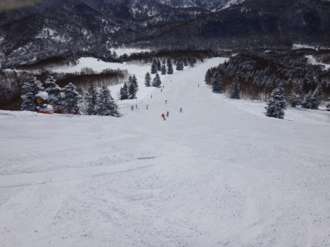

うむ．

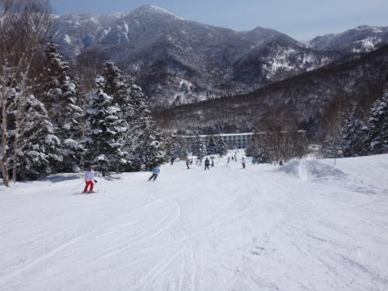

あらら…10時ごろにはちょっと人が出てきましたな…

と，思ったら．

10時半過ぎに．

あうーん．ゴンドラ5分待ち…

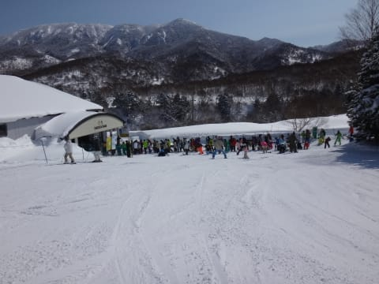

…でも．

ゴンドラを1本滑って戻ってくると．

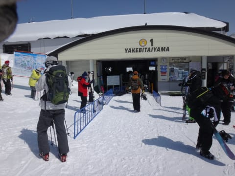

あら．

待ち時間0に減ってるわ．

…ってことで．

今日もゴンドラ待ちがあったのは一瞬．

そのあと，お昼にはまたゲレンデががらがらになり…

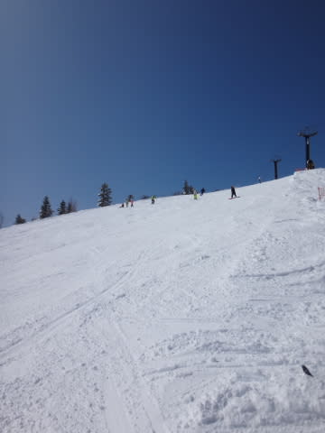

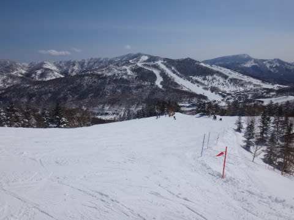

晴れているのに，気温は昼間でもマイナス5度と，

低いままだったので…

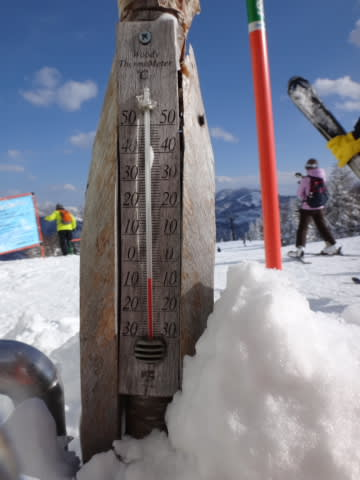

午後になっても雪質は最高のまま…

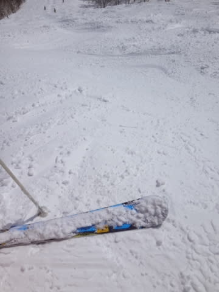

あー．でも．

さすがに．

午後3時頃になってくると．

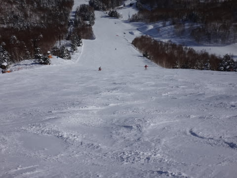

ちょいとところどころ，凸凹さんが現れ始めて

来ましたけど…

んでも，定番の午後3時の無料ドリンクサービスで，

あったかいドリンクをもらって．

元気をチャージしてから．

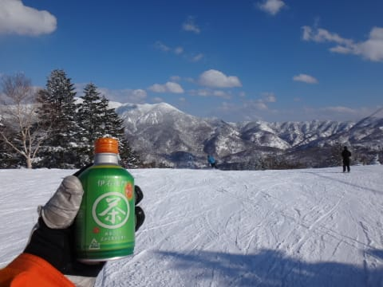

＃この日で，今シーズンの無料ドリンクサービスは残念ながら終了…

ひとがいなくなった夕方のゲレンデを…

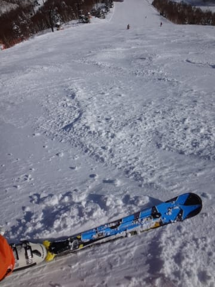

日が陰るまで，滑り続けたのでした…

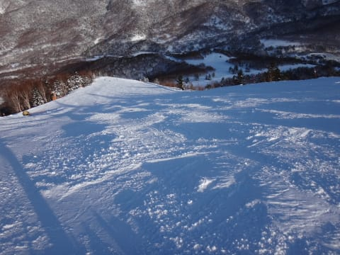

いやー．今日も日が沈むまで，たっぷり滑った！

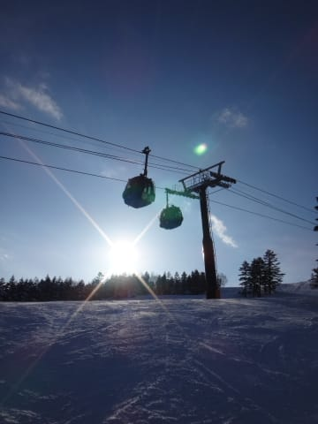

最高の一日だったな～．

やっぱり．

土曜は．

ほかのスキー場に浮気したのがダメだったんだな．

やっぱり私は，焼額ラブだわ～

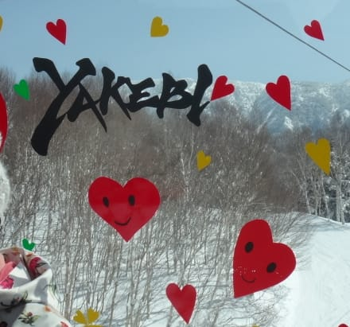

## 💬 コメント一覧

### 💬 コメント by (aqura)
**タイトル**: いいコンディション
**投稿日**: 2014-03-11 12:49:57

土曜日はぶな平を中心に、日曜日は一ノ瀬、焼額山、奥志賀と滑りました。初めてホットドリンクもらいました。そうそう、午前中、駐車場でお車拝見、超混んでいるゴンドラ待ちで、主様、ニアミス？。

本当に日曜日は最高でしたね、ニマニマしちゃいました。

### 💬 コメント by (Skier_S)
**タイトル**: aquraさま
**投稿日**: 2014-03-12 00:04:31

あらー．

車，発見されちゃいましたか．

ドアのへこみで判別できたのでしょうか（笑）．

ホットドリンク待ちでニアミスしてるかもですね～．

でも，日曜はホントに最高でしたねっ！！！

あー．

毎週，こうだったらいいのに…

