# ヤケビオープンの今週末までに，スキー場は冷えて雪がドサドサ積もるのか？を，予想してみたが…

📅 投稿日時: 2016-11-29 03:35:47

🏷️ カテゴリ: [スキー天気予想](c6554f5c3c106093b511a8daae23757e8.md)

えー

昨日は悲しみを誘う雨でしたが．

本日はギンギンに冷え込んでますよっ！！！

かぐら・みつまたスキー場のみつまたエリアも．

今朝7時はこんなだったのに．

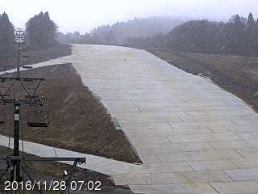

6時間後の午後3時には，雪景色になってますよ～！！！

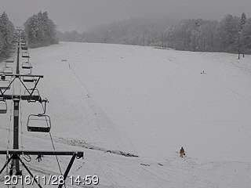

そして今晩は，いろんなスキー場で人工降雪機が

フル稼働しているみたいで…

ゲレンデ状況は，一気に改善してます！

…ってことで．

今週末にわがホームゲレンデ，

志賀高原の焼額山スキー場がオープンするわけですが．

はたして．

今週末までに，雪がドサドサ積もるのか？

それとも…何か悲惨なことが起きるのか？？

…いつも通り，専門天気図から．

今週一週間の天気がどうなるのか，

見てみましょうか…

まず．

火曜日，29日．

850hpa気温は…

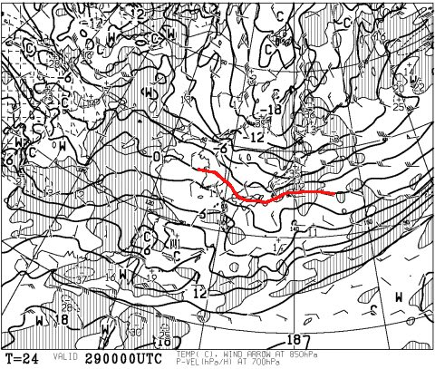

うむ．

0℃線はかなり日本の南側．

ガンガン冷えそうですね．

あまり雪が降らないまでも，昼間も

しっかり人工雪が打てます．

そして，水曜の30日は…

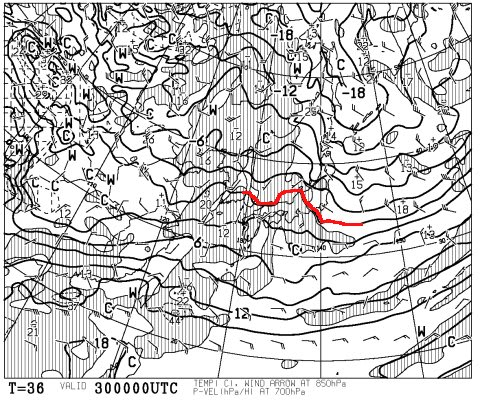

この日も，朝のうちは0℃線がぎりぎり信州に

かかっているので．

朝のうちまで，人工降雪機が動かせそうですね．

しかし．

しかし．

その次の日．

木曜，12月1日は…

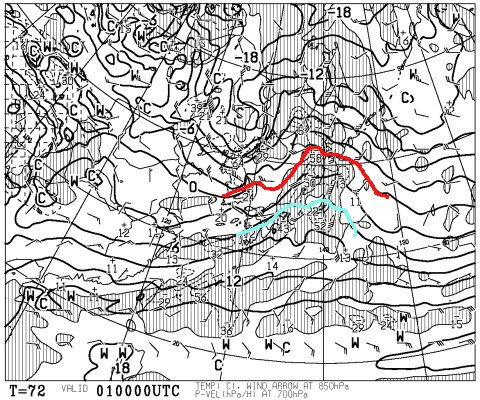

は，はうあっ！？？？

な，なんだ，こりは！（涙）

0℃線は北海道近くまで上がっているし．

信州には，水色で描いた+6℃線が

近づいているのですが？？

そして，この日の地上天気図を見ると…

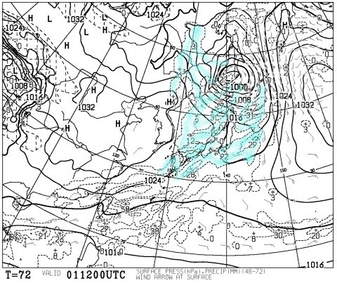

…水色の降水域が，日本全国を覆っている…

これは．

志賀高原も…

降れば雨（泣）．

ダメだ…

でも．

どしゃ降りじゃなく，27日日曜と同じ，

時折パラパラ降る程度の雨で済んでくれそうかな…

そして，その後．

金曜2日は，0℃線は志賀高原よりかなり北…（泣）．

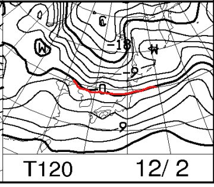

この日は，雪は期待できず．

昼間は人工降雪機が動かせなさそう…

うーーーーーむ．

今週末は，あまり期待できないのかも…

まぁ，土曜3日，日曜4日の850hpa図をみると．

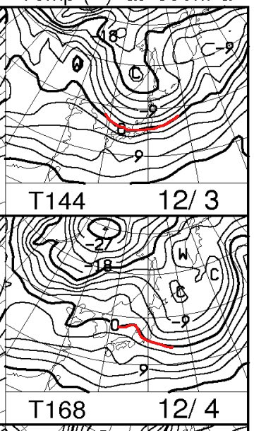

うーむ．

3日は0℃線も結構南に下がり，かなり冷えそう！

4日もまだぎりぎり0℃線が志賀高原に掛かっている

レベルなので，土曜から日曜朝にかけては，

そこそこ冷えそうに見えますね～．

…って，予想したものの．

FXXN519の850hpa気温予想を見てみると．

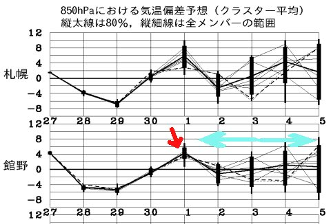

赤矢印で示した，高温になる12月1日までは，

予想ばらつきは小さいけど．

12月2日以降，水色矢印で示したエリアは…

すごいよ．全く予想がバラバラ．

気温が上がるのか下がるのか，よく

わからない状態です…

なんてったって，5日のスプレッドが0.81という

すごい大きい値で．

この値は…ほとんど，

「この日の予想は全くあてにしちゃダメよ♪」

というレベルの数字です．

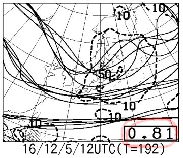

FXXN519の予想をもう一回見てみると．

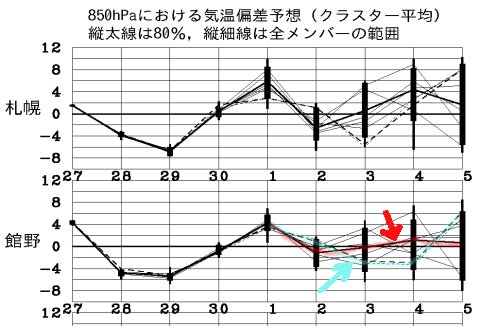

赤く印した太線（アンサンブル平均値）は，

「2日から5日まで，大体平年通りですよ～」

って予想だし．

水色で示した破線（GSM予想)は

「3，4日は冷えるけど，5日はスゲー暖かいよ！」

という予想…

まぁ．

とりあえず．

GSMでもアンサンブル平均でも，

2日の昼間は，人工降雪機が動かせるかどうか微妙．

2日の夜は人工降雪機が動かせそうだけど，

1日の雨で融けた雪が，3日土曜の朝までに回復するのか…

という感じ．

うーーーむ．

まとめると．

29（火）：天然雪+人工雪の積み増しあり

30（水）：天然雪は無いけど，朝までは人工雪がガンガン打てるよ！

　…でも．昼は気温が上がって，人工雪が打てなくなるかも…

1（木）：本降りではないけど，パラパラ降る雨+高温でやられる（涙）．

2（金）：天然雪期待できず．昼間人工降雪機が動かせるか微妙．夜は人工降雪機が動く．

という感じで．

…残念なことに．

今週末はドサドサ積雪でのゲレンデオープン，

…って感じじゃなさそうだなぁ…（涙）．

うーーーむ．

今週末は，たっぷり天然雪という，過剰な期待を

しない方が吉ですね（泣）．

やはり．

1日の高温＆雨が，惜しい…っ！

27日の日曜も，高温＆雨だったし．

この12月の長期予想を見ても．

こういう，時々高温が襲って雨が降る

パターンがしばらく続きそう…（残念）．

とりあえず，週末3，4日の詳細天気は，水曜夜に予想します～！

PS.

ここからは余談なので．

興味がない人は読まないことをおススメ．

…この，FZCXの850hpa気温偏差予想．

赤色のアンサンブル平均と水色のGSM予想が

示されているわけですが．

そのうち，このFEFE19の地上天気図は．

「2～5日は平年通りですよ～」

という，アンサンブル平均での図になります…

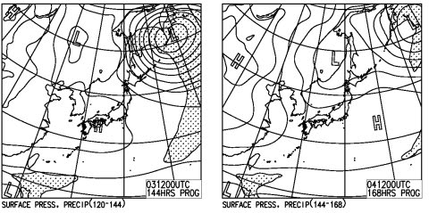

だのに．

この，FXXN519の850hpa気温図．

こちらは，GSMの単一モデル予想なので．

「3，4日は冷える！」という，

破線パターンでの図だったりする…

＃なので，FXXN519のトラフ位置とFEFE19の低気圧位置が対応してない

ちなみに．

統計的に予想が当たる確率を高める手法が

アンサンブル平均なので．

確率的には，GSMよりアンサンブル平均に近づく

可能性が高いわけで．

今回のパターンでは，FXXN519の0℃線（GSM予想)を見て

「お！冷えるね！」と思っても．

実際は，GSM予想よりも冷えないことになっている，

アンサンブル平均に近づいていく

可能性が高いです…

このあたりに気を付けないと，

GSMとアンサンブル平均が大きくずれたような，

スプレッドが大きい領域で，予想

を誤るので注意しましょう！←って，誰に言ってるんだ？？

## 💬 コメント一覧

### 💬 コメント by (れお)
**タイトル**: 今シーズンもよろしくお願い致します!!
**投稿日**: 2016-11-29 10:57:24

お久しぶりです!!

今年も、志賀の天気予報利用させてもらいます!!m(__)m

この感じだと、今週末から２ゴン運行とかにはならないですかね…。

それと、旧モデルですが、またSX購入しました～

しかも、古い板からのVARビン移植という、Ｓさんの作戦使ったので、安く済みました。

最初、ショップの方に移植の話しをしたら、「それできるかな～？」って感じだったのですが、「知り合いでやった人がいるんで大丈夫です（キッパリ!）。お願いします!」って言ったらＯＫでした!（笑）

ありがとうございました～。

### 💬 コメント by (Goku)
**タイトル**: 本降り
**投稿日**: 2016-11-29 16:13:13

今日の志賀高原、午後から一ノ瀬～奥志賀方面にかけて本降りのようです♪

これで、ゴンドラ動くかな？

### 💬 コメント by (はなげ親分)
**タイトル**: 雨・・・
**投稿日**: 2016-11-29 23:32:59

今シーズンも雨が降るんですか・・・。

でも、雨ならコースは空いてるんですよね（笑）

今週も月曜日の夜は雨模様でしたのでイエティは諦めて『疾風ロンド』観てきました。

地方の映画館で月曜のレイトショーでしたので観客は私一人で、ホームシアター状態で楽しみました。

設定に無理があるので突っ込みどころは多々ありましたが、粉雪の野沢温泉を見て気持ちが高揚し、３日の志賀高原に向けての期待度MAXです！

### 💬 コメント by (Skier_S)
**タイトル**: 今週末，どっさり天然雪が積もりますようにっ！！
**投稿日**: 2016-11-30 02:38:39

＞れおさま

お久しぶりです～！

今シーズンもよろしくお願いします～！

…また，SXですか．

それもビンディング移植って…

完全に私と同じパターンですよね（笑）

昨年版の'16SXですか？？

…とりあえず，今週末，雪がドサドサ降ることを

期待！

志賀高原でお会いしましょう！

＞Gokuさま

雪，積もってますね～．

ゴンドラが動いてくれると嬉しいんですが…

それより，今のところは2高が動くことを

祈った方が良いかもしれません．

明日が一つの山場です．

…ひどい雨にならなきゃいいんですが…

＞はなげ親分さま

なぜか，今シーズンも．

12月は春のように速い勢いで

次々低気圧が日本上空を通過するので，

…通過前は，雨になるパターンが

続きそうです…（泣）．

疾風ロンド…そんな映画があったんですね．

微妙な感じのストーリーですね（笑）

とりあえず，3日の志賀高原に向けて

テンション高めてください～！

