# 2024/1/2の志賀高原・焼額山スキー場は…晴れて滑れるコースは増えたけど，強風でゴンドラ営業遅れ＆第2高速故障運休などトラブル続きの一日

📅 投稿日時: 2024-01-03 00:25:47

🏷️ カテゴリ: [2024スキー滑走日記](c453f687e8a0f05679e95831d0a02cd0c.md)

えー．

早くも，志賀高原滞在5日目ですが…

…あれ？もう5日も経ってたっけ？

まだ2日目くらいじゃないんだっけ…？？

と．

時空のゆがみを感じているのですが…

明日帰るのは嫌だ～っ！！！！

まだ1週間ぐらい志賀高原に滞在したい…

とダダをこねたい今日この頃．

…とりあえず．

本日，1月2日も焼額を滑っていたので．

今日の焼額レポートです…！

まず．

すっきり晴天でスタートした本日．

新たに白樺コースもオープンするし，

昨日の雪が圧雪された最高のコンディションが

楽しめるはず…っ！！！

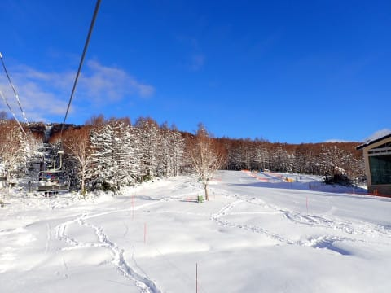

と，期待で焼額のゲレンデに向かったの

ですが．

なんと本日．

強風で第1，第2ゴンドラ運休（激涙）

だもんで．

朝は第2高速と第4ロマンスのみしか動かず．

今日は第2高速リフトスタートです…

あさイチの営業開始時のリフト待ちは

それほどなく．

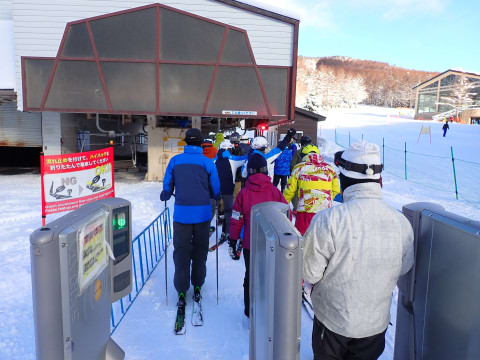

あさイチは，昨日の雪が圧雪された，

いい感じの最高シマシマバーンっ！！

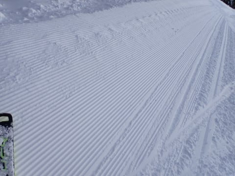

あぁ…

これでゴンドラが動いていれば…

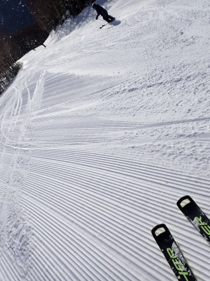

あさイチはガラガラだった第2高速の

唐松コースですが．

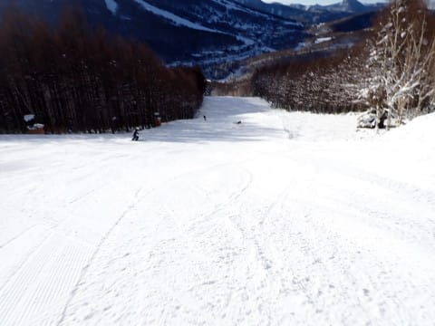

ゴンドラが動いてない本日．

本来なら2本のゴンドラに分散する人が，

リフトに集中するので…

営業開始30分後の9時ごろには，

第2高速リフト，すごい待ちに（涙）

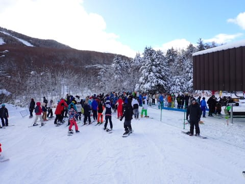

そして．

コースの人口密度も，なかなかすさまじいことに

なってきました…（泣）

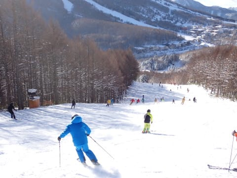

本来なら，本日は白樺コースとパノラマイン

コースがオープンするはずだけど．

ゴンドラが動かないと，このコースは滑れず．

リフトで滑れる唐松コースとサウスコースに

人が集中して…すごいことに（激泣）

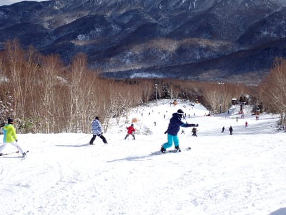

でも．

何とか風が弱まったのか…

午前10時過ぎに，第1ゴンドラ営業開始！！

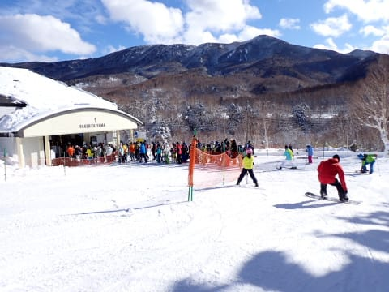

ただ…

第2ゴンドラは強風のため動かず．

また，奥志賀ゴンドラも止まっている

ってのもあり…

第1ゴンドラに人が集中して，約20分という

強烈なゴンドラ待ちが発生（泣）

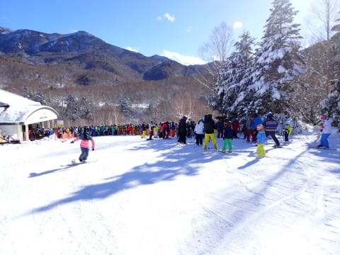

いや…

天気はいいし．

天気はいいけど，ギリギリマイナス気温を

キープしてくれたというのもあり．

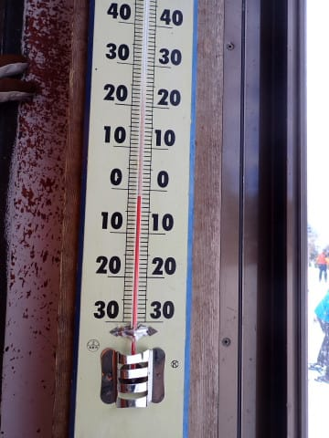

天気がいいわりに，雪質も比較的良くて．

オープンしたてのGS

コースは荒れておらずフラットで，

かなりいい感じなんですが…

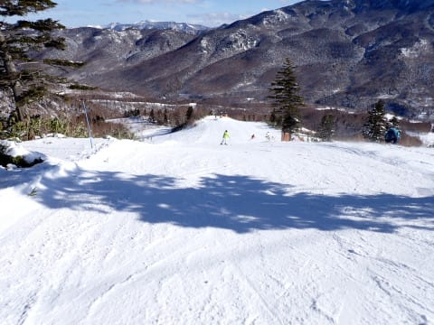

ゴンドラのリフト待ちに耐えられず，

第2高速に逃げようかと思ったら…

なんと．11時に故障のため第2高速が

営業中止（泣）

第2高速側の白樺・唐松コースへは

立ち入り禁止の案内が…（涙）

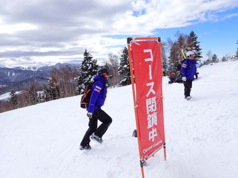

ちなみに，第2高速リフトの下に取り残された

人たちは，バスで4ロマ側（2ゴン乗り場）へ

輸送があったようです…

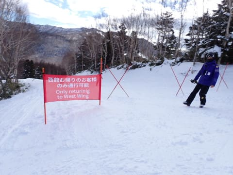

第2高速は止まったけど．

第2ゴンドラも強風で動く気配はないし．

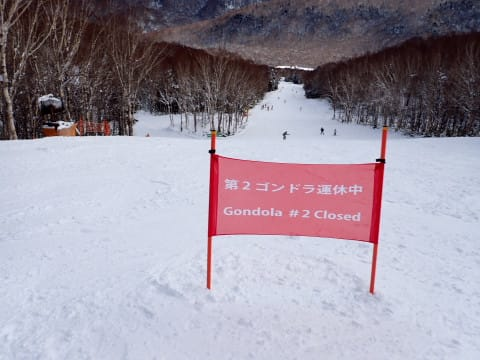

仕方がない．

第1ゴンドラの待ち行列を我慢する

しかないな…

（11時ごろの待ち時間ピークは20分まち（涙））

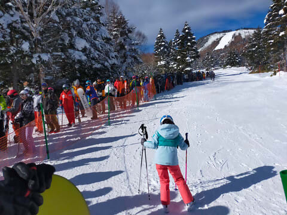

と，第1ゴンドラを回していたのですが．

どうやら，第1ゴンドラを滑る人は

みんなGSコースに行くらしく…

第1ゴンドラに乗って第2ゴンドラ側の

パノラマコースを滑る人はほとんどおらず，

第2ゴンドラが動いてない本日，

パノラマコースはガラガラ！！！

貸し切り状態！！

まぁ，ゴンドラを待っても，ガラガラコースなら

嬉しいよね…

と，数本滑ったところで．

昼休みタイムの12時前には，ゴンドラ待ちも

解消！！

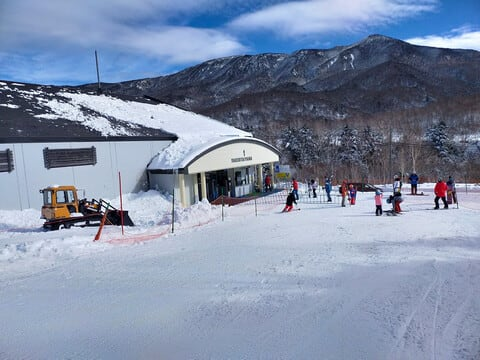

この後，

12時50分ごろには第2高速も運転再開して，

ゴンドラ待ちはこの後ゲートの外に

伸びることはほぼなかったです…

そして．

午後にはリフト待ちもほぼなくなり，

さらに，パノラマインコースと白樺

コースが滑れるようになったことで，

コース上の人口密度も減り…

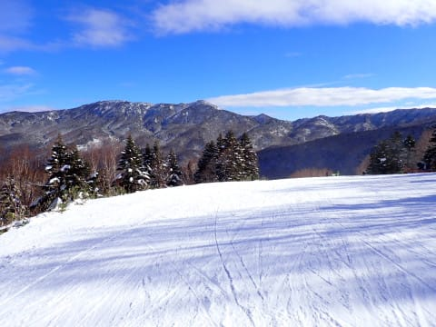

本日オープンのパノラマインコースは，

前後に人がいない貸し切り状態！

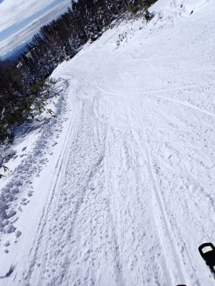

それ以外も，人口密度は午前中ほど

高くなく．

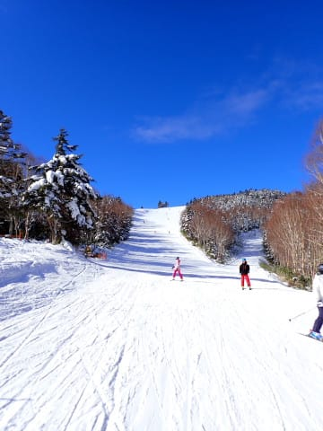

午後は多少凸凹があったものの，

そこまでひどいコブになることもなく．

雪質もいい感じをキープしてくれて．

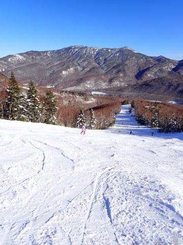

今日の午前中はゴンドラ運休やら，第2高速

故障やら，ちょっと残念な感じだったけど．

午後はリフト待ちもなく，雪もよく，

天気もいいうえに昨日ほど人口密度も

高くない…

という，午前中のマイナスを埋めて

余りあるくらいのいい感じのゲレンデを

たのしめたのでした…

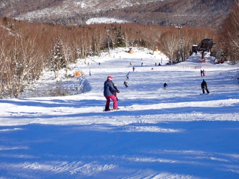

ってなことで．

天気が良かった本日ですが…

本日は白樺コースやパノラマインコースも

オープンしたとはいえ，

まだオリンピックコースや第3高速リフト

周りのコースが全くオープンできておらず．

晴れなくてもいいし，平地にも降らなくて

いいから，せめてスキー場にだけは

雪が積もってほしい

と，

ここ数日の願いを繰り返す，Skier_Sだったのでした…

## 💬 コメント一覧

### 💬 コメント by (ねも)
**タイトル**: Unknown
**投稿日**: 2024-01-03 07:46:20

Ｓさん　謹賀新年🎍

結局、まあまあ滑れてやれやれ、と書いて良いのかな？

あちこちかなり雪不足のようですね(>_<)　３連休に白馬に行くのですが、あまり期待しないことにします(笑)

志賀高原、月末に行く予定。２年ぶりです⛷️

### 💬 コメント by (新米パパ)
**タイトル**: Unknown
**投稿日**: 2024-01-03 12:25:52

謹賀新年す、S様。お会いする事ができず残念す。

昨日も朝イチ高速リフトスタート、最高の2本のあと２ゴンに行くも、、

いやー、とんでもない4ロマ渋滞、イチゴン動くまで大変でした。昼にはあがりました。

二日間それでも十分楽しめました。

大切なのは、

朝飯とばしても8時半にはリフト前にいる事だ！と再確認させていただきました。

今年もよろしくお願いします。

### 💬 コメント by (KYOKO)
**タイトル**: 前代未聞の雪不足😢
**投稿日**: 2024-01-03 12:26:21

Sさん

明けましておめでとうございます。

4年前の2月初旬に、

ヤケビゴン１朝一トラックをご一緒させて

いただいて以来、

ブログ愛読させていただきます。

12/31～1/2まで

一の瀬に滞在しました。

ブログを事前に逐一チェックさせていただきながら、古い板を持ってきました。

12/31は雨予報だったので、

横手山に行ったものの、

渋峠と横手下しかコース空いておらず、

山頂ヒュッテでお昼食べて、

リフトの下りに乗る久しぶりの恐怖体験でした。

夜に5cmほど雪が積もって本当によかったです!!!

1/1は朝一番でヤケビ＆奥志賀に行きました。

朝はGSコースがまだ空いておらず、

奥志賀の方に先に行きましたが、

急斜面エキスパートがコブ斜＆新雪で、

1回で疲労してしまいました。

一番下のリフト乗り場で、

おこみんおせんべいをいただいたのが

ラッキーでした。

ヤケビに戻ったら、

GSコースがオープンしていました！

人は多かったですね。

16時に宿に戻ったら、

まさかの地震で、

余震も含めてかなり揺れましたよね。。

津波ひどくなくてよかったです。。。。

1/2朝一の一ノ瀬ファミリーが

一番コンディションよかったです。

その後ヤケビに行ったら、

強風でゴン１＆２が止まっている!!!!

途中でゴン１動いた情報をキャッチし、

向かい1本目は空いていましたが、

2本目は長蛇の列でその後は挫折。。。

一の瀬に戻ろうとしたら、

第２高速が止まっているという事態で、

これはもう戻れない覚悟で

一の瀬に戻ってしまいました。

が、この後、ゴン１も空いてきて、

高速も動いていたとは!!!

リアルタイムで情報入手が本当に大事ですね。

パノラマコースもっと行っておけばよかったです😢

お見かけできるかと

滑りながら探してみましたが、

残念ながらお会いできず。

またお会いできる機会を楽しみにしています♪

なんとかまだまだ雪が降って欲しいです。

引き続きブログ楽しみにしています！

### 💬 コメント by (Skier_S)
**タイトル**: 無事帰宅
**投稿日**: 2024-01-04 02:23:50

＞ねもさま

あけましておめでとうございます～！

白馬は一時期はドカッと積もりましたが…今はまた雪が足りないみたいですね…

今晩と7日は降りそうなので，そこに期待！

＞新米パパさま

今回もお会いできませんでしたね…

8:30の営業開始時に1ゴンにいれば，会える可能性は高いのですが…

ぜひ朝イチ1ゴンへいらしてください（笑）

＞KYOKOさま

詳細レポートありがとうございます～

2日の昼にはゴンドラも動き，2高も止まっていたのは1時間程度でした…

でも，ゲレンデの人口密度は高く，快適度は低かったですが（涙）

今回は私を発見できなかったようですが，また今後も志賀にお越しの際は，

見つけたぜひら声をかけてください～！！

