# 2019/3/30(土)の志賀高原は…ほぼ全面，昼間は滑らない雪(涙)．寺子屋のみまともか…

📅 投稿日時: 2019-03-31 00:53:22

なんだか．

志賀高原．

昨日まで良かったようですが．

…今日はダメでした（涙）

昨日まで冷え冷えの1月レベルの

雪だったらしいのに．

なぜ，週末に限って…(泣）

とりあえず．

朝，志賀高原に登ってくる道に，

全く雪がない時点で．

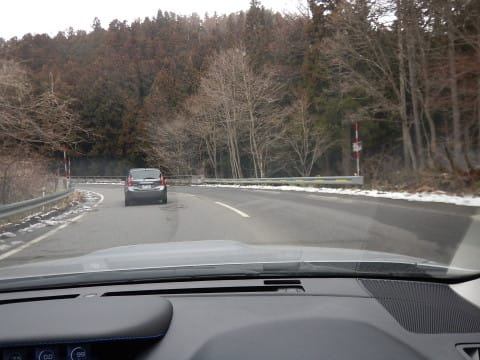

うーむ．

ちとまずいかな…

と，思っていたけど．

いつも通りの焼額のゲレンデに到着して．

通常営業開始の一番搬器に乗って．

山頂に着くと…

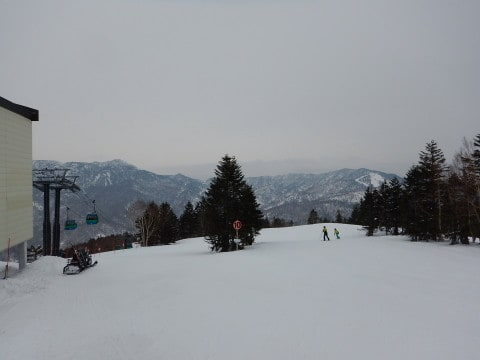

気温，-1℃ですか（泣）

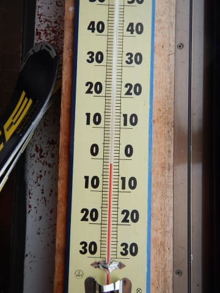

6:30からの早朝営業をやっているので．

ゲレンデはもう，シマシマが崩されてますが…

でも，ところどころシマシマっ！！

朝のうちは，それほどひどく荒れておらず．

いい感じの締まった圧雪バーン！！

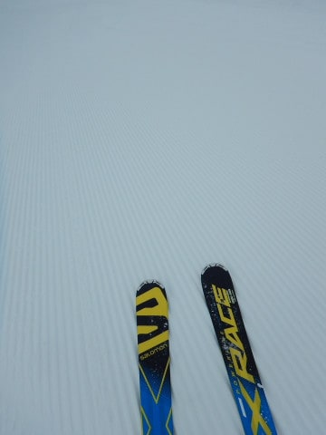

早朝からの参加組は，すでに2時間遺贈

滑っていて．

朝は最高だったらしいけど…

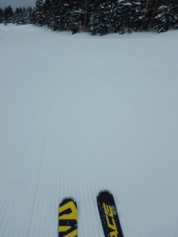

でも，8:30からでも，結構いい感じ！！

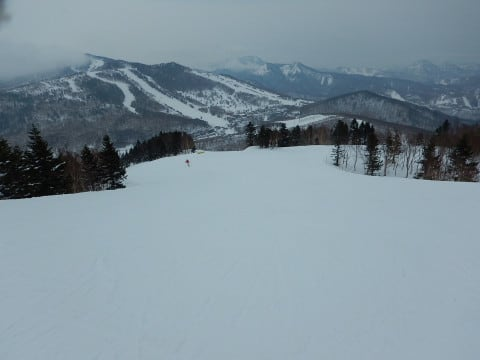

終日曇りのはずが，うっすら日も

さしてきましたよ…

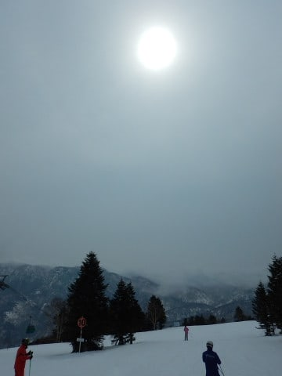

朝のうちは冷え冷え雪質で．

結構いいよ！！

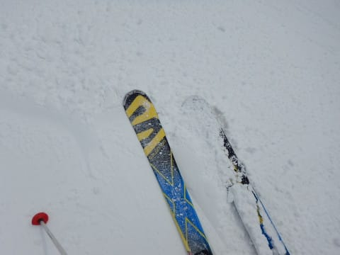

…と，思っていたところ．

この日差しで．

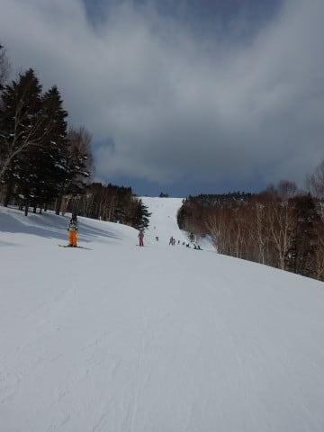

ちょいと雪が緩み始めて…

ダマダマのカタマリになってきたんですが（涙）

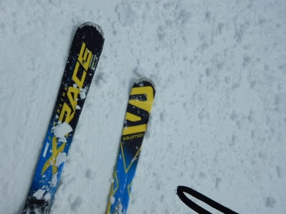

そして．

さらに雪が緩むと…

なんということか．

板に張り付いて，すべらない

雪になってきました…（涙）

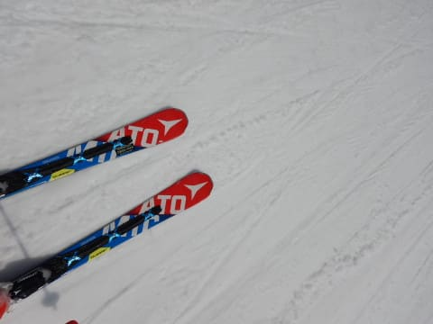

山頂付近は，まだマシな

雪質なんですが．

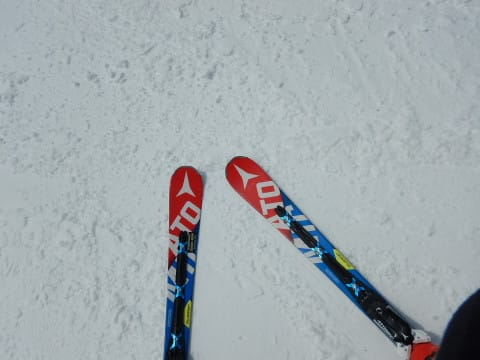

昼の山頂の気温もプラスに

振れてしまったこともあり…

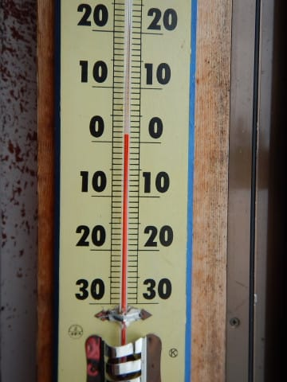

コース全体も，かなり雪が

荒れ気味になってきましたよ…（泣）．

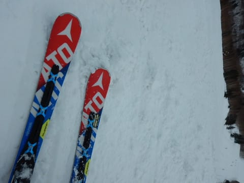

それどころか．

南風が強くなってきて．

うゲゲゲ．

第2ゴンドラが減速運転！？？

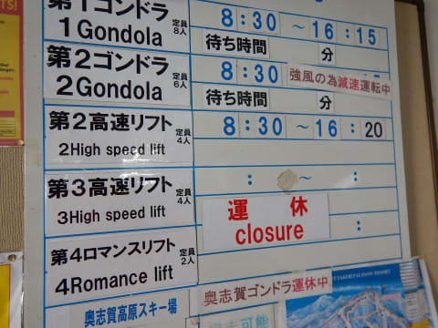

と，思っていたら．

…え？？

なに？？

第2ゴンドラ，止まっちゃいましたよ！？？

強烈な南風で，さらに奥志賀ゴンドラも

止まってしまい．

さらに第1ゴンドラも減速運転で．

山頂まで10分以上かかるように

なっちゃったんですが…（泣）．

なんということだ…（涙）

そして．

強烈な南風で，ゲレンデの雪がみるみる

緩んでいき…

ゲレンデ全体，ダマダマで，

滑らない雪に覆われてしまいました（泣）

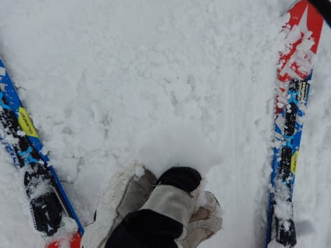

そのせいもあり．

ゲレンデはガラガラだったんですが…

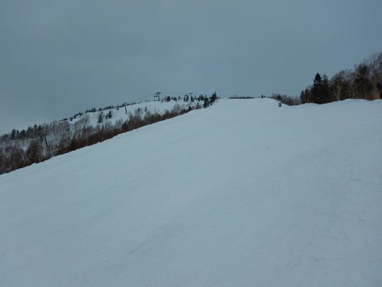

強風で減速運転で．

さらに第2ゴンドラ，奥志賀ゴンドラが

動いておらず．

人が集まる第1ゴンドラは．

ちょっと人が多めだったかな…

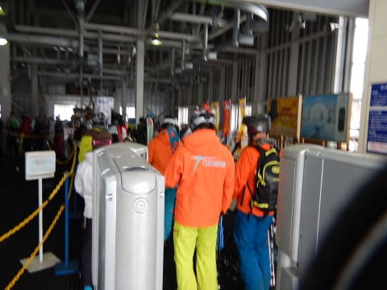

それでも，ゲートの外に列がつくことは

無かったし．

ゲレンデもガラガラだし．

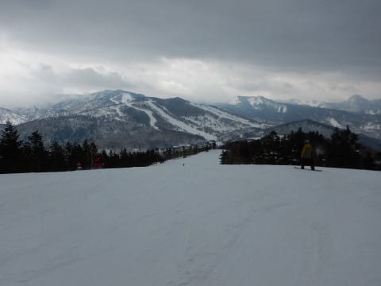

一見よさそうに見えますが．

でも，ゲレンデは全面張り付いて

スピードが出ない雪です…（泣）

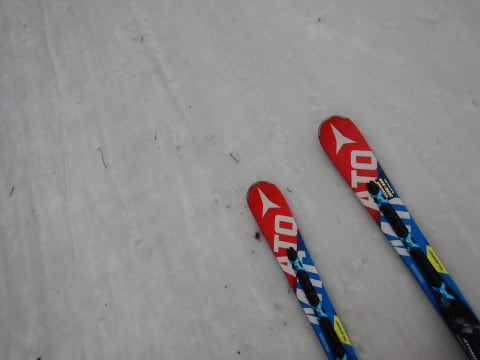

だもんで．

午後はちょいと一の瀬方面へ逃げてみますが…

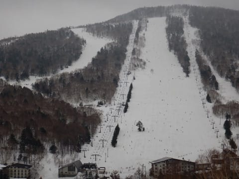

一の瀬方面も，決して雪は良くなく．

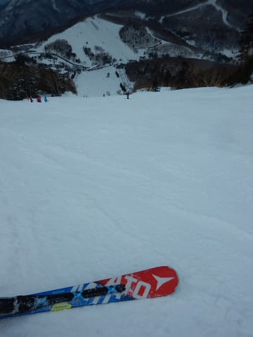

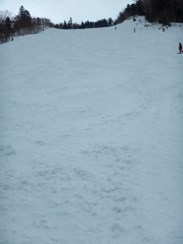

下半分は完全張り付き雪で．

ちと残念…

ただ，志賀全面張り付く雪になってしまった

今日，唯一．

寺子屋のみ，張り付く雪ではありませんでした…！

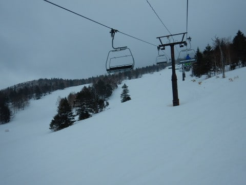

そして．

寺子屋に到着した午後2時ごろ．

一瞬結構な勢いで雪が降り，

びっくり！

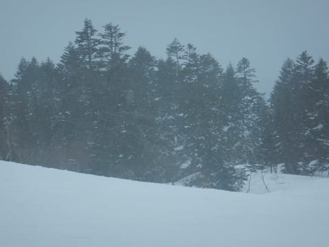

まぁ，すぐに止んで．

積もるほどではありませんでしたが…

そして．

寺子屋も午後3時ごろには脱出し．

また，ホームゲレンデの焼額に

戻ってきましたが…

焼額も，やっぱり雪はかなり重くなっており．

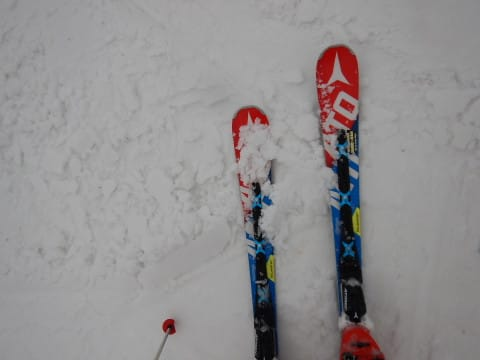

で．

午後3時を過ぎると．

雪がぱらつくタイミングが…

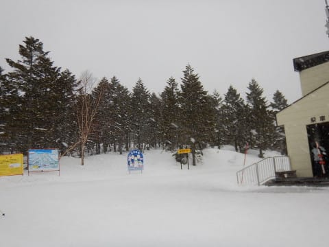

降りはパラパラですが．

ふもとでは，かなり雨っぽい

感じ…（泣）

取り合えず，

今日も，焼額のリフト終了の午後4時半

まで，しっかり滑りましたが．

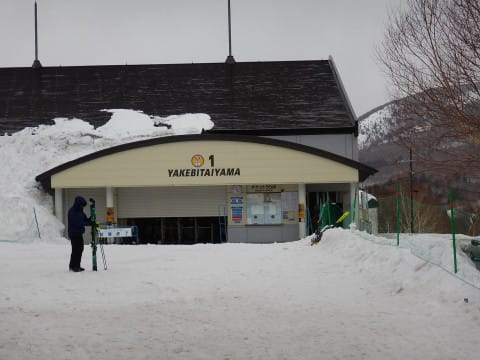

うーむ．

昨日までは最高だったらしいのに．

なんだか，かなり残念なことに．

一日で，

張り付いて．

重くて．

楽しくないゲレンデと化してしまいました…（涙）

あぁ…

ダメだ…（泣）

でも．

リフト営業終了後，夕方にかけて

かなりの勢いで雪が積もってくれたので．

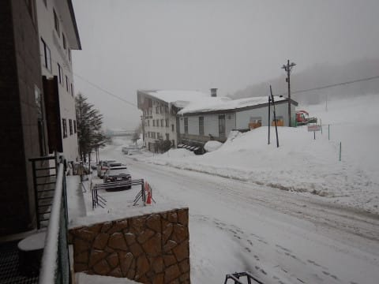

これから明日にかけて．

ゲレンデ状況，回復してくれないかな～．

## 💬 コメント一覧

### 💬 コメント by (ほっぽ)
**タイトル**: 3/30　志賀高原
**投稿日**: 2019-03-31 08:17:17

Ｓさん

昨日も全くお見かけしませんでした。(^^;

定位置にあるスキー板だけは確認しました。

昨日は奥志賀スタートでハイシーズン最後なのでジャイアントまで旅に出ましたが、どこもストップ雪で厳しかったですね。

特にブナ平はきつかった。

私は日帰りで今日は仕事なので、ゲレンデコンディションが回復して、

皆さんが楽しく滑られることを遠い空から祈ってます。

ハイシーズン営業最後の滑走レポートを上げておきました。

### 💬 コメント by (いか)
**タイトル**: Unknown
**投稿日**: 2019-03-31 16:01:13

昨日土曜日は志賀では雨は降らなかったのですね〜。白馬は昼前から豪雨で、昼からはお蕎麦、コーヒーと春の休日を満喫しました（笑）

そして、本日日曜日は、上部豪雪でした！うさぎ40cm、黒菱50cm＋と少し重めながらスーパーDay、本気ファットで15時まで滑ってしまいました。

これでGWまで雪がもちそうな感じになってきました〜、今ももさもさと積もっていっています（帰りたくないですね）。

### 💬 コメント by (Skier_S)
**タイトル**: 今日はいい感じの一日！
**投稿日**: 2019-04-01 02:09:45

＞ほっぽさま

土曜はお見かけしませんでしたね…

土曜はストップスノーで残念でしたが，

日曜は良かったですよ～！

土曜に仕事で，日曜スキーなら良かったのに…

って感じです．

では，また次の週末にお会いしましょう！

＞いかさま

え！？？？

50cmパウダー！？？

そして，ファットスキー？？

重くなかったんですか？

信じられない…

リーゼン，名木山も雪だったんでしょうか？

八方，かなりヤバそうな感じだったと聞いてますが．

これで無事GWまで営業できそうなら，良かったですね…

