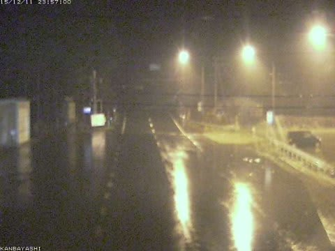
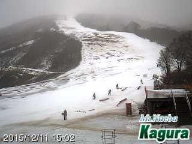

# 明日から志賀高原だけど…雪が減ってる…（涙）．

📅 投稿日時: 2015-12-12 00:24:19

🏷️ カテゴリ: [日記](cc4b5682fb7b8b144980957a978653fb0.md)

えー．

本日は一日．

予想した通り．

ものすごい気温が上昇し．

…そして．11日の金曜日は．

雨

です（流れ出る涙）．

（略）

志賀高原でも，昼間は+10℃近くまで上がるってことなんですが！？？

って予想が，悲しいほど当たってしまって．

気温+10℃近いなまあたたかい風が吹き，

すごい雨になったみたいで．

…今も，志賀高原の麓はすごいどしゃ降りのようです．

山の上では，雪が積もり始めてきているみたいなので…

明日の朝に期待ですが．

しかし．

焼額山の，[今日のBlog](http://blog.princehotels.co.jp/yakebi/2015/12/11/)を見ると．

すごいことになってます…

第2高速と第4ロマンスの間をつなぐコース，雪が

完全になくなってますね…

強引に雪入れをしてつないでるみたいですが

うーーむ．

今晩は人工雪が打てるだろうから，

天然雪+人工雪で，明日は何とか

しのいでほしいところ…

かぐらも．

なんだかすごいことになってます（涙）

これが…

これが，12月中旬のゲレンデかっ！？？

とりあえず，今晩から明日の朝にかけて．

わずかに雪が降り，何とか人工雪は打てそうですが…

それほどドサドサ降りません．

土曜は曇り，時々日も射すだろうし…

日曜も気温が上がり，土曜夜から日曜に掛けては，

人工雪は打てない可能性が高いなぁ…

今のところ，日曜の天気予想は終日曇り．

気温は平年より4度ほど高く，昼間はプラス気温．

あぁ．

土曜のどしゃ降りは避けられたけど．

うーん．

あまりコンディションは良くなさそうだなぁ…

とりあえず．

あと3時間後に出発なので．

これからシャワー浴びて寝ます…

…あと2時間しか寝られない…

明日も2時間睡眠で滑るのか…

では，おやすみなさい…
