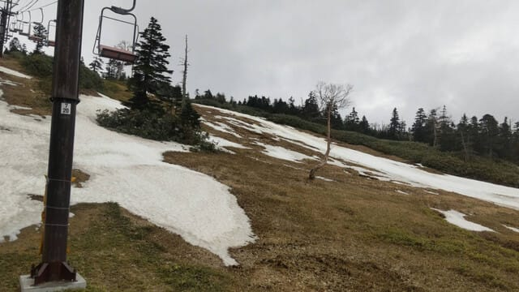
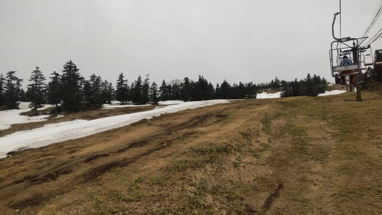
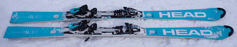
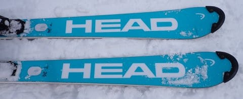
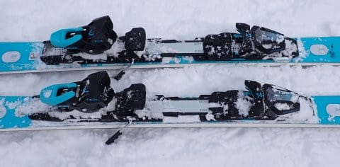
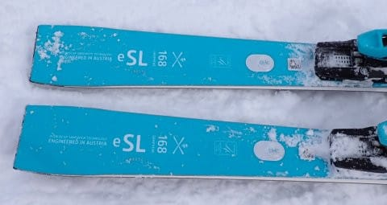
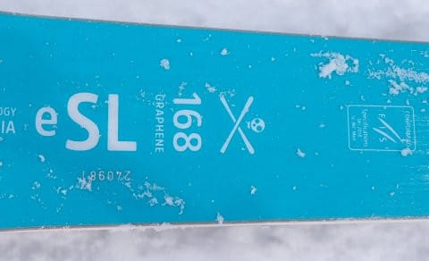

# 2026シーズンモデルのスキー板，試乗レポートその3…HEAD WORLDCUP REBELS e-SL EVO Speedblue

📅 投稿日時: 2025-05-23 04:56:21

🏷️ カテゴリ: [スキー板試乗](c0bd8048615710cee890e403a36cc9a2b.md)

ダいろいろクリティカルで，

今日ももうこんな時間…

朝4時半じゃないか…

この時期だと，この時間はもう空が

明るくなってきてるんだけど…（泣）

果たしてこれから寝て，明日の朝ちゃんと

起きれるのか…（涙）

それでも今日もBlogを書く！

書かないで寝たいけど、書く！

だからみんな褒めて！！←強制するな

ってなことで．

今日もおこみん特派員から、22日の渋峠情報

が送られてきました〜！

渋峠は，昨晩からちょっと雨が降ったのかな？

午前中はほぼ雨が降らずに滑れたようですが…

ゲレンデは硫安がまいてあったからか，

かなり板は走ったようですが．

でも，雪はかなり少なくなってますね…（泣）

これ，やっぱり25日の雨でやっぱり

やられちゃうかも…（泣）

延長営業は期待しないほうが良さそうかも…

ってな感じで．

今日も本題の2026シーズンモデルのスキー板の

試乗レポートです！

今日はヘッド編．では，どうぞ～！

〇HEAD WORLDCUP REBELS e-SL EVO Speedblue 168cm

基礎小回り．

2025年はカタログでは

WC SL-REBEL FIS EVO SPEEDBLUE

とも呼ばれたけど．

まぁ，e-SL EVOと呼ぶ人が多かったかな…

165cmのFIS競技用のe-SLと違い，

168cmというわずかに長めの板ですが．

この板もFIS公式マークがついたSL板です．

ただ，FIS競技用モデルとプレートが違い，

ちょいと優しめのプレートが着いてます．

滑ってみたところ…

フレックスが結構強め．

コア材がしっかりしていて，メタルより

心材で張りを出しているように感じる

板で，バネ感があってたわむというより

硬い板がしっかりこらえる感じ．

しっかりしたフレックスで結構グリップが

強く感じ，フレックスが強いので，

踏まなければあまりたわまず，小さめの

サイドカーブよりはまっすぐ目に滑る感じ．

だもんで，SL板でもロングターンまで

十分引っ張ることができます．

ただ，サイドカーブが小さいので，

角付けを強めるとサイドカーブに乗って

結構小さめの半径で回ります．

ただ，角付けを強くした場合でも，

たわんで曲がっていくというよりは

強めにグリップするエッジに乗って，

小さめのサイドカーブに沿って

板の行きたい方向に回っていかされる

感じ．

サイドカーブに乗ってレールターンを

していく感じで，

たわみが板に溜まってそれが解放される…

というバネ感で小回りになっていき，

バネで左右に反復横跳びのように飛ばされる

小回り強制板ではないです．

しっかりグリップして，ターンの最後まで

エッジに重さをかけてターンを仕上げられる

感じ．

そして，グリップもフレックスも強いので，

スピード耐性は結構高めで，かなりのスピードを

出しても怖くないです．

結構なスピードで，レールターンのような

エッジに乗り続けた左右ターンを続けて

行けるし，スピードを出しても板がたわみ

すぎて忙しい小回りになることもない，

安定感のある板です．

軽快さもあるし，フレックスの強さで

小回り板にしてはある程度まっすぐも

落としていけるので，張りの強めの

板が好きな人が，小回りベースの

ゲレンデ板として履くのはありかな？

## 💬 コメント一覧

### 💬 コメント by (Skier_B)
**タイトル**: Unknown
**投稿日**: 2025-05-24 00:23:35

睡眠削ってブログ書くS様、家族一同尊敬してます！

でも寝てくださいw

### 💬 コメント by (Skier_S)
**タイトル**: ＞Skier_Bさま
**投稿日**: 2025-05-24 00:37:42

家族そろって応援いただき，ありがとうございます…

寝たいんです．寝なきゃいけないんですが…

今日もおそらく睡眠時間3時間でまたお出かけしちゃいそうな自分がいる…

