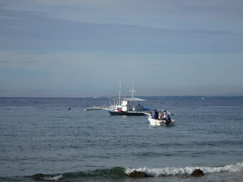

# 2014年8月　オスロブagain…再び，子連れでジンベエザメと泳ぐぞ！　その14

📅 投稿日時: 2014-09-20 03:00:17

🏷️ カテゴリ: [ダイビング日記](ce3a7a8d424d112fce83ee85c81a0e344.md)

そして…

ダイビング2日目の，朝．

本日は，ジンベエスイムに行く予定にしてる日です…

うむ．

昨日と違って．

今日は，晴天ですなっ！！

太陽のもと，ジンベエ様を拝めそう！

いつも通りレストランに向かい，朝ごはんを食べますが…

朝ごはんを食べている間に，ダイビング組が出発

していくのが見えました…

ダイビング組は，今日も遠征に行くらしく．

朝7時15分という早めの出発．

それに比べ，ジンベエスイムの我々は朝8時15分

集合なので，のんびりです…

デザートのおいしいマンゴーをゆっくり食べてから．

ダイビングショップへ向かいます．

ダイビングショップへ着くと…

ええ？？

なんだか，すごい人数なんですがっ！

へぇ？

今日だけで，ゲスト20人いるの？

私「なんだか，すごい人数ですね～」

ガイド「いや，これでも今日は少ないほうです…」

私「前回は5-6人でしたけど…」

ガイド「前回は11月ですよね？だったら

　そのくらいですかね．まぁ，夏休みは毎日

　こんなもんです」

ふむ．

なるほど．

前回は11月だったから，人が少なかったのね…

やっぱり，夏は混むんだなぁ…

ということで．

シュノーケリングとダイビングを合わせて

20人．

ホテル前から小舟でバンカーボートへ

向かいますが．

さすが1隻のボートでは間に合わず．

2艘のバンカーボートで出発です．

いや，しかし．

いい天気だなぁ～！

晴天の中，ジンベエのポイントへ向かいますが…

今日は最高のシュノーケリング日和になりそうだなっ！
