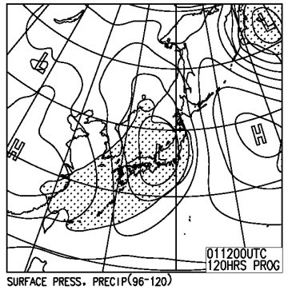

# 定番！この週末の志賀高原の天気は…うーむ．予想の難しい，南岸低気圧パターン…

📅 投稿日時: 2015-03-05 00:05:41

🏷️ カテゴリ: [スキー天気予想](c6554f5c3c106093b511a8daae23757e8.md)

ということで．

今週末の天気ですが…

うーーーーーむ．

うーーーむ．

私の嫌いな，南岸低気圧なんですよ…

前にも書いたと思いますが．

低気圧の進路がわずか数10km，南北にずれるだけで．

全く天気が変わってしまいかねないというこの南岸低気圧．

予想がむずかしいんですよね～（涙）．

実は，先週の日曜も，南岸低気圧だったので．

雨の予想を外してしまったんですよね～←天気予想を外した言い訳

予想ではこんな天気図だったけど…

実際はこんな天気図で，

…この，予想図と実際の天気図．

ほとんど同じに見えるかと思うんですけど．

微妙に，予想に比べ，実際の天気図の方では．

前線を張ったメインの低気圧，南にずれてます．

予想では，低気圧の中心は本州の中央部を通りそうな感じだったけど．

実際の天気図では，太平洋上を低気圧の中心が通っていきました．

低気圧の中心が，予想よりわずかに南にずれちゃったので．

…だもんで，低気圧の南側の暖かい空気がそれほど

北まで入り込まず，気温が予想ほど上がらなかったので，

雨の予想が雪にかわったんですね～．

このように．

南岸低気圧パターンでは．

たったこれだけの，低気圧の通過位置のずれで．

全く天気が変わっちゃうんですよ…←必死に天気予想が外れた言い訳をしている

ってことで．

この週末の天気図を見てみると，ですね．

土曜日に，四国沖に低気圧が発生し…

日曜にかけて，日本の南岸を通過するパターンで．

…そして，850hpa気温はいやらしいことに．

土曜も…

日曜も．

こんな感じで，0℃線がぎりぎり志賀高原にかかるかどうか．

…とりあえず，この予想図のままなら，志賀高原は雨には

ならないはず…

ってか，ほとんど何も降らず，2日間ともうす曇り．

土曜の夜から日曜にかけて，ちらちら雪が舞うかな…

という程度…なんだけど．

なんてったって，南岸低気圧だから．

この低気圧が，わずかに北にずれると…

0℃線もそれに伴って北にずれるので…

…

…

雨になるかも…

でも．

今のところ．

8日の予想ばらつきを示すスプレッドは，0.39という比較的小さめの値で．

赤く囲った部分の特定高度線の予想ばらつきも小さいので．

…おそらく，低気圧は，ほぼ予想通りの位置を通りそうかな～．

とりあえず．

現時点での天気予想は

土曜日：もしかすると，夜の間にうっすら数mm雪が降るかもしれないけど…

　　朝の山頂は，マイナス5度以下にまで冷えて，しっかり締まった，固めの圧雪．

　　快適なハイスピードバーンでしょう．

　　天気は…朝は薄曇りかな．午前中は，ちらちら日が射すタイミングも

　　あるかもしれないけど…基本的に曇り．午後に向けて雲は増えていく．

　　気温は，昼間には0℃近くまで上がる．そんなに寒くない．

　　午後は，チラチラ雪が舞うときもあるかも…

　　雪質は，すごく重くなったりもせず，しっかりした圧雪が終日続く．

　　…急斜面は，下地のアイスバーンが顔を出すかも．

　　

日曜日：朝から曇り．雪がちらつくかも．

　　この日も，朝イチはしっかり締まった圧雪バーン．

　　…低気圧が予想より北を通るようなら，ちょっと重めの新雪が

　　数cm積もっているかも．

　　この日は終日曇りで，時々雪がちらつく．

　　昼間は0℃くらいまで上がるかな…

って感じで．

今のところ，雨になったり，強風でゴンドラが減速or運休になる

ことはなさそうですが…

…なにぶん，敵は，私の嫌いな南岸低気圧ですから．

また，直前に最終予想をします…
