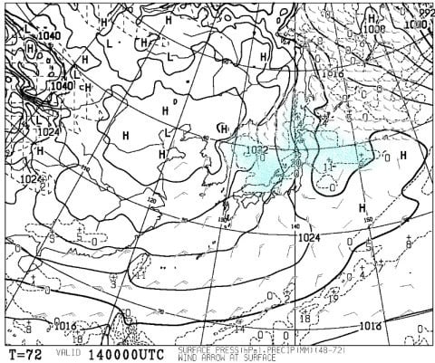

# やっぱり，今日12日の朝は志賀も雨だった（涙）…でも，午前中から雪になって，13日にかけてちょっと積もるよ！

📅 投稿日時: 2018-12-12 06:46:25

…なぜか．

今日もご無体時間なので．

皆さんお待ちかね，物欲選手権の記事を

書きたかったのですが．

ちょっと時間が…（涙）

だもんで，本日はちょっと志賀の天気レポートをば．

（…すみません．コメント回答もしばしお待ちを…）

ってわけで．

数日前から雨が降ると予告していた，

11日の夜～12日の朝を迎えたわけですが．

…やはり，雨だったようです（涙）

（[北信建設事務所HP](http://www.q0.ws302.smilestart.ne.jp/index.htm)より）

志賀3号トンネルの入り口…

朝6時過ぎで気温2.2度（涙）

路面も濡れています…

そして，横手も雨で，

降雨量が11mmですか…（泣）

（[北信建設事務所HP](http://www.q0.ws302.smilestart.ne.jp/index.htm)より）

運が良ければ，雨にならずに済むかと

思ったんですが…

深夜1時頃まで雪っぽかったけど．

それから気温が上がって，雨になっちゃったのが

惜しい…

ただ，今日の午前中には雪になって．

そして…

13日の朝まではぱらつく程度ですが…

13日から14日にかけて．

ちょっと積もりそうな予感！

14日朝の850hpa気温図．

赤い0℃線はかなり南に下がり…

志賀は-9℃線が近づくという，気合の入った冷え方！

そして，14日の地上天気図は…

をを！

水色の降水域が日本海を覆い．

日本海側にのみ降水域がかかる，

見事な冬型の降雪パターン！

おそらく，13日から14日にかけて．

志賀高原でも20cm近く．

運が良ければ30cmくらいの積雪が

ありそう…！

とりあえず．

このまま14日まで．

雪が積もるように，全スキーヤーが

熱い思いを込めて，必死に冷え冷え踊りを激しく，

情熱的に踊り続ければ，

今降っている雨はすぐに雪に変わり．

この週末はゲレンデ状況がかなり

改善しそう！！

皆さん，踊りましょうっ！！！

## 💬 コメント一覧

### 💬 コメント by (若杉勲71)
**タイトル**: 二ゴン試運転
**投稿日**: 2018-12-12 15:23:24

今日は朝のうち雨で、、常連さんはほぼ休業。でも雪質は最高でしたよ。

そして、ゴンドラ試運転に感動でした。

週末は大阪の指導員研修が予定されているようで、ヤケビも必死ですね。

### 💬 コメント by (Skier_S)
**タイトル**: 若杉さま
**投稿日**: 2018-12-12 23:42:40

え？？

雨だったのに，雪質が良かったんですね！！

…明日は新雪がそこそこ積もるので，もう少し

良くなるかも．

明日は終日降り続け，結構寒いですよ！

そして，今日はついに2ゴン試運転ですか！

…雪が積もれば，今週末からでも動いてくれそうですね…

今週末はおそらく赤い軍団の方々がたくさんいらっしゃるかと．

せめて2高が動いてくれないと，すごいことになりそうです…（恐怖）

