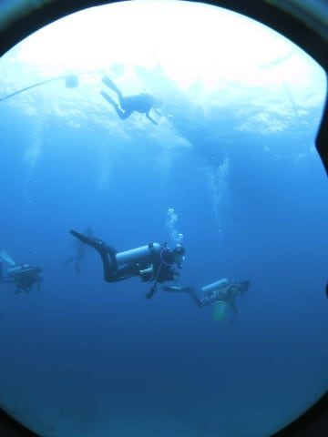
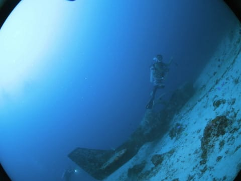
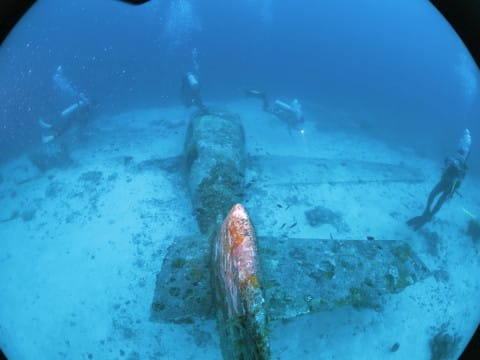
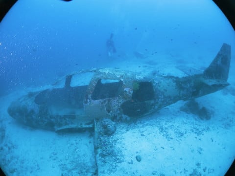

# 2018年8月，モアルボアルで小5の娘をダイバー化！その8…午後の前半，本日3本目のダイビング

📅 投稿日時: 2019-07-17 01:01:26

ということで．

3連休，ちょうど1周年を迎えるLEVORGに乗って，

ちょっとした長距離旅行に行っていたのですが．

…まぁ，気が向いたらどこに行ったかを

書こうかと思っていますが…

うーん．

書けるかなぁ…

とりあえず．

本日は，いつものダイビング旅行記の続きです～！

---

ってなわけで．

お昼ご飯の後は，午後のダイビングに

向かうわけですが．

午前中がプール講習だった娘．

午後からは海洋実習になるので．

ファンダイブ組と一緒にボートに

乗って出発です！

ファンダイブと海洋実習は

同じポイントに潜り．

娘のみ，浅めの場所で実習と

なるようです…

普通は，海洋実習1本目は，

足が着くビーチエントリーで

やるのかと思っていたら…

いきなりボートダイブで

海洋実習とは…！

しかし．

体重30kg程度の10歳の小学生には，

10kgを余裕で超える重いタンクと

器材を背負って，足場の悪いビーチを

歩いてエントリーするのはちょっと

難しそうな気がするので．

重いタンクを背負って歩かなくていい

ボートダイブの方がいいでしょうね…

ってなことで．

同じボートで娘もダイビングに行く…

ということにちょっと感慨を受けながら．

やってきたポイントは，Airplane．

ダイビング用に，飛行機が沈めてある

ポイントです．

ファンダイブ組が先のエントリーで．

娘の初の海洋実習を見ることはできません

でしたが…

とりあえず，このポイントの目玉，

沈めてある飛行機に到着！

まぁ，数年前に一度潜った

ポイントですし．

飛行機自体には，そんなにいっぱい

魚が着いているわけでも無いし．

まぁ，定番（？）の，

飛行機の中に入っている写真を

みんなが撮ったら…

飛行機を後にして．

他にもいろいろ巡ってみます…

…が．

どうも，午前中のジンベエザメのインパクトが

大きすぎたのか…

かなりきれいなクジャクベラやら．

ほっぺたの棘がそれほど育ってない，

ちっちゃなスパインチークの子供が

居たりしたけど．

まぁ，それほどのインパクトもなく

エグジット．

…ダメだ．

ジンベエを見ちゃったので．

今日はもう何を見ても，印象に残らない…

ってな感じで，エグジットしたら．

娘は先に海洋実習を終えていたようで．

ボートの上で待ってました…

娘にとって，初めての海洋実習．

どうだったか聞いてみたら…

娘「楽しかった～！！！！！」

…うむ．

普通は緊張したり怖かったりすると

思うのだが…

とりあえず．

うちの娘．

ダイバーになる素質は，

十分にありそうだな…
