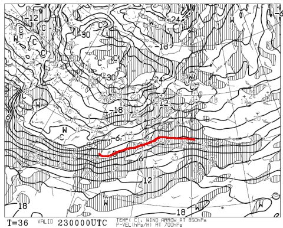
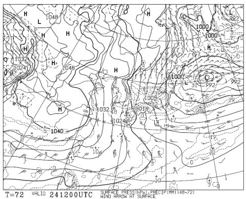
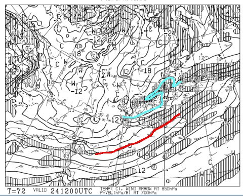
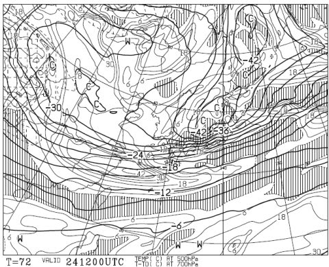
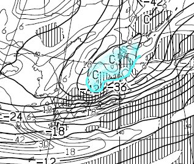

# 今週末，1月23日・24日の志賀高原の天気は…日曜はすごい雪か？積雪は？

📅 投稿日時: 2016-01-22 02:03:52

えー．

本日の志賀高原．

たっぷり雪が積もったようですね～！

無事，焼額のオリンピックコースも

滑れたようで．

コース上，ブッシュの心配はないようです！

＃れおさん，コメントありがとうございます

いやーーーー．

やっと．

やっと，本格シーズンになった感じですね～！！

ということで．

今週末の天気予想にいくわけですが．

まず，土曜23日の朝の地上天気図を見てみると…

ふむ…

ちょっと残念なことに，冬型が崩れてますね．

だもんで．

この日の朝は，前日からの積雪はなさそうな感じ…

パウダーは楽しめなさそう．

でも，山陰地方に小型低気圧があって．

こいつが通過する午後は，志賀でも雪がちらつくかな～．

で，850hpa図を見ると．

0℃線は日本のはるか南．

そして，志賀高原には-9℃線が近づいてるので…．

ふむ．

この日の朝は，-10℃を下回り，山頂では-13℃くらいか．

今シーズン一番の冷え込みになるかな！

朝は冷え冷えの柔らかい雪が圧雪された，

最高のフカフカシマシマバーンが滑れそう！

そして．

日曜の地上天気図を見ると…

うむ？なんだかすごい縦縞の，これまで見たことのない

レベルの冬型なんですが…

で．

850hpa図を見ると…

なに？？

赤くマークした0℃線が，沖縄より南まで下がってるんですけど！？？

…これはすごい．

志賀高原は水色で示した-12℃線がかかっているので，

朝は-15度クラス．昼間も-10℃以下．

超絶寒い一日になりそう…

そして，500hpa図を見ると．

なんだ？？

なんだ，これはっ！！？？

日本付近を拡大すると…

水色で示した-42度の寒気が，

北日本にかかってるんですけどっ！？？

普通は，-30℃が雪の目安，

-36℃が大雪の目安だけど…

-42℃って，なに？？

私も天気図を見て長くなるけど…

日本本土に-42℃の線がかかるのを，初めて見た．

…これは，何が起こるのか．

私の想像を超えるレベルです…

おそらく，終日雪だと思うけど…

どのくらいの降りになるのか．

風がどのくらい吹くのか．

未経験領域なので，想像が難しい…

そんな中．

とりあえず，志賀高原の天気を予想してみると．

土曜：前の夜からの積雪はほとんど無し．

　朝イチは冷え冷えの雪が圧雪された，柔らか最高のシマシマバーン！

　朝のうちは晴れ～曇り．だんだん雲が多くなり，午後は雪がちらつく．

　結構寒い一日．昼間も-5度を上回ることは無く，

　午後も冷え冷えなので，雪質は終日いいままキープ．

　夜に向かって，雪は強くなっていく．

日曜：朝は20～30cmの積雪か？脛～ひざパフの激軽パウダー！

　とりあえず，朝は-15度クラス，昼間も-10℃以下の，激烈に寒い一日．

　風が強まるタイミングもあるので，焼額第2ゴンドラは

　減速運転に入るかも．

　吹雪っぽいかもしれないけど…

　焼額第1ゴンドラが止まるほどの強風にはならないはず．

　雪は終日降る．時折かなり強く降る．

　昼間もモサモサ雪が増えていき，午後のゲレンデは人が

　少ないのもあって，終日ゲレンデをうっすらパウダーが覆う，

　パウダーな一日かも…

　心配なのは帰り道．

　日曜の夜，雪による交通事故や通行止めとかに巻き込まれず，

　無事関東までたどり着けることを祈るばかり…

という感じで．

私がこれまで見たことのない天気図となっている，

この日曜日．

何が起こるのやら…

まぁ，雪不足の心配はなさそうですね（笑）．

## 💬 コメント一覧

### 💬 コメント by (Tomoko.Y)
**タイトル**: 今週末
**投稿日**: 2016-01-22 13:38:42

こんにちは。

今週末、志賀高原に行きます。

そう、私が雪女かも知れません(笑)

サンバレー、奥志賀間をツアーする予定です。

焼額でお見かけできるかどうか…。

日曜には無事に関東へ辿り着きたい組です。

### 💬 コメント by (Skier_S)
**タイトル**: Tomoko.Yさま
**投稿日**: 2016-01-22 23:15:59

今週末志賀高原ですか～！

もう，雪女確定ですね（笑）．

私はいつも通り，焼額第1ゴンドラをグルグル

してると思います…

家族連れなので，時々いろいろぶらついて

いるかもしれませんが．

もし，焼額でお会いできたらよろしくお願いします～

