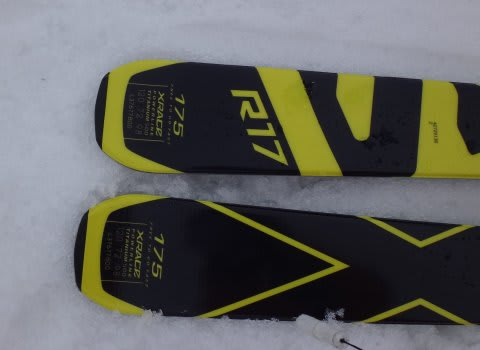

# 2016シーズンモデル，スキー試乗レポート第5回…SALOMON編その１

📅 投稿日時: 2015-03-25 00:49:30

🏷️ カテゴリ: [スキー板試乗](c0bd8048615710cee890e403a36cc9a2b.md)

えー．

本日も，志賀高原は．

意味もなく冷えてかなり冷え冷えのいい雪が降ったようですが．

こんな感じで冷えてくれるのは水曜日までなのだ．

また，木曜からは暖かい日々が舞い戻ってくるので．

…この週末も，ずっしり重い春の雪が，ゲレンデで皆さんをお待ちしています（泣）．

…見事に週末を避けていい雪が降るってのは．

何かの嫌がらせかな～（涙）．

というわけで．

まだまだ続く，2016シーズンモデルのスキー板，試乗インプレッション．

本日は，サロモンのレース…というか，エキスパートモデルとして

使える，FIS非対応のレースモデル，2機種です．

では，どうぞ～！

○SALOMON GS LAB MASTER X 175cm

GS，パラレルスラローム用．

175cmでR=15ｍっていう，何のレースに使うんだ？

っていう感じの板ですが…

パラレルスラローム向けに作ったってのは，今年の

ATOMIC Redster XTと同じですか．

まぁ，長さ＆ラディウスともに，ゲレンデで大回りベース

オールラウンドとして使うにはちょうどいいかも．

履いてみた感じですが，

…やっぱり，性格はX-raceに近いですね．

テールがしっかりグリップして回っていきます．

荷重ポイントは，明確にかかと寄り．かなりテール気味．

テールを抑えていくと，サイドカーブとたわみに乗って

気持ちよくターンしていきます．

R=15ってのもあり，純粋なGS板よりは小さい回転弧で

回っていけます．

グリップは結構強めで，張りもX-raceほどではないにしろ

そこそこ強め．

ビンディングも強めのVARビンディングってのが効いてるのかも．

フレックスがしっかりしているので，スピード耐性は高いですが，

カービングしか許さないX-raceと違い，ずらしのコントロールも

やりやすいです．

175cmなのに，ずらしできれいに小回りができるとは！

板自体は重めですが，ずらしでコントロールしようという

気を全く失わせてしまうほどズッシリと重いX-raceと比べると，

ある程度は楽に動かせます．

結構ハイスピードが好きで，しっかりしたグリップの板が

ほしいけど，X-raceは強すぎるなぁ…

って思う人にはぴったりの板かも．

○SALOMON X-RACE 175cm

GS用，エキスパート大回り用．

私の今シーズンの朝イチ焼額用マシン，X-raceの175cm版です…

普段は165cmを履いているので，175cmを履いてみたわけですが．

板自体は，完全に今年からキャリーオーバーらしく．

コスメは変わってますが，中身は3年目のモデルになります．

…板の完成度が高いので，変える必要はなかったってことでしょうか…

履いてみたところ．

当たり前ですが165cmと性格自体は全く同じ．

やっぱり，ズッシリ重く，しっかりエッジグリップする，むちゃくちゃ強い板です．

R=17mってことで，リアルなGS板よりは旋回半径は小さいですが．

それでもフレックスは強めなので，乗り手が自ら仕掛けて

たわませていかないと，結構まっすぐ落ちていきます．

重いし，強いし，体力が要ります．

ただ，X-raceに慣れてきた身にとっては．

自ら積極的に仕掛けてたわませていった時の，

どこまでも板が耐えるような強烈なグリップと

それによって発生する横Gの強さは，ある種の

快感でもあります…

そして．ズッシリとした重さと強いフレックスが生み出す，

恐ろしいばかりの高速安定性はピカイチ．

普通の板ならバタバタ叩かれて，ラインがずれていくような

超高速域に入っていっても．

ガチガチアイスバーンでも．

しっかりグリップして，何事もなく滑っていけます．

この板を履くと，スピードレンジが2次元くらい上がります．

ちなみに，165cmと175cmの違いは，ターンの切れ上がり量の

違いだけで．

それ以外の履いた感じ，踏み応え量，返りの強さ，

グリップポイントなどは，ホントに一緒です…．

ただ，決して低速で扱いやすいとか，

こぶ斜面で滑りやすいとか．

自分から仕掛けなくても板なりに楽に滑れる，

といった板ではありませんので…

かなりの体力があり，よっぽどな高速で滑る人で，

かつこの板以外の普段履き板を準備できる…

って人には，朝イチピカピカゲレンデ専用大回りマシンとして

チョーお勧めしますが．

そうじゃない人には，あまりお勧めできないかな～．

## 💬 コメント一覧

### 💬 コメント by (マルハバ)
**タイトル**: SALOMON GS LAB MASTER X 175cm
**投稿日**: 2015-03-25 10:25:47

興味津々なんですよね～この板・・

ＳＬでもなくＧＳでもない

「スーパーＳ」？「ナンチャッテＧＳ」？の

オヤジＯＢ大会にはピッタリ合いそうな板♪

来週のアサマ2000で是非試したいと思っております。

### 💬 コメント by (Skier_S)
**タイトル**: マルハバさま
**投稿日**: 2015-03-26 00:14:19

パラレルスラロームってのが，スノーボードでは

見たことあるんですが…

どのくらいのゲート間隔の競技なのかがイマイチ

よくわからないんですが．

ATOMICのRedster XTも175cm，R17程度なので，

まぁこのくらいの板で滑る競技なんでしょうね～．

ちなみに，私は競技はやったことがないので，

GSのゲートもSLもくぐったことはありません…（笑）．

でも，大回りベースのオールラウンドとしては

結構イケてる板だと思いますよ～！

