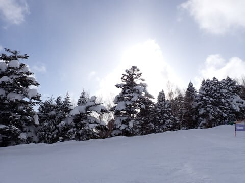

# 2024/3/10(日)の志賀高原焼額山スキー場，速報レポート…朝は積雪50㎝程度と予想より積もったよ！雪のち曇り時々晴れ間も．午後は荒れたけど冷え冷えの2月の雪！

📅 投稿日時: 2024-03-11 02:01:50

🏷️ カテゴリ: [2024スキー滑走日記](c453f687e8a0f05679e95831d0a02cd0c.md)

えー．

本日，この日曜の志賀高原ですが．

積もりました．

予想以上に積もりました…

とりあえず．

いつも通り今日もラストまで滑り，

帰宅が深夜なので…

速報モードにて，本日の志賀高原の

レポートです！

まず．

あさイチは，湯田中でも一晩でこれだけ

積もってて…

そして，志賀高原に登る道も本格雪道で，

さらに高天ヶ原まで登ってくると

朝8時でもガン降り！！

焼額に到着すると…

あさイチの山頂気温は‐11℃と，

今日も予想通り冷え冷え！

朝のゲレンデは，圧雪バーンは

圧雪の上に結構軽めの新雪が10cm，

そしてコース脇は極上の軽さとは

言えないけど，軽めの膝パフ，

場所によっては太ももパフもある

新雪です！！！

…ただ，新雪はファーストトラックで

かなり食われて，通常営業開始後は

一瞬で食いつくされちゃいましたが…（ちょい涙）

で．

午前中は結構雪も強く，視界も悪い中

モフモフ斜面を滑るという，

モフモフは楽しいけど，見えなかった

予想しないところで板を取られたりして，

なかなかテクニカルな斜面だったけど…

10時ごろまでは雪が降り続いたものの．

10時過ぎには雪も弱まり，視界もよく，

2月よりもよっぽど冷え冷えの柔らか

パフパフ雪を楽しめました～！！

そして．

昼頃には青空も顔を出してきて．

「をを？？予想通り晴れるのか？？」

と思ったところ…

残念ながらその後もすっきりとは晴れず，

時折曇ったり青空がのぞいたりという

微妙な天気…

でも，バーン状況は良く見えたので，

すっきり晴れではなかったけど

問題なし！！

最高気温も－4℃程度とそこまで

上がらなかったので，雪質も終日良い

ままをキープしてくれました～！！

…ただ．

圧雪の上にも新雪が乗っていたので，

それが蹴散らされた午後は，バーンが

全体的に凸凹してきて．

かなり疲れるバーン状況でしたが…

まぁ，新雪が積もった日のトップシーズンの

ゲレンデってこんな感じですよね．

とりあえず，なぜか春の雪になったり，

硬いバーンになりがちだった2月よりも

よっぽど2月っぽい柔らか雪で滑れたし．

雪が積もってくれたことに感謝の一日

でした…！！

いやー．

この一週間でかなり積もってくれて，

ゲレンデ状況は一気に改善！！！

そのおかげで…

志賀高原焼額山スキー場では，

一旦クローズになった

オリンピックコース

SGSコース

イーストコース

ミドルコース

ミドル連絡コース

の再オープンが決定しました！！

すばらしい…！！

（[焼額山スキー場Facebook](https://www.facebook.com/yakebitaiyama/posts/pfbid02GCyLvfGyhgZ2RgXTHVJvDhJ1Qmn8wztPJkTFDyDjuEkVP2db2QaWyuQhkY75bMa1l)より)

ただ，明日11日以降15日金曜まで，

第3高速は営業しないので，イースト

コースはゴンドラからSGSコースを

経由しないと行けません…

惜しい．

週末は第3高速動かしてくれるのかな？？

まだ例年に比べれば雪は少ないですが．

この週末の積雪で，志賀高原はかなり息を

吹き返した感じです…

焼額のスタッフさんも胸をなでおろしている

感じでした．

いやー．よかった…

今週火曜から水曜にかけても，

重い雪ながらまたそこそこ積もって

くれそうなので．

このまま奇跡の3月，4月となって

GWまで営業が続くことを期待…！！

…でも，来週土日は気温上がりそう（涙）

## 💬 コメント一覧

### 💬 コメント by (新米パパ)
**タイトル**: Unknown
**投稿日**: 2024-03-11 06:45:32

ニューヤケビ姉妹、拝見いたしました。

あんな小さい子がオガサカの板でむちゃくちゃ速い！

おねーちゃんは片脚で滑ってむちゃくちゃ上手い！

びっくりしました。

### 💬 コメント by (チームオレンジ)
**タイトル**: Unknown
**投稿日**: 2024-03-11 11:52:54

家族で毎年志賀高原に来ている者です。いつも家族でこちらのブログを参考にさせていただきながらゲレンデの様子を拝見しています！とっても素敵な文章に毎回感動しています！これからも楽しみにしております〜。

### 💬 コメント by (地元民)
**タイトル**: Unknown
**投稿日**: 2024-03-11 21:31:44

長野地方気象台VS徒然スキ━ヤ━日記

長野地方気象台の勝利〜。でも、ゲレンデ状況改善したんだから、オッケーっすよね😁

### 💬 コメント by (Skier_S)
**タイトル**: 冷え冷え3月になりそうな予感…！
**投稿日**: 2024-03-12 02:32:22

＞新米パパさま

やっぱりご覧になりましたか…

滑りのレベルが突出しているのですぐわかりますよね．

下の子はまだ幼稚園年長さん，4歳ですよ…信じられない．

＞チームオレンジさま

応援コメントありがとうございます～！

こういう一言が，記事を書く元気の源になってます．

これからもご愛読のほどよろしくお願いします！

＞地元民さま

完敗でしたね…でも結果オーライ．

そして，明日からまた積雪がありそうです！！

