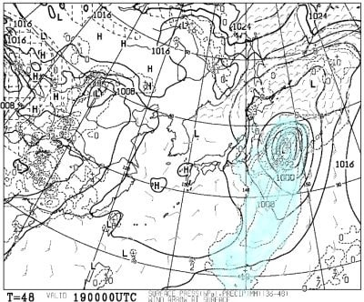
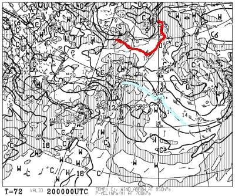

# 4月20，21日の週末の志賀高原スキー場の天気予想！…今週末も土日とも異常高温（泣）．土曜は晴れ．日曜は曇りだけど時折ポツポツ空から液体が落ちてくるかも

📅 投稿日時: 2024-04-18 01:15:44

🏷️ カテゴリ: [スキー天気予想](c6554f5c3c106093b511a8daae23757e8.md)

えー．

本日の焼額山スキー場は水曜で

お休みだったのですが．

ライブカメラを見ると，今日も

気温は+10℃を越えたようで，

高温が続いてますね…（涙）

でも，昼間は曇りだったので，それほど

雪はダメージを食らってないみたいで

一安心…！！

でも．

明日から，奥志賀連絡コースが

クローズになるようです（涙）

焼額→奥志賀は，山頂での行き来だけ

となります．

まだGSコースが滑れるのに，残念…

という感じで，悲しいほどの高温が

続いている4月ですが．

この週末こそ冷えてくれるよな？？

という，わずかなうっすらとした期待薄で

望むべくもない願いを込めて，今週末に

向けての天気図を見るわけですが…

まず，18日木曜の850hPa気温を見ると…

ふぎゃーーー！！

赤い0℃線，樺太よりさらに北まで

上がってますよ…！！

ここまで北に行くのって…5月のGWでも

そうそうないレベル．

そして，志賀高原は水色の+6℃線より南に

あるので．

18日も気温がかなり上がりそう…

そして，木曜の地上天気図は．

南岸低気圧が近づくので，雲が多そう．

水色の降水域は志賀にかかってないので

液体が降ってくる心配はないし，

これだけ高温なら，雪が解ける晴れより

曇りがいいよね…

で．続く19日の金曜日の850hPa気温は．

ダメだ…

これもダメだ．

引き続き赤い0℃線ははるかシベリア．

志賀高原は，水色の+6℃線が近づいている

レベルで…

朝は冷えるかもだけど，昼間は気温が

ぐんぐん上がりそう（泣）

金曜の地上天気図を見ると，わずかに

水色の降水域が志賀近辺にかかってる

ようにも見えますが．

まぁ，降ってもポツポツレベルで，

降るのは木曜の夜だけ．

金曜は西から高気圧が近づくので，

曇りのち晴れだと思います．

で，肝心の週末の20日土曜の

850hPa気温を見ると…

この日，志賀高原に近づく水色の線は，

前日より温度が高い+9℃線（泣）

これだと，昼間の気温は確実に+10℃越え．

暑いくらいの気温です…（涙）

そして，土曜の地上天気図を見ると．

この日は高気圧に覆われて晴れそうです．

残念ながら，高温の晴天で，雪は

気温+日差しでダメになる感じです…（泣）

まぁ，雨より晴れてる方が楽しいよね…

と，自分を慰めるしかない感じ（涙）

続いて21日の日曜の850hPa気温を見ると．

この日も志賀高原にかかる水色の

線は+9℃線．

日曜も志賀の気温は+10度を越えて，

夜も氷点下に落ちなさそう．

日曜の地上天気図を見ると…

網掛けの降水域が，ぎりぎり志賀高原に

かかってないので．

リフト営業時間中は降らないで

いてくれるかな…

四国にかかる南岸低気圧の影響で，

基本的に早朝から曇り空になりそう．

ってなことで．

まとめると．

18日(木)：朝から気温はプラス．

　昼間は+9℃くらいまで上がるか．

　気温が上がりそうだけど，終日曇りで，

　日が当たらないので雪はそこまでひどく

　荒れたり，ストップ雪になったりは

　なさそう．

　

19日(金)：前日夜にもしかするとポツポツ

　雨が降っているかも？

　未明は気温はぎりぎり0℃くらいまで

　下がりそうなので，朝は雪は硬めかも．

　朝のうちは雲が多く，日差しもないので

　締まった雪を滑れそう！

　でも，昼過ぎから晴れ，気温は+10℃

　近くまで上がり，雪は緩んで荒れ始め，

　緩斜面は滑りが悪くなるか…

20日(土)：朝からすっきり晴れ！

　気温も早朝から+5℃くらいに上がって，

　早朝スタートの一瞬は雪が締まってるか

　もしれないけどすぐ緩み，通常営業の

　頃には春のザブザブ雪に．

　晴天で昼間の気温は余裕で+10度を

　越えるので，雪は板が潜るような

　柔らかい雪になり，午後は荒れた

　バーンになっていく．

21日(日)：早朝から雲が多め．

　この日も早朝からプラス気温．

　未明に雪が締まってくれればいいけど，

　運が悪ければ早朝スタートから

　雪は緩め．

　運よくあさイチの雪が締まっていれば，

　曇り空なので通常営業スタートの

　頃までいい感じの雪で持ってくれるかも．

　でも，この日も昼間の最高気温が

　+10℃を余裕で越えてくる高温なので，

　曇り空でも通常営業が始まる時間には

　雪が緩み始める．

　午後も曇り空で，日差しがなくて雪は

　そこまで融けないけど，高温で緩んだ雪が

　荒れていく．

　運が悪いと，昼過ぎにぽつぽつと液体が

　空から落ちてくるかも

という感じでしょうか…

この土日も，異常に気温が高い2日間に

なりそうです(泣)

土曜は晴れ，日曜は曇り空なので，

ガスが出たり液体が落ちてきたり

しなければ，日差しで雪がやられる

土曜より日曜がいい気がするけど…

今の天気図だと，日曜はリフト営業中には

降らなさそうだけど，日曜の低気圧の位置が

わずかでもずれると，リフト営業時間中に

液体が落ちてきかねないので…

日曜に液体が降るかどうか，

まだ明日以降の天気図を見ないと

日曜の天気の詳細は分からないです…

でも．

晴れても曇っても降ってもいいから．

気温がマイナスになってほしい（切実な願い）

おかしい．

今年の2月は例年の3月並みの気温で．

今年の3月は季節が戻って例年の2月並みの

積雪があった感じだったので．

今年の4月は，例年の1月並みになるんじゃ

ない？？？

…と，期待していたけど．

やっぱりそうはならなかったか…（涙）←そのまま行って

5月が12月並みの気温になったらヤバすぎでしょ
