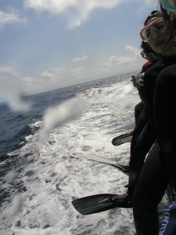
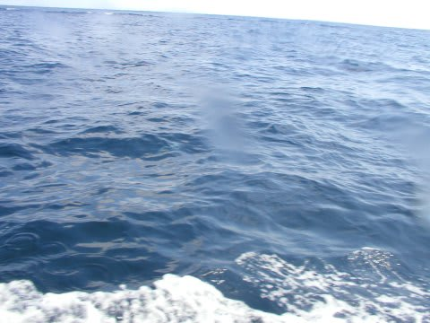
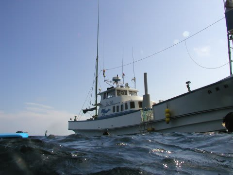
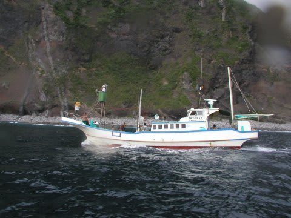
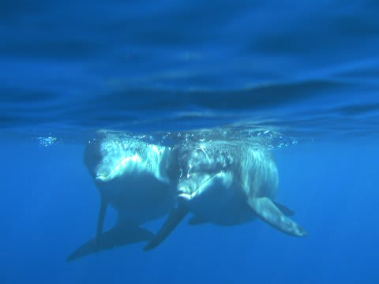
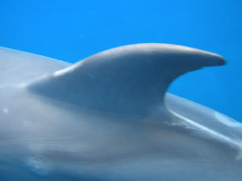
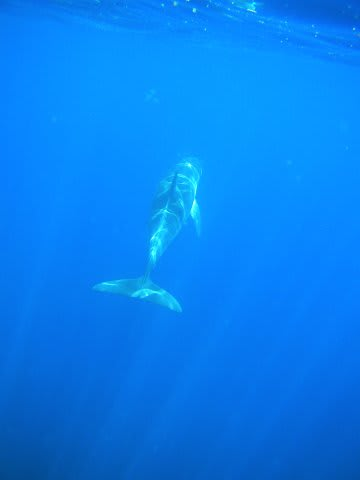

# 2007年8月　三宅島ドルフィンスイム＆ダイビング旅行記　その5

📅 投稿日時: 2013-09-13 03:01:27

🏷️ カテゴリ: [ダイビング日記](ce3a7a8d424d112fce83ee85c81a0e344.md)

え～

今日からタオで潜ってます。

しかし、波が高くて近海でしか潜れず…(;_;)

明日も波が高そうなので、ジンベエが見れる外洋

へはしばらく行けなさそう…(涙)

さて。

果たして、滞在中にジンベエは見られるのか？

とりあえず、また三宅島レポートです。

-----

…ということで

ドルフィンスイムの説明が終わったら．

みんなフィン，マスクを着用して．

船べりに座って，準備Ready!

「飛び込めー！」

の声がかかるのを待ちます．

ドルフィンスイムをやるのは，御蔵島のまわり，

大体岸から200m程度の範囲ですかね～．

そーいった島のそばでイルカを探し初めて．

1分も経たないうちに…

ゲストの何人かから「あ！イルカ！いる！いるっ！」

＃シャレじゃない．言ってる本人はすごい興奮して言ってる

という声が．

指差す方向を見ると…

をを！何頭かのイルカの背びれが水面に見え隠れしてる！

ポイントについて1分もたたずに，もうイルカを発見できるとはっ！

(この写真だと，どれが背びれだかわかんないけど…)

船はぐるっと旋回し，イルカが泳いでいく方向に先回りします．

イルカたちは潜ったのか，もう背びれは見えません．

どこに行ったのかなぁ？と思うと…

「飛び込んで～っ！」

との声．

え？え？え？行っていいの？

とりあえず，飛び込め！

船べりの高さは1m程度．

それほど高くないですが，マスクを手でしっかり抑えて

飛び込まないと，水面に飛び込んだショックでマスクが

飛んで行っちゃう！

飛び込んだ後，水面に浮かび上がったらシュノーケルクリアをして，

マスククリアをかまして水中を見渡しますが…．

イルカが見当たらない．イルカはどこ？

今日は結構波が高めなので，顔を水上に出しても，

波に阻まれてまわりの海面はほとんど見えないよっ！

船の方を見ると…

船がイルカを追い込むように

回り込んでいるのが見えます．

あっちか！

全力でフィンキック．

すると…いた！

3頭，水面付近を向こうからこっちにやってくる．

うお！速い！

真正面からこっちにやってくる

近いっ！カメラのファインダーからはみ出る！

…と思う間もなく，目の前を一瞬で通り過ぎて，

後ろの方に泳ぎさって行きました．

真横，50cm以内を通りすぎたでしょうか…．

すかさず振り返って，全力でフィンキックしますが，

イルカはむちゃくちゃ速いのでぜんぜん追いつけないよ…

…こんな一瞬で，イルカちゃんとの一回目の遭遇は終わりなのかな…？
