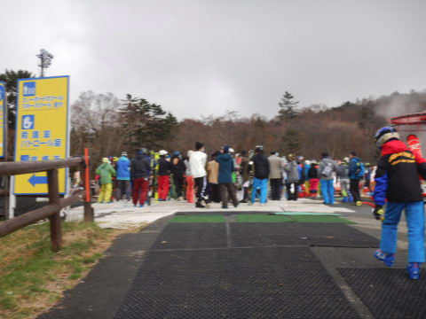
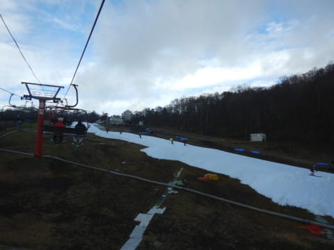
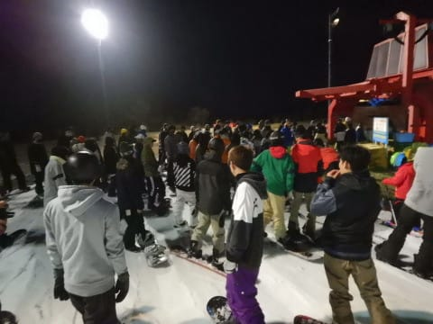

# 2020/11/8(日)のイエティ詳細レポート…ゲレンデ状況は悪くないけど，幅はまだ狭いしリフトが混んだよ(涙)

📅 投稿日時: 2020-11-10 01:15:54

えー．

[木曜の記事](e75dfb19a9fbd3cb9a0b5cd1bd5d42c6d.md)に，

　9，10，11日あたりまで，

　平年比-4℃程度と冷えそうです！！

と，書いたように．

今日，9日の早朝から冷え始め，

志賀高原も結構白くなったようです！

([志賀高原山の駅Facebook](https://www.facebook.com/ShigakogenYamanoeki/photos/a.2005968013040910/2491344391169934/?type=3)より）

そして…

かぐらもうっすらと雪化粧してますね！

（[かぐらスキー場ライブカメラ](https://www.princehotels.co.jp/ski/kagura/livecamera/)より）

予想通り，この冷えは11日の昼間まで続き．

志賀高原は10日はさらなる積雪もありそう

だし（せいぜい10cm程度だけど），

9，10，11日と3日間，人工降雪をフルパワーで

動かせば，今週末14日の熊の湯と横手，

なんとかオープンできないかな…

と願っている今日この頃，

皆様いかがお過ごしでしょうか（時候の挨拶）

…しかし．

12日以降しばらくは気温が上がり，人工降雪機が

動かせない気温が続きそう(泣）．

やっぱり14日オープンは厳しいかな…

とりあえず．

今のところは，これから11日までの

冷え込みに期待！

…ってことで．

昨日速報レポートした，日曜のイエティの詳細ですが．

えー．

まず，朝9時のオープン前から，ゲート前には

そこそこの列がついていて…

うーむ．

今日も混みそうですね…

そして．

以前は9時ちょうどにゲートオープンだったけど．

今はゲートで検温があり，時間がかかるからか．

ちょいと早めにゲートがオープンして，

ゲレンデ目の前で9時を待つパターンに

変わりましたね…

うむ．

一番乗りを狙う人が，こんなにたくさん…

これは，混む．

今日は，混みそう…

ってなことで．

9時ジャストにコースオープン！

オープンを待っていた人が，

一斉にスタート！

あさイチのシマシマを狙っていた

わけですが…

今日はオープン待ちの人が多く，

自分の前にかなり人がいたので．

完全きれいなシマシマとは

行かなかったものの…

でも，朝の数本は人も少な目で，

圧雪かけたてのコースを気持ちよく

滑れました～！

しかし．

人が少なかったのは，せいぜい3-4本程度で…

最初の30分ちょっとは，リフト待ちも

短かったけど．

オープン1時間後の10時ごろには，

かなりコース上の人も増えて…

…うぎゃーーー！

リフト待ちも，かなり長くなって

しまいました…(泣）

でも．

クワッドリフトが混んできたら，

並行するペアリフトを動かしてくれるから，

混雑は解消されるはず…

…

と，思っていたけど．

なぜか，今日はペアリフトが動かず（涙）

なぜ，今日はこんなに混んでるのに

ペアを動かしてくれないんだろう…(泣）

そのため，この日は終日リフト待ちが

10分前後あり，ちょっと密な感じ…

うーむ．

ペアリフトが動いてくれれば…

天気は曇り時々晴れで，

晴れるとちょっと暑さを感じるほど．

だもんで，日が射すと雪の表面が溶けて

しっとりと感じになり，板の滑りが

ちょっと悪くなる感じ．

こういう時期は，ちょっと曇るくらいが

ちょうどいい感じなんですが…

ただ，雪はちょっと緩んだとはいえ．

今シーズン，雪の厚みは比較的あるので，

ちょっと茶色くなったところが数か所あったけど．

穴が開きかけたところは，すぐにスタッフが

埋めてくれて．

今日はゲレンデに穴が開くようなことは

無かったですね～．

しかし．

今日は午前10時から午後4時近くまで，

お昼休み時間の2-3本を除くと，

ずっとリフト待ち10分程度と，

結構な待ち時間だったし．

(でも，軽井沢よりはずっとマシかな…)

ペアリフトが動いてない分，

コース上の人口密度は低くなるかな？

と思ったところ，そんなことは無く．

いつもコース上も人は多かったし．

コース整備が入る直前の16時まで．

結構な人口密度が続いたのでした…

(16時直前のコース状況）

…そして．

16時から17時までは，コースを閉鎖しての

コース整備タイム！

コース整備後，17時の一番乗りを

狙って，コースオープンを待ち構え…

いざ，17時コースオープンへ，

一番乗り！

うはーー！

シマシマ！！

前に人がたくさんいた朝イチと違い，

前に誰もいない，日が暮れて気温が下がってきた

締まり気味のシマシマをいただきました～！！

いやー．

やっぱりシマシマハンターとしては，

このシマシマが狙える17時のコースオープンは

外せませんね～！！←だからシマシマハンターって何？？

ってなことで．

ナイターオープン直後は誰もいなくて

気持ちよかったけど…

3本目には，もうコース上に人があふれはじめ…

…そして，あっという間にコースも

荒れてしまい（涙）

リフト待ちも昼間と同じくらいまで

長くなっちゃったし（泣）

暗い中，コースの人口密度も高く．

ちょっとこわかったので．

今日はナイターを1時間程度で切り上げ，

退散したのでした…

ってなことで．

ペアリフトが動かず，かなりリフト待ちが

長かった，この日曜日のYetiでしたが．

今年の4月の緊急事態宣言の頃を考えると．

スキー場が混んでいるという，日常の

状況が戻っていることに感謝せねば

ならない…

と．

いつものポジティブシンキングで自分を

ごまかした，Skier_Sだったのでした…

## 💬 コメント一覧

### 💬 コメント by (ad)
**タイトル**: Unknown
**投稿日**: 2020-11-10 16:32:54

今週末の志賀高原オープン可能性の分析を期待しています。

オープン延期の場合、ホテルはキャンセル料なしでokとのことでしたが、私も冷え冷え踊りをやっておこうと思います

### 💬 コメント by (Skier_S)
**タイトル**: ＞adさま
**投稿日**: 2020-11-11 02:32:01

横手はかなりの人工降雪機を揃えたようで，もしかすると11日までの短期間に

一気にゲレンデを作り上げるかも…

ただ，熊の湯は人工降雪機の台数的に厳しいかも．

とりあえず，冷え冷え踊りを踊り続けましょう…！

