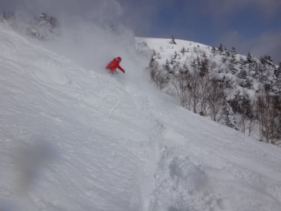
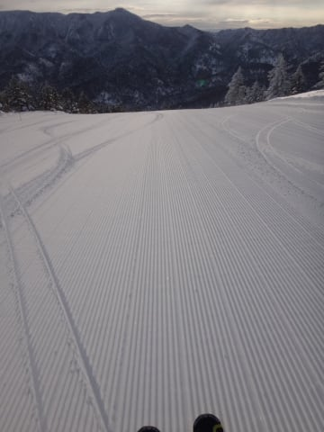
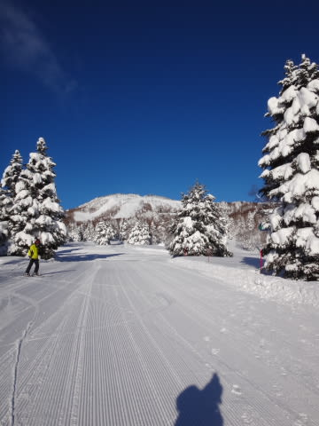

# というわけで、8日間滑った正月休みが終わったわけだが

📅 投稿日時: 2015-01-06 00:02:46

🏷️ カテゴリ: [日記](cc4b5682fb7b8b144980957a978653fb0.md)

という感じで．

9日間中，8日間を志賀高原で過ごしてしまった

正月休みが終わったわけですが．

朝イチ最高ディープパウダー：27日，1日，2日，3日

晴天＆ぴかぴか圧雪：28日，31日，2日，4日

って感じで．

8日中4日間もディープパウダーが楽しめたし．

さらに，すっきり晴れた日も4日間あり．

…普通の正月休みなら，必ず数日は出くわす，

新雪が積もってくれたわけでないのに曇って視界が悪いとか，

とても滑れる状況じゃないほどに強烈に吹雪く…

って日が，一日もなく．

大変お天気に恵まれた，この正月休みだったかなっ！

そして．

この正月休み期間も．

何人かの読者の方に声をかけていただきました～！

…みなさん，よく見つけますね…

ありがとうございます～！！

さらに．

[以前に書いた](e688bd85b36410d46aaf4ffc7117e2c63.md)ように．

ウェアを変えてても，索道係の皆さんには

完全に覚えられ，いろいろ声をかけていただいたり

したわけですが．

今回．

焼額山で，全く想定外の方々に覚えられていることが判明して，

ちょっと驚いてしまった出来事があったんですよ…

そう．

それは，昨日．

最終日の，夕方．

コース上にいた，わが連れが．

コース横の新雪部分からコースを横切るように

飛び出してきたボーダーに激突され．

パトロールに運ばれてしまうという出来事が

生じたのですが．

2人がかりで，歩けない妻を助け上げてスノーモービルに

連れて行くパトロールさんに向かって．

私「すみません…ご迷惑おかけします」

と，平身低頭のところ．

それをうけたパトロールさんは，気にしなくていいですよ～，

って感じで，妻と私に声をかけた後，

パトロール「もう，いつもいつもお越しいただいてますから！」

私（…

　え…？

　…パトロールさんにまで，常連だってバレてる…）

索道の方は，いつもリフト乗り場で会うけど．

パトロールさんには，そんなに会う機会もないのに…

なぜ，私のことを知ってるんだろう？？

とりあえず．

焼額では，絶対に絶対に，悪いことはできないな…

と思った，Skier_Sなのだった…

PS.わが連れは，その後診療所に運ばれて，

　幸い骨折はなかったようですが，

　飛び出してきたボーダーのボードをもろに脚に

　食らってしまったために，

　自力で起き上がることすらできない状態で，

　しばらく，松葉づえ生活になってしまいました…

　回復具合によっては，しばらくスキー場レポートは

　できないかも…

　今週末3連休までには，ぴんぴん歩けるようになって

　ほしいな！←ちょっと無理か？？

## 💬 コメント一覧

### 💬 コメント by (れお)
**タイトル**: あああぁ痛そう
**投稿日**: 2015-01-06 11:24:26

それはかなり痛そう…。松葉づえなんて奥様お気の毒です。

お大事になさって下さい。早く治ることを祈ってます!!

### 💬 コメント by (mae)
**タイトル**: 年末年始
**投稿日**: 2015-01-06 18:17:24

ヤケビで何度か会話させて頂いたものです。

ほんの数ヶ月前に偶然blogを発見し、拝見するようになりましたが、趣味をエンジョイしている生活のスタイルが、かつて子供が一人だけの頃の自分の姿と良く似ているなと拝見していました。

奥様、災難でしたが何より骨折でなくて幸いでしたね。ともかく完治するまでは介抱してあげてくださいね。

ps:昨年から私の事もご存知のようでしたが、私もおなじ部類かな？ヤケビでは悪いことはできない(笑)

### 💬 コメント by (オヤジスキーヤー)
**タイトル**: お大事に！！
**投稿日**: 2015-01-06 18:47:21

初めまして！いつも楽しみに拝見しておりました。奥様くれぐれもお大事に！！一日も早く回復する事祈っております。今シーズン板を購入する際にブログ参考にさせて頂きました。結果、Ｒ社の黄色い板でいいシーズン迎えさせて頂きました。これからも楽しみにしております。くれぐれもお大事に！！

### 💬 コメント by (Goku)
**タイトル**: お大事に
**投稿日**: 2015-01-06 19:17:06

奥様、とんだ災難でしたね。

松葉杖では普段の生活も大変でしょうが、このブログ読者全員が応援していますよ～。

一日も早く良くなって、スキーが出来ると良いですね。

### 💬 コメント by (megalith)
**タイトル**: お大事に
**投稿日**: 2015-01-06 21:37:37

ご無沙汰しています。

奥様の件大変でしたね。

幸い骨折していないそうですが、あまり無理なさらず完治を目指してくださいね。

実は自分も小学校の頃スキー教室で昼食のためロッジに向かって皆と滑り降りていたら、横から暴走スキーヤーに思いっきり当て逃げされ吹っ飛ばされたことがあります。

少し後ろで自分達生徒を見ていた先生が足の骨が折れたと思わせるようなコケ方だったそうです。

その時自分は何が起きたのか全く理解できていませんでした。(^_^;)

幸い体に怪我はありませんでしたが、当時の板は半グラ(下半分がグラスで上部が木です。)の木の部分がポッキリ折れていて、駆けつけた先生が自分の無事を確認した後逃げた暴走スキーヤーが滑っていった方向を激怒しながら睨みつけていました。

その日は自分はもうスキーは出来ないので、帰宅命令が出ましたけどね。

おそらく木の部分が衝撃をある程度吸収したので体は無事だったのではないかというのが、当時の先生のコメントでした。

### 💬 コメント by (はなげ親分)
**タイトル**: お大事に
**投稿日**: 2015-01-07 00:36:02

奥様、お気の毒です。

早い回復を妻共々お祈りしております。

### 💬 コメント by (Skier_S)
**タイトル**: みなさん，ありがとうございます
**投稿日**: 2015-01-07 02:14:48

＞れおさま

ありがとうございます…

外出できないので，買い物やら何やらも

全くできないため，生活上の問題もあるし，

早く治ってもらいたいものです…（涙）．

せめてもの救いは，動かすとすごく痛いけど，

普段は全く痛くないらしいことです…

＞maeさま

あ，ヤケビではお世話になりました…

ご一緒できて楽しかったです．

このBlog，ヤケビ常連さんにはあんまり

知られてないんじゃないかと思っています（笑）．

これからもご愛読ください．

maeさんも，絶対ヤケビで「あ，あの人か」

って思われている一人だと思うので，

悪いことはできないはずです…（＾＾

＞オヤジスキーヤーさま

初コメントありがとうございます～．

また，妻へのお気遣い感謝です．

今後もぜひご愛読のほどを…

＞Gokuさま

いやーーー．

もう，災難でしたよ．

未だに，足が曲げられず，しゃがめないので

一人では寝たり起きたりという動作ができない

状況です．

日常生活がほとんど不可能な状況です（涙）．

Blog読者の応援を，妻に送ります～（感謝）．

＞megalithさま

お久しぶりです～！！

お気遣いありがとうございます～．

そちらは，板が体の代わりになってくれたんですね．

こちらは当て逃げではなく，相手は仲間みんな

誠意をもって謝ってくれたし，その後の対応も

真面目だったので，それが救いでした．

＞はなげ親分さま

お心遣いありがとうございます…

皆さんの祈りが届いて早く回復するよう，

こちらとしても願うばかりです…

