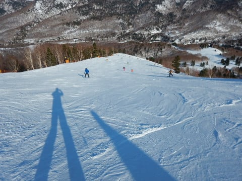

# 3月17日(土)の志賀高原は…終日晴天！雪は日が当たるところとそうじゃないところで全然違ったよ！

📅 投稿日時: 2018-03-18 01:35:29

🏷️ カテゴリ: [2018スキー滑走日記](c11b88dc181f34079ab41db74a3587646.md)

えー．

本日．

予告通り，志賀高原へ来ていますが．

もう，ぴかぴか晴天の一日でした…

まず，朝の登り坂．

今週も道路にそれほど雪はなく，

あっさりと上がってこれます．

とはいえ．

スキー場そばでは凍結気味だったので，

スタッドレスじゃないと登ってこれませんが…

しかし．

うーむ．

昨晩から積雪は無しか…

ゲレンデに到着し，通常営業開始の1番搬器で

山頂に上がると．

うむ．気温自体は-8℃と，そこそこ冷えてますね．

そして天気は…

雲一つない快晴！！

…ゲレンデは6時半からの早朝営業をやっていたので，

もうシマシマは消えかかってますが…

でも，ところどころ残るシマシマ！

朝イチの圧雪は結構硬く締まった感じで．

スピードが出るハイスピードバーン！！

気持ちいい！＿

朝イチは人も少なく，最高だよ！！

と，気持ちよく1時間ちょい滑っていると…

午前10時ごろには，さすがちょっとゲレンデの

人も増えてきたかな…

でも，普段の土日より人は少な目かも？

ゴンドラも，一瞬だけゲートの外まで列がついたけど…

混んだのは午前10時過ぎから11時前まで．

普段は平均的にこのくらいの待ち時間で…

ほぼ飛び乗り状態！！

けど．

今日は昼間の気温がぎりぎり0℃程度と，

それほどひどく暑くならなかったものの．

終日天気も良く…

日が当たる，東～南斜面は．

昼近くには，ちょっと雪が重くなっていき．

オリンピックコースなんかは，

朝は良かったものの．

昼頃には，全面重い雪で覆われちゃいました…(涙）

でも．

日の当たらない，GSコース側は．

終日雪はしっかり締まったままで．

うむ．

同じ焼額なのに，オリンピックコースとGSコースという，

隣のコースがここまで雪質が違うとは！！

だもんで．

日が当たる側のオリンピックコースは，

すごい勢いで荒れていきましたが…

GSコースは，夕方になっても比較的フラットなまま！

…ただ，その代わり．

下地の硬いのが結構出てきてましたが…(ちょっと涙）

夕方になると．

日が当たった側の斜面は，かなりのコブっぽい

凸凹斜面になりましたが…

でも．

日が当たらない側の斜面は，

ラストまでしっかりとフラットなままで．

日差しは強かったものの，気温がそれほど

上がらなかったので．

日が暮れるまで，意外と快適に滑れたのでした…

…

そして．

はい．

お約束ですね．

今日も当然，ナイターです！！

ダイヤモンドナイターにやってきますが…

お約束のシマシマです！

…とはいえ，

圧雪がちょっと粗目で．

昼間にゆるんだ雪が固まった硬めの

斜面だったため．

ちょいと手ごわかったですが…

でも，3月末で今シーズンが終了してしまうダイヤナイター．

今シーズンの営業が残り3回となったナイターを

おもいっきり満喫してきたのでした…

…しかし．

このナイターが終わった後．

ちょいと飲みに行ってしまい．

Blog更新がこんな時間（涙）

…酔っぱらっているので，文章が多少変かもしれませんが，

ご容赦を…

明日朝，ちゃんと起きられるのかなぁ…

とりあえず．

飲みに行ったにも関わらず，夜中に更新している自分．

偉い！！←誰もほめてくれないので自分でほめておく

## 💬 コメント一覧

### 💬 コメント by (しんちゃん)
**タイトル**: スゴイ！
**投稿日**: 2018-03-18 01:56:20

前日の睡眠時間が数時間にもかかわらず、ナイター行って、飲みに行って、これだけブログ更新するなんて…。スゴイ！！

### 💬 コメント by (かず)
**タイトル**: Unknown
**投稿日**: 2018-03-18 02:31:25

ほんとタフですね～　今週SMで混むかと思ったのですがそれほどでもないみたいですね　来週平日からめて行こうとか思ってましたが毎日雨ですよ....

### 💬 コメント by (マルハバ)
**タイトル**: 昨夜の・・
**投稿日**: 2018-03-18 17:57:28

ダイヤモンドナイターでは

2年振りにご一緒させていただきました。

あの固いデコボコバーンを

切れ味鋭い深回りで滑り降りる姿・・

さすがでございます。

正味50分くらいでしたが、

私の方は結構 息切れが激しかったです。

本日午前の焼額ゴンドラでもお会いできて

この2日間の晴天のごとく晴れやかな気分で

帰宅しました。

またお会い出来ることを祈っております

ありがとうございました。

### 💬 コメント by (ノムノム)
**タイトル**: 来週末行きます！
**投稿日**: 2018-03-18 21:00:17

御無沙汰しております。ノムノムです。

相変わらずハイペースで楽しんでおられる様ですね！

当方も3/24～25志賀高原行きます。正月以来の志賀高原ですが、雪のコンディションが心配です。

お会いできるといいですね！

### 💬 コメント by (Skier_S)
**タイトル**: 明日朝早いんだけど，起きられるかな…
**投稿日**: 2018-03-19 03:09:20

＞しんちゃんさま

Blog更新しなければ1時間は早く寝られるのですが．

…睡眠時間を削ってBlogを書いている自分を

褒めてあげたいです(笑)．

＞かずさま

今週はそれほど混まなかったですね～．

これから一週間は，残念ながら微妙な

天気が続きそうです．

冷えてもう一降り来てほしいのですが…

＞マルハバさま

昨日のナイターではご一緒ありがとうございます～！

夜のイベントのすき間を縫ってのナイター参戦，

お疲れ様でした．

気温が高めで，雪質はちょっと残念でしたけど，

天気が良くていい2日間でしたね～．

また志賀にお越しの際はお会いしましょう！

＞ノムノムさま

今週末志賀高原ですか！

…雪はまだあるので，今週末は

焼額や一の瀬は問題ないかと思いますが，

西館山とか東舘とかブナとか，

そろそろ土が出てきているところが…

土日は焼額グルグルしていると思いますので，

またお会いしましょう！

…焼額の雪質が悪くなる午後は，一の瀬方面に

脱出している可能性もあります…

### 💬 コメント by (いか)
**タイトル**: Unknown
**投稿日**: 2018-03-20 00:00:39

土曜日はご一緒くださいまして、ありがとうございました〜 朝練から終礼までよく滑りました(^^)

ちなみに私も白馬についたら、なぜか飲みに行くことになりまして、死にそうになりながら、翌朝ゴンドラに並んでいました(笑)

また来シーズン？もよろしくおねがいします！

### 💬 コメント by (Skier_S)
**タイトル**: いかさま
**投稿日**: 2018-03-20 04:09:43

土曜はありがとうございました～！

朝練から終礼までお疲れ様でした(笑)

…そして，白馬まで運転してそのあと飲んで，

次の朝からスキー，お疲れ様です…

また来シーズンもよろしくお願いします～！

