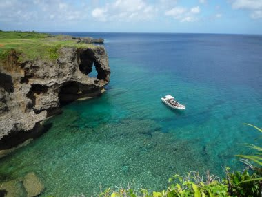
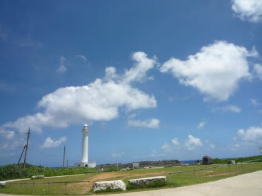
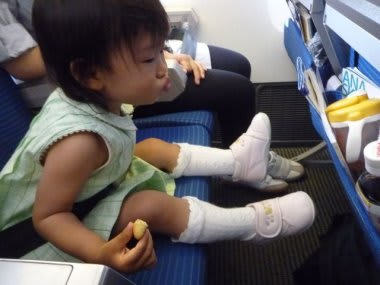

# 初の子連れダイビング旅行記＠2009年　その13　旅の終わり

📅 投稿日時: 2012-07-24 00:52:04

🏷️ カテゴリ: [ダイビング日記](ce3a7a8d424d112fce83ee85c81a0e344.md)

徒然スキーヤー日記という名にそぐわないダイビング日記が続き．

予想通り順調に閲覧者が減っている今日この頃．

＃まぁ，子連れダイビング日記を連載するブログタイトルではないわな

とりあえず，初の子連れダイビング記録はこれで終わりです．

んですけど…

次回から，最新ダイビング旅行記がまた続きますので．

よろしくお付き合いのほど（笑）．

では，初子連れダイビング旅行記，最終回です～

----

ダイビングが終わって後は帰るだけの最終日．

帰りは夕方の飛行機なので，朝食後11時のチェックアウトまでのんびりしたあと，

万座毛とか…

残波岬って回りましたが…

娘は寝てましたね．

後半ほとんど，ぐっすりと．

で，空港に着いたらあとは飛行機に乗るだけ．

車の中であれだけ寝てたから，飛行機で寝ないかも…

帰りはまさか大泣きしないよな？？？

って思ってたら…

搭乗後は起きてたけど．

離陸直後からすぐにすやすやと寝ちゃってました．

東京到着まで，ほとんどずーーーーっとぐっすり寝てて，

飛行機の中では全くぐずらず，ずっと寝たまま．

なんて親思いなんだろう…

ということで，今回の初子連れダイビング，

食事は大丈夫か，

知らない場所で夜寝ないんじゃないか，

母親が潜りに行って泣かないか，

飛行機は大丈夫か…

っていった，事前の心配はいっぱいあったけど．

何の問題もなくすべて無事クリア．

何の心配も要らないじゃないか．

これだったら．　　　　　　　　　　

…これだったら．

今年中，2歳になる前に海外ダイビング，いけるんじゃないか？？

という，悪魔の誘いが湧き上がってきたのでした…

＃2歳前に行けば，飛行機代はタダ．宿代も多分タダ

…しかし，プールに漬けておけば1時間でも2時間でも

ご機嫌で遊んでいてくれるなんて，なんて親思いな娘なんでしょう…

っつーか，親に似て遊び人の血を引いていることが

よく分かった今回の旅行でした．

## 💬 コメント一覧

### 💬 コメント by (KENKEN)
**タイトル**: 悪魔の誘いに乗りました。
**投稿日**: 2012-07-24 22:51:23

私も初めて子連れでダイビングに行く時(3年前)はかなり悩み＆慎重に準備を整えました。

我が家は妻が子供を置いて(預けて)ダイビングなんて・・・・と消極的だったので、他の子連れダイバーの体験記(この時はまだSkier_Sさんの存在を知らず)を妻に見せ説得ました。(子供には酷い父親だ)

いざ出発の飛行機に乗り、娘も大人しくしていたので油断していたところ、着陸10分前からギャン泣きでした。こりゃ失敗したと思いましたが、何故か乗り継ぎ以降は機嫌も良く、その後も飛行機に全く嫌がる様子も見せなかったので、私にも悪魔の誘い(2歳前なら海外旅行はほぼタダ)が・・・・。

という訳で2歳を前に近場のグアム(ダイビングなし)へ行きました。東南アジアでのダイビングも考えましたが、Skier_Sさんほどは思い切れませんでした。

次回からは今年7月のダイビング旅行記が始まるとのこと。

我が家も同時期に西表(前回と同じショップ)に行ってきました。

今年のSkier_Sさんのダイビング旅行記も期待しています。

### 💬 コメント by (Skier_S)
**タイトル**: KENKENさま
**投稿日**: 2012-07-25 00:12:24

うちは逆に妻が「旅行に行きたい」というのと，幸いうちの両親もダイバーなので，

両親と一緒に行って大人が4人もいれば何とかなるか…というわけのわからん

根拠で子連れダイビングに行ってみました．

意外と行ってみると何とかなるもんですよね～．

で，そのあとの悪魔の誘い，初海外ダイビングに行ったわけですが．

実はまだ，初海外ダイビングのレポートを載せていないので，

また後日タイミングを見計らって，2009年の初海外ダイビングレポートを

乗せようと思っていますので，お楽しみに…

