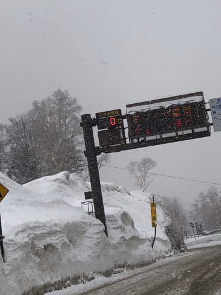
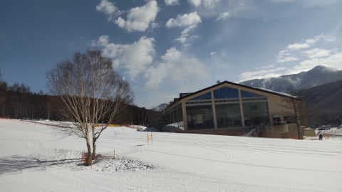
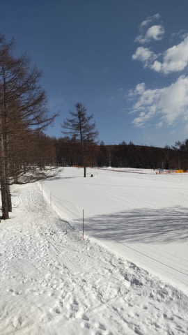

# 3月10日(金)の志賀高原は，雨にならなかったみたい…朝は雪，10時ごろには晴れ！でも，雪は強烈なストップスノーに

📅 投稿日時: 2023-03-11 01:11:46

なんと．

本日の志賀高原．

天気図をどう読んでも雨になるはずの

ところ…

雨にならず，雪だったようです！！！

サンバレー近辺までは雨っぽかった

みたいですが，少なくとも一の瀬

エリアは雨にならなかったみたいです！！

そして，朝10時頃には雪も止んで，

すっきり晴れになったみたいです…！！

ただ，湿った雪が積もったあと，

新雪が日差しで融けたおかげで…

午前中からしっとりした雪が

板に張り付く，ストップスノーに

なったようで（涙）

せっかくの晴天なのにあまり楽しく

ないと，特派員からレポートが

入りました…

一見すごいコンディションよさそうなん

ですがね～…

明日の土曜も異常に気温が高くて，

朝から雪は緩みそうだけど…

新雪が積もった今日ほどはひどい

ストップスノーにはならないかな？？

でも，土日とも晴れて，GW並みの

気温なので…

雪はかなり残念な感じのコンディションに

なりそう（涙）

まぁ，晴れてくれるので，雨よりは

マシかな…（何とかポジティブシンキングで

ごまかそうとしている）

ということで．

今週末も志賀高原に行きますが．

あと2時間半後に出発です～！！

果たして，今週も睡眠不足の

毎日なのに．

さらに2時間睡眠で，無事志賀高原に

たどり着けるのか…？？

…ってか．

12時過ぎに職場から帰宅して，

3:30に家を出るってのにかなり

無理があるな…（涙）
