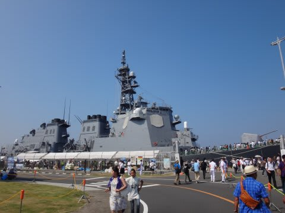
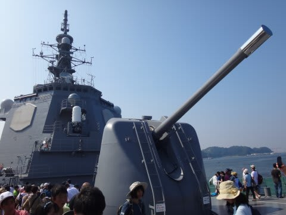
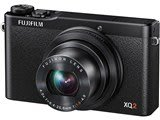
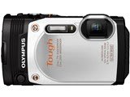

# 水中カメラ買い替え計画，プランCを検討してみたが…

📅 投稿日時: 2015-08-02 23:11:22

🏷️ カテゴリ: [PC,カメラ&小物](c0d8caed13e597efe97b661a8ae56bed0.md)

というわけで．

あと4日後に，夏休みを控えているので．

この週末も，久しぶりにK奈川県を脱出しない週末を

過ごしたわけですが…

でも．

昨日は，同じK奈川県とはいえ．

ちょっと出かけて，横須賀の自衛隊一般公開に

出かけてきたり…

さらに日曜の今日も，同じK奈川県内にもかかわらず．

車で高速を走って，公園やらなにやら…

朝から夕方まで，いろいろ廻ってました…

ってことで．

ゆっくりしようと思い，K奈川県を脱出しなかったものの．

…あまりゆっくりできなかったこの週末．

また明日，早朝に家を出て，新幹線で某所へ

出張しなくてはならないというのに．

明日の朝イチまでが期限の持ち帰り仕事もあるというのに．

まだ，夏休みのダイビング旅行の荷物を全く

作っていないのに．

大丈夫か…？

自分？？

…と思いながらも．

本題の，水中カメラ買い替え計画のお話へ，Go!←いや，こんな記事を書いてる暇があれば，仕事しろよ

---

という感じで，

新しいデジカメ＆ハウジングの調査に入ったわけですが．

最近のデジカメで．

水中ハウジングが売ってるカメラって，

どんなのがあるんかいな？

…と，調べてみたものの．

最近のデジカメ，ハウジングに入れられるカメラ，

ほとんどないじゃないかっ！

3-4年前まで，かなりの機種のデジカメ，オプションとして

水中ハウジングが売っていたのに…（涙）

…どうやら．

安い防水デジカメ．かなりいろんな機種が出てきて．

それも，カメラ単体での防水機能が，10mや15m防水…と，

かなり本格化してきてるので．

ふつーの人はこういうデジカメがあれば，ハウジングなんて

要らないだろうから，ハウジングが売れなくなったんだろうなぁ…

現在売っているカメラで，ハウジングが選べるのは．

Fujifilm XQ2　　　　　　3.5万円　

Canon Powershot GX7　　　　6万円

Canon Powershot G1X MkII　7万円

Olympus STYLUS TG-860　　3.5万円

Olympus STYLUS TG-4　　　4.5万円

…この5機種のみ．

1万円前後のカメラで，水中ハウジングを

売ってるものがほとんどないのか…（涙）．

どれも高い．高いよっ！！

…水没させたIXY210は，新品でも

1.4万円くらいだったなぁ…

あのころは，このくらいのお値段のカメラのハウジングが

いっぱいあったのに…

とりあえず．

この中で，もっとも安いのは，FujiのXQ2と，

OlympusのTG-860の2機種．

ふーむ．

XQ2は…

レンズがF1.8と明るく，撮像素子も2/3インチと大きめで．

絞り優先AEが使えて，絞り調整や露出補正がリングで

コントロールできる…という．

比較的マニアック仕様なカメラだな．

私なら高機能なこっちを選びたいが．

…妻は，使いこなせない気がする…

で．

TG-860は…

レンズはF3.5 と暗いし，液晶も解像度が低め．

絞り優先AEなどマニアックな機能はないけど．

マクロ機能がすごく強く．

さらに，本体15m防水！！

ハウジングを水没させても，カメラは生き残りそうじゃないか！

うーむ．

水没リスクを避けるならこっちだな…

お値段はどちらも同じ，

通販で底値を探せば本体3万円，ハウジング2万円くらいか…

さて．

この2機種の最終決戦．

どっちがいいかなぁ…

やっぱり，水没して，また買い替えるとお金かかるから．

水没しても大丈夫な，TG-860かなぁ…

と，2機種のどちらにしようかを必死に考えつつ，

新宿のカメラ屋をぶらついていた時．

「ん？んんっ？？？…こ，これは…」

この最終決戦をぶち破る，予想外のものが

目に入ったのだった…っ！

（続く）
