# 12月11日（日），志賀高原レポート，詳細モード…雪降り激寒の一日

📅 投稿日時: 2016-12-13 04:19:50

🏷️ カテゴリ: [2017スキー滑走日記](c7d777cecfc91bdf0fa464ad62c6d49ab.md)

えー．

もう，本日になりますか．

13日，火曜の850hpa図を見ると…

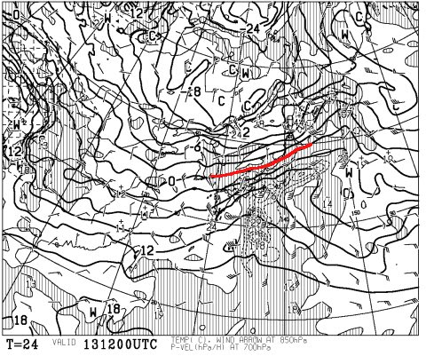

うむむむむ？？

赤く印した0℃線，志賀高原より北にあるんですが？？

それどころか，+3℃線がかかっているくらいなのですが…っ！？？

で．

地上天気図は…

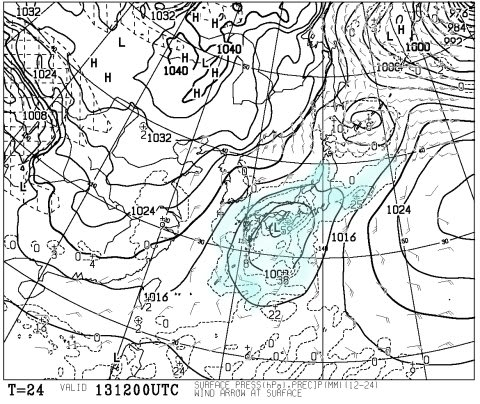

…水色で塗った降水域が日本全国を

覆っているので…

…

…

ヤバい．

やばいよ．

今日の昼間．

スキー場に降るのは液体かも…（涙）．

標高の低いスキー場ではアウトです．

確実に雨です（泣）．

…でも．

安心するのだ．

標高の高いところは13日夕方．

低いところでも，夜中には雪になって．

14，15日は冷え冷え雪降りになるのだ！

…だもんで．

今週末は，結構いいコンディションになりそう

なのだ！！！

…という前フリのあとは．

本題．

昨日速報した，日曜の志賀高原．

詳細レポートです…

さてさて．

昨日レポートしたように，

20cm程度の積雪で始まった朝．

残念ながら，期待した焼額のゴンドラは動き

ませんでしたが…（涙）．

第2高速リフトで山頂に上がると…

うほ！

コース脇は，ふわふわ新雪っ！！

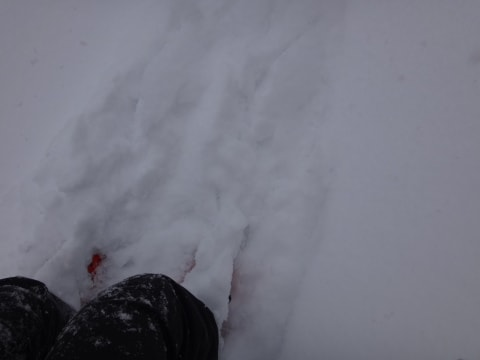

コースは圧雪の上に5cm程度の新雪で．

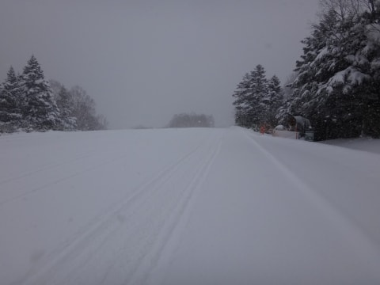

朝イチのシュプールがほとんどついてないコースを．

うはははは．

いただきまーーーす！

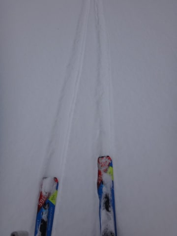

…うひょーーー！！！

下地はしっかりした人工雪の圧雪でしっかり

エッジが効いて．

その上にフワフワ新雪…

最高っ！！！

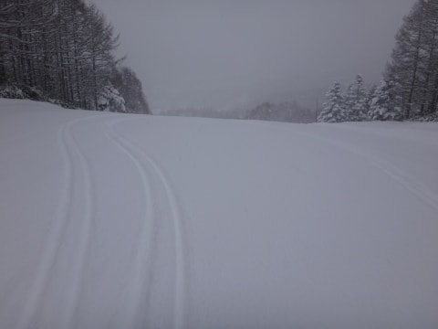

…という感じで，

ほとんど人がいない快適バーンを

滑ること，約1時間．

ゲレンデ上はちょっと人が出てきたものの…

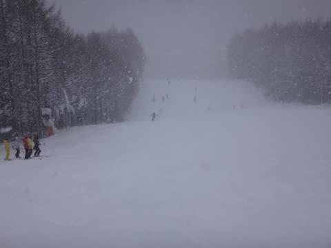

でも．混雑具合はこんなもの．

Yetiや，オープン週のアサマ2000や．

先週の焼額に比べれば…

天国！！

リフト待ちは，一番混むタイミングでもこの程度で．

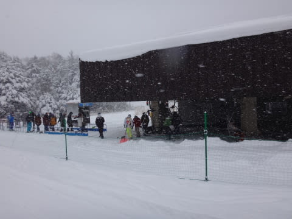

タイミングによっては，飛び乗り状態！

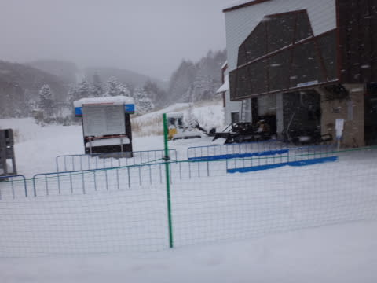

もう，高速リフトを思う存分グルグルできます！！

最高っ！！

…

…

…だけど．

気温は-8℃程度と，かなり低く．

朝から終日雪も降り続け．

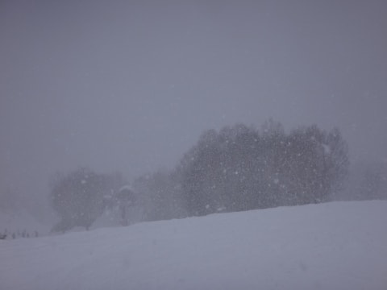

ゴンドラでない，吹きさらしのリフトは

寒いよ…（涙）．

これだけ積もったんだから，ゴンドラを動かしてほしい…

でも．

リフトより上の，ゴンドラコースは．

昼間必死に圧雪車でコースを踏み固めて…

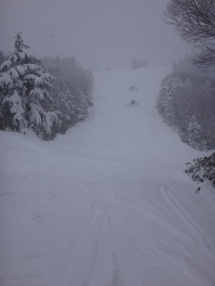

そのあと，夕方には人工降雪機をセット

していたので．

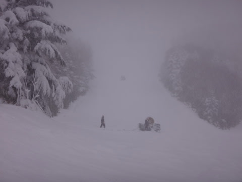

やっぱり，ゴンドラ動かすにはもう少し

雪が足りなかったのかな～？？

でも．

人工降雪が打ってある，オープンしているゲレンデは，

昨日からの積雪でコンディションばっちり！

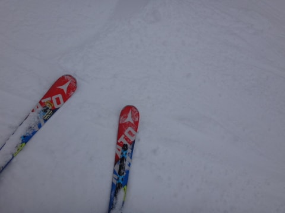

…だけど．

第2高速リフト側，唐松コースは．

昼近くになると，ちょっとところどころ，

下地のアイスバーンが出てたのが，

ちと残念でしたが…

でも．

先週までの全面アイスバーンに比べれば．

コース幅も広いし．天国っ！←昨年がひどかったので，基準となるレベルが低くなっている

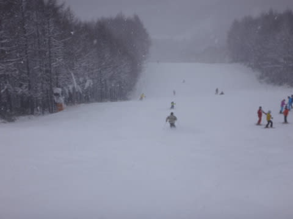

唐松コースは，それほど混雑せず

自分の好きなラインを取れる，

比較的シアワセな状態！

…で．

気温激冷えの本日．

雪が終日降り続け．

リフトに乗っていると，冷凍人間化

しそうでしたが．

…それでも，低速の第4ロマンスに乗る人が

結構多かったらしく．

第4ロマンス側のサウスコース．

結構人がいましたね～．

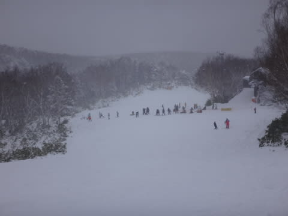

…リフト乗車時間が短い第2高速リフトでも

死にそうに寒かったので．

さらに乗車時間が長く，冷凍人間製造機になってると

しか思えない第4ロマンスに乗る根性が無い私は，

サウスコースは滑りませんでしたが（笑）．

そして．

あまりもの寒さのせいか．

午後にはゲレンデから，ほとんど

人がいなくなっちゃいましたよ…！

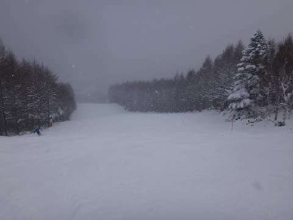

…これは．

ほぼ貸し切りバーン状態ですね（笑）．

昼すぎのゲレンデは，ちょっと荒れてきたものの．

柔らかい雪が踏み固められた，トップシーズンっぽい

コンディション．

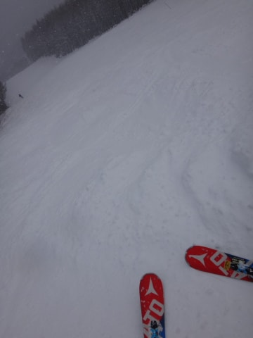

…昨シーズンは．

1月に末にならないと，こんな雪で滑れなかったのに…

良かった．

今シーズン，12月上旬にこんな冷え冷え雪で滑れて，

良かった…（感動）

で．

午前中は，積もるほどではなかった雪も．

午後2時ごろには，かなり降りが強くなり…

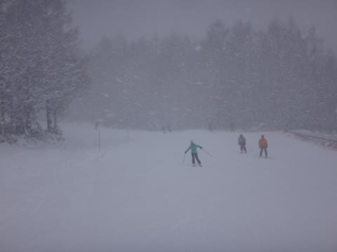

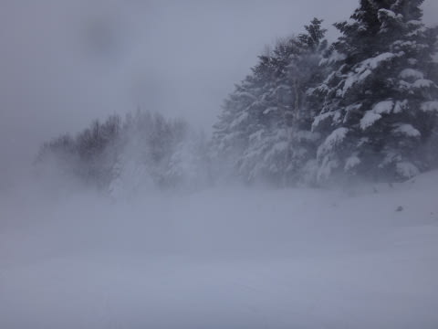

そして．

そのおかげで．

うほーー！

夕方なのに．

また，コース脇はプチパウダー状態！

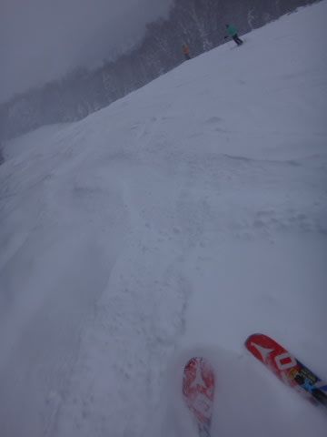

人が少ないので，新雪がほとんど踏まれずに

積もっていくよ！

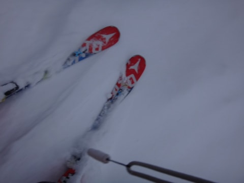

という感じで．

激しく雪が降るゲレンデを，

今日もしっかり，営業終了の4時まで．

たっぷり思う存分滑ったのでした…

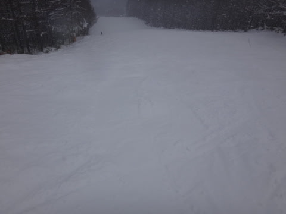

…そして．

車に戻ると．

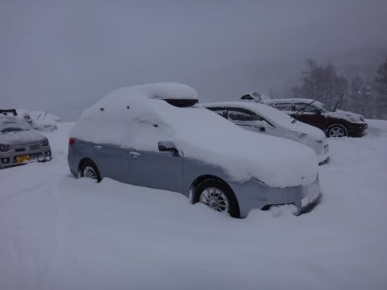

リフトスタート時に駐車場に止めた車が，

こんな感じになってたので．

うーん，リフトスタートからの積雪は，

かなりあったように感じたけど．

実際は10cmってところだったのかな…

ってことで．

冷え冷えのこの土日．

ドサドサ積もった，ってほどではないものの．

そこそこの積雪があったおかげで．

ゲレンデ状況はかなり良くなりました～！！！

あとは．

今日の雨にさえ耐えれば．

また，冷え冷えの日々が続くので．

今週末も，期待！

## 💬 コメント一覧

### 💬 コメント by (Goku)
**タイトル**: Unknown
**投稿日**: 2016-12-13 19:32:36

４ロマの冷凍人間１号、GokurakuSkierです(笑)

いや～ホントに寒かった！

あれだけ寒いのは久しぶりでした（日頃雪降りの日には滑らないので）

今日の長野、午後からの雨はポツポツ程度でした。

週末に向けて冷え込みが続いて無事ゴンドラが動くと良いですね。

ＰＳ

リンゴ持っていきますね♪

### 💬 コメント by (KENKEN)
**タイトル**: ありがとうございました
**投稿日**: 2016-12-13 23:44:43

2日間お世話になりました。

昨年は一度も降雪中にスキーをすることがなかったにも関わらず、今年は初日から降雪中にスキーが出来ました。

ストックの付く場所の指導は目から鱗でした。

滑りが劇的に変わった気がします。

やっぱりスキーは楽しいと再認識した2日間でした。

次回は年を越しますが、ご一緒できるのを楽しみにしています。

### 💬 コメント by (Skier_S)
**タイトル**: 寒かったですね～
**投稿日**: 2016-12-14 01:27:40

＞Gokuさま

冷凍人間製造リフトの犠牲になりましたか…

昨シーズンは体験できなかった寒さでしたね（笑）

長野の雨はそれほどひどくなかったなら安心ですが…

ちょっと夜遅くまで降り続けたようなので，

大丈夫かな～，とおもってました…

リンゴ，ありがとうございます！

楽しみにしています～！！！

＞KENKENさま

2日間ありがとうございました～！

ストックの位置だけで，滑りがすごく変わって

面白かったでしょ？？

また1月3連休，よろしくお願いします～！

