# え？熊の湯，さらに一日早い本日5月6日で営業終了(泣)．そして横手も第1ゲレンデ終了．5月5日の横手・渋・熊の湯からの特派員によるゲレンデ状況は…

📅 投稿日時: 2023-05-06 13:18:48

今日もちょっと休日進行（？）で，いつもと違う

時間に更新していますが…

はい．

昨日の夜は久しぶりに家でのんびり夕食を食べ，

その時お酒も飲んでしまったので，

Blogを書かず撃沈していました…

…いや．

家の食卓で夕食を食べてお酒を飲んだのは，

今年初めてでは…？

今年初めて，ゆっくり余裕のある時間を

過ごせている気がする…

（5連休にもかかわらず仕事はしているけど（涙），

食事時間を惜しまなきゃならないほどの仕事量じゃない）

で．

GW5連休も異常高温が続いていますが…

予定を切り上げて5月7日での営業終了を

宣言した熊の湯．

さらに一日繰り上げて，

本日での営業終了

となりました…(涙）

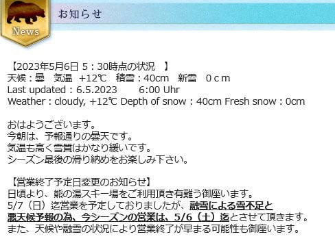

（[熊の湯スキー場ホームページ](https://www.kumanoyu.co.jp/lift/)より)

そして，奥志賀は昨日で終了（泣）

まだ，雪を寄せてコース幅を制限すれば

滑れそうな感じでしたが…

雪出しをやりきってしまい，もう雪のストックが

ないとのことで終了のようです…

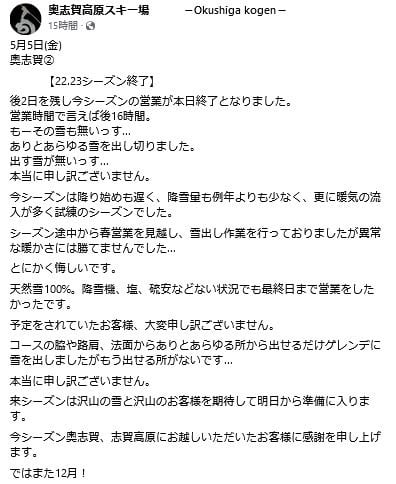

（[奥志賀高原スキー場Facebook](https://www.facebook.com/okushiga.kogen/?locale=ja_JP)より）

で，横手＆渋峠ですが…

ついに，第1ゲレンデが5月5日をもって

終了となったようです（涙）

でも，良く今までもたせたなぁ…

でもまだ第2，第3と渋峠の2コースが

滑れるのがすごいです…

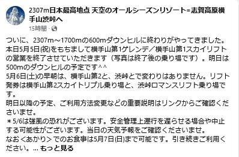

（[横手山スキー場Facebook](https://www.facebook.com/yokoteyama2307/)より）

ってなことで．

各ゲレンデからの特派員情報を見てみると…

本日で終了の熊の湯は．

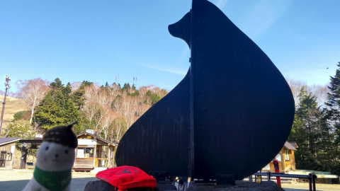

昨日の朝の段階では，まだ一見雪が

ありそうに見えますが…

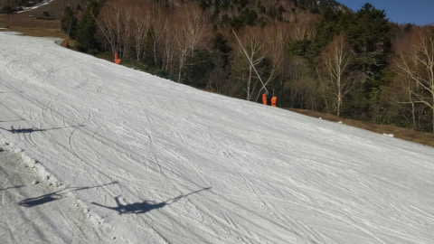

特派員によると，時間が経つと雪が

ひどくなっていき，

特にリフト降り場からすぐの当たりは

雪がかなり薄くなったようで．

「明日で終わりも納得…」

と思ったそうです．

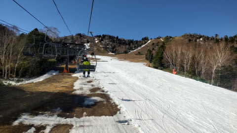

一方，横手山．

昨日の早朝では，バーンも硫安がしっかり効いて

硬く，楽しかったようで…

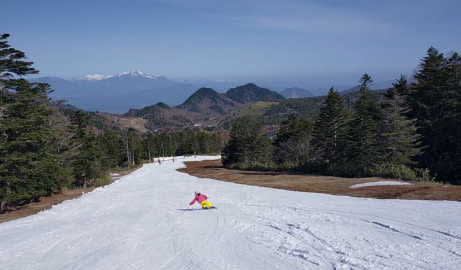

渋峠ももう少しは大丈夫かな？

って感じに見えますね．

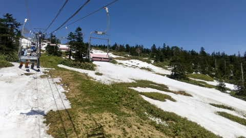

渋のリフト乗り場近辺は，かなり雪が

集めてありますね…！！

まだまだ持ちそうな感じ．

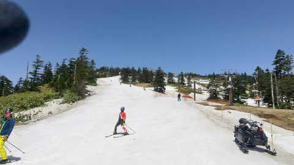

ただ…

5月1，2日の段階ではまだまともだった

第2ゲレンデ．

朝はまともでも，時間が経つと結構悲惨な状態に

なっているようです…（涙）

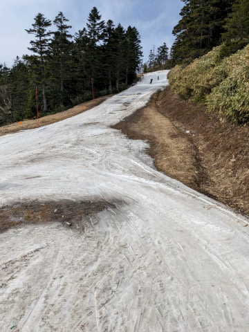

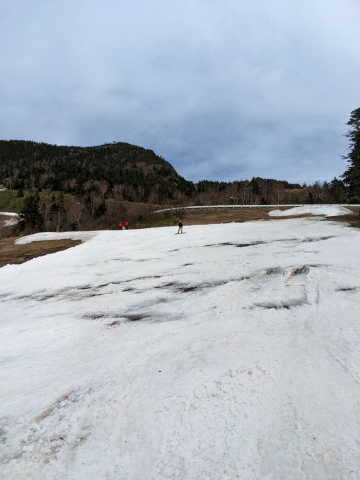

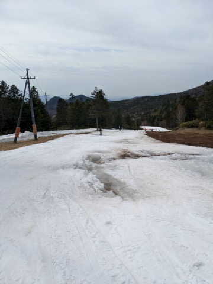

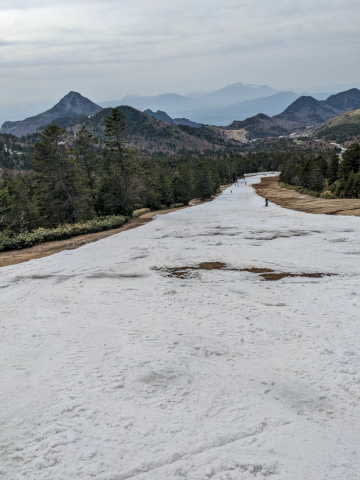

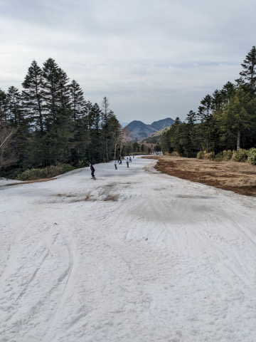

そして，昨日で死に絶えた第1ゲレンデは…

まぁ，営業終了するわな…

という感じ（涙）

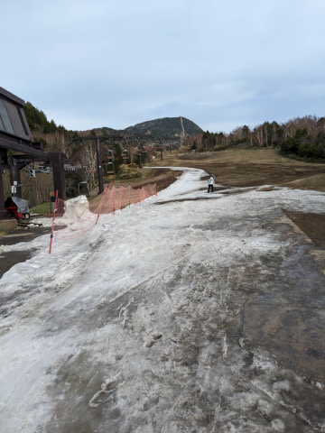

ってなことで．

本日は，風が強いながらも熊の湯，

横手・渋ともにリフト営業しているようです．

…明日は，強風＆豪雨で営業できないだろうなぁ…

うーん．

GW以降も残るは横手・渋のみですが．

今日の夜以降，月曜の朝まで3日に渡って

降り続けそうな雨に，ゲレンデがどこまで

耐えるのやら…

## 💬 コメント一覧

### 💬 コメント by (Ski45)
**タイトル**: Unknown
**投稿日**: 2023-05-07 00:44:41

Sさん

今年は温暖化の影響なのか融雪が早いですね…

Sさんを見かけた焼額山から、

・4/29、かぐら

2便で上がり、朝イチはいい感じのバーンで、かぐらの第1高速も初回3回くらいは待ち時間ゼロ！

田代エリアや、帰りのかぐらゴンドラ横の下山コースは、必死で子供たちの背中を押しながら進まないと軽くて短い板の子供たちは止まってしまうレベル…

・5/5、野沢温泉

朝イチから緩んで2時間で撤収！

去年か一昨年から新しくなった『長坂ゴンドラ』(石打丸山のサンライズエクスプレスや、白馬岩岳に来年導入予定のゴンドラも同タイプ？)は快適です！

たまに、トラブルになる焼額山のSさんの別荘もこれになるといいですね♪

これで我が家もシーズンオフにしました。

これから、キャンプ中心の週末になります。

ところで、Sさんの過去のダイビング日記を読ませていただいていますが、

乳幼児連れてエコノミー？でタヒチはスゴイですね…！

10年くらい前にボラボラ島に行きましたが、この路線のフライト時間は大人でもキツイ…

我が家も子供が生まれてからは、

8カ月でバリ島、

1歳2カ月でモルディブ、

0歳と2歳でモルディブ、

1歳と3歳でモルディブ、

2歳と4歳でモルディブ、

個人的には、大冒険をしたと思っていましたが、

シンガポール航空のビジネス

(壁の直後のフルフラットをリクエスト)

この広いシートがあっての旅でした。

それでもヒヤヒヤしながらの移動でしたが…

最近は、特典航空券で沖縄本島や宮古島ですが、

国内線のエコノミーでもモニター付の機材が増え、

6歳と8歳(本日年齢up!)の子供はアニメを見ながら楽しんでいる中、親が過呼吸で苦しんでいる始末(笑)

これから、時々ダイビング日記の続編を読ませていただきますね♪

### 💬 コメント by (Skier_S)
**タイトル**: ＞Ski45さま
**投稿日**: 2023-05-09 23:50:53

すみません！このコメント見逃して回答遅れました…

GWも終わり，シーズンオフされたんですね．

まだかぐらも月山もありますが（笑）．

夏はキャンプ中心なんですね．

我が家も昔はキャンプやりましたが，娘が部活で土日休め無くなったので行かなくなりました…

で，海外ダイビングですが．

我が家はエコノミーしか使ったことがない人間なので…

2歳児までタダというラストチャンスでタヒチに行っちゃいましたが，

それ以降はタイやインドネシア，フィリピン等近場が多いです．

でも，3歳と4歳の時にダイブクルーズ船に乗せるという無謀をやってますが（笑）．

うちの娘は船も飛行機も大好きなので，長距離移動は苦になりませんでした．

ここ3年間ダイビングに行けてませんが…

この夏は行けるのかな…？？

